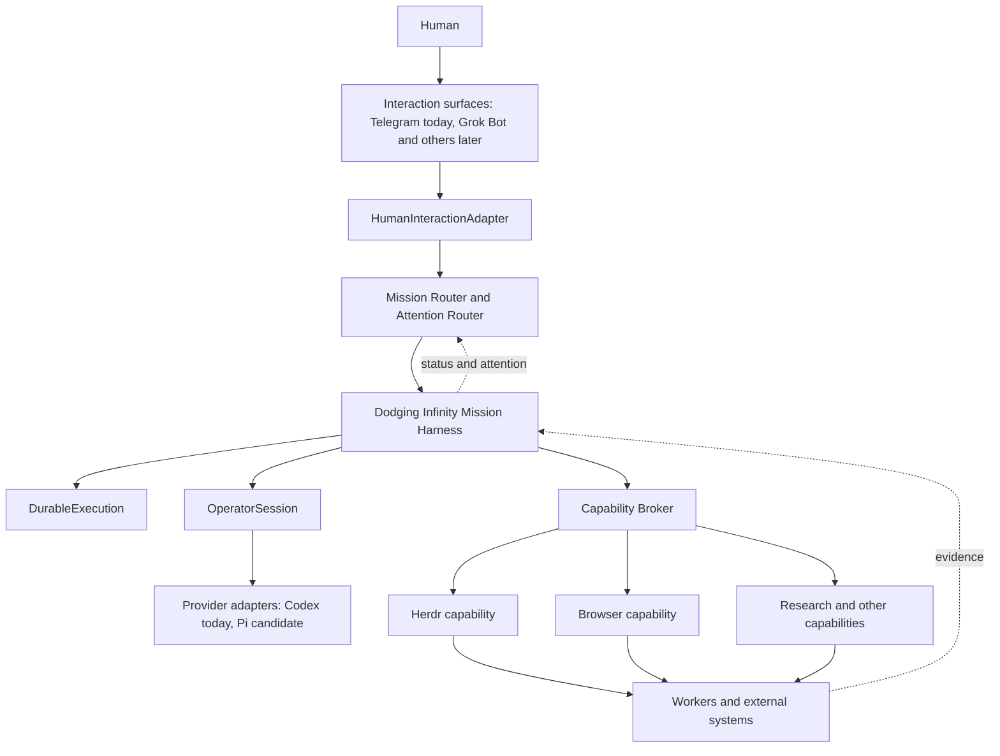

<p align="center">
  
</p>

# Dodging Infinity v0.7.0

[](https://github.com/TheMickeyDodger/dodging-infinity/actions/workflows/ci.yml)
[](LICENSE)
[](https://github.com/TheMickeyDodger/dodging-infinity/releases/latest)

> **Bounding the infinite to the finite.**

## What this is

Dodging Infinity is a governed system for giving AI real work without
giving AI uncontrolled authority.

You state an objective from your phone. The system turns it into one
bounded mission: an exact target and baseline, explicit rules, and a
one-shot human approval bound to the exact mission text. An engineering
organization does the work. Independent review challenges it. A verified
result comes back exactly once. Nothing consequential happens after that
without a separate human decision.

The operating model, in one line:

> **Grok Bot converses. Operator operates. Herdr engineers. Dodging Infinity governs. Humans authorize. The Reconciler keeps truth current. The Ops Steward learns. The world observes.**

**Grok Bot converses.** The conversational plane is where a person talks to
the system in plain language. Telegram is the reference transport today.
Grok is the planned front door for phone and desktop, with specialist
experiences such as Mission Coordinator, Research, Operations, Release,
Browser QA, and Incident or Recovery. A surface is never an authority, and
Grok never owns one.

**Operator operates.** The Operator reads evidence and chooses bounded work
for one mission. It is a role, not a model brand.

**Herdr engineers.** Herdr is the engineering organization inside an
engineering mission: Supervisor, Lead, Executor, and an independent Reviewer.

**Dodging Infinity governs.** Mission identity, authority, evidence,
lifecycle, and boundaries live here, in durable state, not in a
conversation and not in a model process.

**Humans authorize.** Every consequential boundary is a separate human
decision. The machine path holds no delivery authority.

**The Reconciler keeps truth current.** Canonical state is compared with
reality and corrected in the open, never silently. An Operator process
that goes missing changes canonical truth; the record stops saying the
work is under way. A Herdr COMPLETE without Reviewer evidence is not
complete. An external effect with an ambiguous outcome is reconciled
against reality before any retry is considered. The Reconciler is Phase 2
work.

**The Ops Steward learns.** It looks across missions for repeated failures
and repeated human interventions, and proposes regression tests,
deterministic guards, skills or profiles, reconciliation rules, and
maintenance. It cannot grant itself authority. It is roadmap work.

**The world observes.** Observation is read-only. Today that is `/status`
on the phone and `herdctl observe` on the Mac. Eventually it is a visual
mission OS that reads canonical Dodging Infinity state and is never the
backend: if the visual client dies, the missions continue.

## Why this matters

Spawning agents is becoming a commodity. The hard problem is making
autonomous work durable, isolated, observable, recoverable, evidence-based,
provider-neutral, bounded, safe under uncertainty, safely actionable, and
understandable to a human.

Most agent systems ask a model to do more. Dodging Infinity makes the
problem smaller: a large objective becomes bounded units with explicit
scope, rules, ownership, and validation, so the system scales outward
without silently expanding any single agent's authority.

The intelligence is replaceable. The orchestration and governance contract
is not.

## Intent is not authority

What a person asks for is intent. Intent is not permission.

Mission execution, commit, push or PR, merge, release, and deploy are
separate consequential boundaries. Approval at one never carries to the
next. A mission authorization does not authorize a commit. A commit does not
authorize a push. A push does not authorize a merge. A merge does not
authorize a release. A release does not authorize a deploy.

Today the mission approval is one exact phone approval, and commit, push,
and release tag are three separate one-shot human gates on the Mac. Remote
mission execution authority exists. Remote delivery authority does not:
current Telegram missions carry `delivery_authority = none`. Exact one-shot
remote approvals for PR, merge, release, and deploy are roadmap work.

## What works today (v0.7.0)

**v0.7.0 adds DI-REMOTE-2 Remote Target Repository Routing.** A
natural-language Telegram request produces a separately planned, one-shot
Mission Authorization. An independent Runtime advances it through an
isolated managed target workspace into a real Herdr with Supervisor, Lead,
Executor, and Reviewer. No manual clone, target registration, terminal
bootstrap, or Herdr setup.

In the tree and pinned by tests: exact one-shot approval, where typed chat
text carries no authority; isolated target materialization verified against
the approved baseline; independent review and evidence-gated verification;
an exactly-once verified result, with ambiguity that fails closed rather
than replaying an external effect; deterministic Runtime and Broker
boundaries; local human commit, push, and tag guards; Codex behind the
Codex Gateway as the reference Operator path; and `OperatorSession` and
`HumanInteractionAdapter`.

DI-REMOTE-2 has both hermetic proof and bounded live proof: the automated
suite proves the whole fail-closed lifecycle end to end, and one real
mission ran against a real external repository. That mission,
started from a natural-language phone request about an external repository
issue, ran through the isolated target Herdr, reached COMPLETE, and recorded
a Reviewer APPROVE. It then exposed genuine post-dispatch policy drift and
correctly terminated BLOCKED, so no verified result was declared and no
target Git delivery occurred. The fix that followed was proven against the
hermetic suite and adversarial review, and that is the final-result release
certification for v0.7.0.

Not in the tree yet: a durable mission record with budgets and checkpoints
under a Mission Harness; the Reconciler; an Observation Service and an
Attention Router; human approvals at PR, merge, release, and deploy; a full
provider-neutral Operator lifecycle; Workers and a Browser capability; true
multi-mission execution; the Ops Steward; the Grok front door; and the
visual mission OS.

The goal is not merely multi-agent coding. The goal is a reliable boundary
between human intent, operator reasoning, autonomous engineering,
adversarial review, deterministic evidence, and human-controlled delivery.

## The experience this converges toward

Picture this exchange on your phone. It is the experience the architecture
is converging toward, and not all of it is implemented today.

You type:

> Figure out why the export path is timing out, fix it if safely possible, prove it, and get it ready for review. Do not ship anything without me.

The system replies with a bounded mission, not a plan of attack: the target
repository and baseline, the objective in your words, the rules, what counts
as done, and the line it will not cross. You approve once, and that
approval is bound to that exact text and nothing else.

The Operator investigates: it reproduces the timeout and narrows the problem
into one bounded engineering objective. It does not write the fix.

Herdr engineers. The Supervisor decides the route. The Lead breaks it down.
The Executor implements a fix and adds a regression test. The Reviewer,
reading independently, rejects the first version: the fix hides the timeout
instead of removing it. The Executor reworks it. The Reviewer approves.

Evidence accumulates in the durable record: the reproduction, the diff, the
test run, both review rounds, and the decision. You ask what is happening.
The answer comes from the record, not from interrupting the work.

The result comes back once, verified because a gate passed, not because a
model said so. Then the locked actions wait, each behind its own human
authorization: the commit, the push or the PR, the merge, the deploy.
Approving one unlocks nothing else. "Do not ship anything without me" is the
default posture of the system, not an instruction it has to remember.

## Herdr: the engineering organization inside a mission

Herdr is the engineering organization, not the mission control plane. It
runs inside an engineering mission and never governs the mission around it.
The Supervisor owns strategy and decomposition, and is the first place in
the whole path where an engineering plan is written. The Lead owns
acceptance and completion. The Executor implements. The Reviewer is
read-only, sees the work fresh, and answers with one canonical token,
`HERD_DECISION: APPROVE` or `HERD_DECISION: REJECT`, which the Lead
validates and persists deterministically.

A verified result is gated, not declared. The verification turn's answer is
necessary, never sufficient, and Herdr lifecycle COMPLETE alone can never
verify. A Reviewer APPROVE is target-produced evidence that the target's
own review ran and concluded, never independent verification. Herdr runs
unchanged inside every remote target and holds no mission or delivery
authority.

## Operator: a replaceable role

The Operator reads evidence and chooses bounded work for one mission. It is
an architectural role, not a model brand, and it can be replaced without
changing the contract around it. Codex through the Codex Gateway is the
current reference path: every Operator turn is a fresh, restricted process
with a read-only sandbox and no path to the engineering layer. Pi is a
candidate provider-neutral runtime. `OperatorSession` and
`HumanInteractionAdapter` are initial seams on `main`, not end-state
implementations.

## Direction of travel

Telegram, the adapter seam, `OperatorSession`, Codex, and Herdr exist today;
the routers, the Mission Harness, DurableExecution, and the general
Capability Broker are ahead. The v0.7.0 Target Broker is its narrow ancestor.



# Architecture

The operating model is deliberate. In v0.7.0 the principal operating model is Remote Target Repository Routing (DI-REMOTE-2):

**Phone → Telegram → Mission Authorization → approval → Runtime → Broker → isolated managed target → target Herdr → evidence verification → Telegram result → human-gated delivery**

The released v0.6.3 operating model remains the local-mission path (a mission against this repository):

**Phone → Telegram → Telegram Adapter → Codex Gateway → Codex Operator → Herdr → verified result → human-gated delivery**

## Current architecture on `main`: remote target routing (DI-REMOTE-2, v0.7.0)

```text
control repository (this repo: pinned control + policy, never the work target)
    |
    v
fresh Codex turns (read-only sandbox, no resume/fork; the Mission
Authorization comes only from a separate fresh planning turn, route (b))
    |
    v
Runtime (`dirun`, a separate deterministic process)
    |
    v
Broker (privileged, fixed lifecycle actions only)
    |
    v
managed target workspace (isolated, materialized only after approval)
    |
    v
target Herdr (Supervisor -> Lead -> Executor / Reviewer)
    |
    v
evidence verification (a verified result is gated, not declared)
    |
    v
Telegram result (the verified result, exactly once)
    |
    v
human delivery gate (commit/push/PR/tag/release/merge stay local human actions)
```

This repository is the control repository, never the work target; target
engineering can never modify it through this path. The Runtime (`dirun`) is
a separate process, coupled to the control chain only through the durable
workflow authority store; Telegram, the Gateway, and Codex never invoke it
in-process. The Broker is privileged and performs only fixed lifecycle
actions, each against a Runtime-minted one-shot capability; sensitive values
are never supplied by the caller, and capabilities are minted by the
Runtime, never by Codex. Target workspaces live under the protected
per-user root, are materialized only after one-shot approval, and pass
containment, canonical-remote, and baseline verification. The first
dispatch is the byte-exact stored handoff; a follow-up is a bounded
corrective brief. A record at a hard bound stops that one workflow and never
kills the Runtime.

- **Telegram result**: before dispatch, the adapter creates and durably
  binds one bot-owned result placeholder. After independent verification,
  the final result edits that same known Telegram object. Ambiguous
  placeholder creation fails closed before dispatch, crash-after-edit
  recovery reconciles against that same object, and the result is never
  sent a second time.
- **Human delivery gate**: no delivery authority exists anywhere in the
  machine path. Commit, push, PR, tag, release, and merge stay human actions.

## Released architecture (v0.6.3): local missions

This is what the released v0.6.3 tag does, and it remains the
local-mission path on `main` (a mission against this repository).
It is preserved compatibility behavior, not the principal `main`
architecture above. The Codex Gateway has no Herdr authority of its own and
must never become an alternate execution path around Codex.

## Roadmap

Phase 1: host survival and seams (DurableExecution, Capability, Worker),
with DBOS, Pi, and Grok explored as candidates and none selected. Phase 2:
the Mission Harness, with durable mission identity, a manifest, authority,
evidence, blocker, and artifact state, the lifecycle, the Reconciler, and
observation. Phase 3: routing and attention, with the Mission Router, the
Attention Router, and the Grok conversational plane. Then, in dependency
order: provider neutrality, true multi-mission execution, BrowserCapability,
artifacts, workers, chaos and recovery, the Ops Steward, productization,
broader autonomous work, and a visual mission OS. Details are in the
[Remote Mission Fabric roadmap](docs/remote-mission-fabric-roadmap.md) and
[docs/wiki/Roadmap.md](docs/wiki/Roadmap.md).

## Quick start

Every command below was checked against `herdctl.py --help` in this
checkout. `ALIAS` names the repository and `CMD` is its verification command.

```bash
bash scripts/install.sh                   # herdctl, codexgw, tgop, dirun into ~/.local/bin
herdctl init --alias ALIAS --preset max-quality --test-command 'CMD'
herdctl set-test 'CMD' --repo ALIAS       # if CMD was not known at init
herdctl safety-install                    # runtime command guard, once per Mac
herdctl doctor --repo ALIAS
herdctl health --repo ALIAS
herdctl task 'OBJECTIVE. Do not commit.' --repo ALIAS
herdctl status --repo ALIAS
herdctl observe --repo ALIAS --json
herdctl upgrade --repo ALIAS              # after pulling a new version, then doctor again
```

Commit, push, and release tag stay behind the human gates below. The full
command surface, presets, rules, mission contract, and task lifecycle are in
[docs/reference/herdr-operations.md](docs/reference/herdr-operations.md).

## Telegram Remote Operator

Telegram is the current reference transport, shipped as an adapter (`tgop`),
not an execution system: no direct path to Herdr or `herdctl`, and
allowlisted users are authenticated before any content is parsed. The config
lives outside any repository, in `~/Library/Application Support/DodgingInfinity/telegram/config.json`:

```json
{
  "bot_token": "<token from @BotFather>",
  "allowed_user_ids": [123456789],
  "repository": "/path/to/one/repository"
}
```

`allowed_user_ids` is an exact numeric allowlist, and one adapter instance
serves one repository. Run it with `tgop run`, or install the per-user
LaunchAgent with `tgop install-agent` and remove it with
`tgop uninstall-agent`. From the phone, send natural-language intent (or
`/mission <intent>`) and approve the rendered mission once; `/status`
reports durable state without interrupting the work, and `/help` lists the
commands. Setup, transport, approval binding, and recovery are in
[docs/reference/telegram-remote-operator.md](docs/reference/telegram-remote-operator.md).

## Remote Target Repository Routing (DI-REMOTE-2, v0.7.0)

Routing is route (b): the legacy Operator turn's DI-REMOTE-2 marker is a routing signal only, and a separate fresh planning turn produces the Mission Authorization, which binds the destination and its boundaries, never implementation strategy. The user's exact typed message is stored verbatim and shown to every role turn, so the Operator can never change what the human said.

- Approval is one-shot and bound to the exact rendered mission text. After
  Approve Mission there is no manual Mac, clone, registration, Herdr-setup,
  or terminal step: the Runtime, a separate process, claims the consumed
  authorization on its own and runs the lifecycle to a verified result.
- The verified result returns to Telegram exactly once: never twice and
  never silently dropped. The result edits one placeholder bound before
  dispatch, so there is no duplicate delivery, and an ambiguous outcome
  fails closed rather than being re-sent; recovering a terminal outcome is
  a human step. Every durable delivery state is listed in
  [docs/reference/telegram-remote-operator.md](docs/reference/telegram-remote-operator.md#remote-mission-result-delivery-di-remote-2).
- A schema-1 workflow record is retired, never upgraded, by
  `tgop migrate-workflows`, which keeps a byte-exact backup.
- An unresolved target identity gets one fresh `status_recovery` turn that
  binds exactly one provable child or stops durably BLOCKED, never guessing.

The Runtime is `dirun`: `dirun once` runs one claim pass, `dirun run` the
loop, and `scripts/dirun-agent.sh install [--config PATH]` or `uninstall`
manages the LaunchAgent ([docs/reference/runtime-and-host.md](docs/reference/runtime-and-host.md)).

## Upgrading: explicit state migration (breaking)

The adapter state schema moved from version 1 to 2. An existing v1
`state.json` fails closed until the human runs `tgop migrate-state`, which
keeps a byte-exact v1 backup. The adapter refuses to migrate silently
because the migration marks every pre-existing approval superseded for v2
purposes only; v1 local semantics are unchanged.

## Strict Reviewer protocol

The Reviewer's decision is exactly one canonical token, `HERD_DECISION:
APPROVE` or `HERD_DECISION: REJECT`; synonyms are not accepted. The Lead
validates and persists it with
`herdctl review-decision --repo example-repo --reviewer reviewer1`:

```json
{
  "valid": true,
  "decision": "APPROVE",
  "review_file": "/.../.herd/state/reviews/<task>-round-02.md"
}
```

Malformed output returns `"valid": false` and the Lead re-prompts the same
Reviewer session; the full protocol is in
[docs/reference/herdr-operations.md](docs/reference/herdr-operations.md).

## Human delivery gates

Three gates, three separate one-shot human authorizations, each bound to
exact state and a short TTL, and none of them implies the next.

```bash
herdctl approve-commit --repo example-repo     # bound to worktree, branch, HEAD, staged diff hash
herdctl approve-push --repo example-repo       # then: git push
herdctl approve-push --tag vX.Y.Z              # then: herdctl push-tag vX.Y.Z
```

Bindings, and what each gate does not authorize, are in
[docs/reference/human-git-gates.md](docs/reference/human-git-gates.md).

## `herdctl observe`

`herdctl observe [--repo NAME] [--json]` builds a strictly read-only
point-in-time projection of a repository's Herdr, as a summary or as the
schema-versioned JSON projection.

- **Observation is a reporting surface, not a gate.** It does not mutate,
  repair, prompt agents, change workflow or control execution.

The schema, the limits on what observation can say about a running model, and
the hard bounds are in [docs/reference/observability.md](docs/reference/observability.md).

## Documentation

Architecture and direction: [Architecture](docs/wiki/Architecture.md), [Current vs End State](docs/wiki/Current-vs-End-State.md), [Authority and Safety](docs/wiki/Authority-and-Safety.md), [Missions and Lifecycle](docs/wiki/Missions-and-Lifecycle.md), [OperatorSession](docs/wiki/OperatorSession.md), [Herdr](docs/wiki/Herdr.md), [Evidence and Verification](docs/wiki/Evidence-and-Verification.md), [Observation and Recovery](docs/wiki/Observation-and-Recovery.md), [Capabilities and Workers](docs/wiki/Capabilities-and-Workers.md), [Roadmap](docs/wiki/Roadmap.md), [Examples](docs/wiki/Examples.md), and [Glossary](docs/wiki/Glossary.md).

Operating reference: the [reference index](docs/reference/README.md), [release evidence](docs/reference/release-evidence-v0.7.0.md), [CHANGELOG.md](CHANGELOG.md), [SECURITY.md](SECURITY.md), and [OPERATOR_PROTOCOL.md](OPERATOR_PROTOCOL.md).

## Contributing, security, and license

Contributions follow [CONTRIBUTING.md](CONTRIBUTING.md). Security
boundaries, the threat model, and how to report a problem are in
[SECURITY.md](SECURITY.md). Dodging Infinity is licensed under the
[Apache License 2.0](LICENSE).
