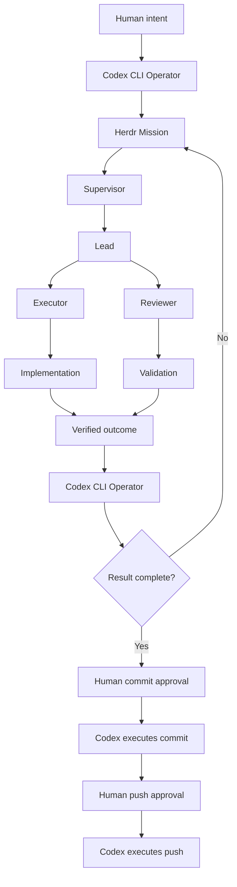

<p align="center">
  
</p>

# Dodging Infinity v0.6.0

[](https://github.com/TheMickeyDodger/dodging-infinity/actions/workflows/ci.yml)
[](LICENSE)
[](https://github.com/TheMickeyDodger/dodging-infinity/releases/latest)

> **Bounding the infinite to the finite.**

**Any problem. Any repo. Any issue.**

Dodging Infinity is an engineering orchestration system built around Herdr for turning human intent into bounded, isolated, and verifiable engineering work.

v0.6.0 establishes the durable boundary between an outer operator and Herdr execution. Structured missions can carry an objective, constraints, rules, acceptance criteria, and verification requirements into Herdr's Supervisor, Lead, Executor, and Reviewer workflow.

The next milestone completes the natural Codex CLI operator loop: a human speaks to Codex normally, Codex investigates and formulates the mission automatically, Herdr performs the bounded engineering work, control returns to the same Codex session, and Codex inspects the result before driving the terminal toward the existing human-gated commit and push flow.

The goal is not merely multi-agent coding. Dodging Infinity creates a reliable boundary between human intent, model reasoning, autonomous execution, adversarial review, and verified outcomes.

## Why Dodging Infinity?

Most agent systems ask a model to do more.

Dodging Infinity does something different: it makes the problem smaller.

Instead of giving one model an expanding context and hoping it can reason across everything, Dodging Infinity recursively turns a large objective into bounded units with explicit scope, rules, ownership, dependencies, and validation.

That means the system can scale outward without silently expanding the authority of any individual agent.

The intelligence is replaceable. The orchestration contract is not.

## Target architecture



The architecture deliberately separates responsibilities:

- **Human** defines intent and retains delivery authority.
- **Codex** is the persistent outer operator.
- **Herdr** owns bounded engineering execution.
- **Supervisor** coordinates.
- **Lead** owns acceptance and completion.
- **Executor** implements.
- **Reviewer** challenges the result independently.
- **Git gates** enforce human authorization at delivery boundaries.

## What v0.6.0 adds

- **Operator-to-Herdr mission boundary** — Added a durable mission contract that carries objective, constraints, rules, acceptance criteria, and verification requirements into Herdr.
- **Mission CLI** — Added `herdctl mission create`, `herdctl mission show`, and `herdctl task --mission`.
- **Herdr execution ownership** — Herdr remains the canonical engineering engine through Supervisor, Lead, Executor, and Reviewer roles.
- **Simplified orchestration model** — Removed the experimental Mission Control layer instead of building a second orchestration system beside Herdr.
- **Full mission envelope delivery** — The complete structured mission is delivered to the Supervisor while mission rules remain enforceable through task policy.
- **Stronger bootstrap boundaries** — Agents are explicitly prevented from inferring engineering work from repository state, verification commands, or shared memory before receiving an explicit task or delegation.
- **Deterministic review protocol** — Reviewer decisions remain canonical, persisted, and validated through Herdr's existing review gates.
- **Human-controlled delivery** — Commit, branch push, and release-tag push operations remain protected behind deterministic one-shot human authorization gates.
- **Improved push approval lifecycle** — `git push --dry-run` no longer consumes a one-shot approval.
- **Release-tag authorization** — Annotated tag pushes can be bound to the exact tag ref and tag-object SHA through `herdctl approve-push --tag` and `herdctl push-tag`.
- **Repository isolation** — Agents remain bounded to their assigned repository and task scope.
- **Model/runtime flexibility** — Operator and Herdr runtimes remain replaceable components behind stable orchestration contracts.

## What v0.6.0 does today

v0.6.0 provides the durable mission representation and the dispatch path into Herdr.

A mission can be created explicitly:

```bash
herdctl mission create \
  "Fix the authentication bug" \
  --constraint "Do not change the database schema" \
  --rule "Preserve backward compatibility" \
  --acceptance "Authentication tests pass" \
  --verification "python3 -m unittest discover -s tests"
```

Inspect it:

```bash
herdctl mission show
```

Then dispatch the complete mission into Herdr:

```bash
herdctl task --mission
```

Herdr receives a deterministic envelope containing:

```text
OBJECTIVE
Fix the authentication bug

CONSTRAINTS
- Do not change the database schema

RULES
- Preserve backward compatibility

ACCEPTANCE CRITERIA
- Authentication tests pass

VERIFICATION
- python3 -m unittest discover -s tests
```

The Supervisor then owns execution through the normal Herdr hierarchy.

## Next milestone: the complete Codex operator loop

The intended user experience is deliberately simpler than the machinery underneath it.

```text
Human
  |
  v
Codex CLI
  |  understand
  |  investigate
  |  clarify when necessary
  |  formulate mission
  v
Herdr
  |  Supervisor
  |      |
  |     Lead
  |      |
  |  +----------+
  |  | Executor |
  |  | Reviewer |
  |  +----------+
  |
  |  execute
  |  challenge
  |  validate
  v
Codex CLI
  |  inspect result
  |  inspect diff
  |  inspect validation evidence
  |
  +-- incomplete --> formulate follow-up mission --> Herdr
  |
  +-- complete ----> prepare delivery
                      |
                      v
                Human commit approval
                      |
                      v
                Codex -> git commit
                      |
                      v
                 Human push approval
                      |
                      v
                 Codex -> git push
```

In normal use, the human should not need to manually construct `herdctl mission create` or `herdctl task --mission` commands.

Those commands are the stable machinery underneath the operator experience.

The remaining operator-loop work is:

### Repository-level Codex contract

Ship an `AGENTS.md` that establishes Codex as the persistent outer operator.

Codex should:

- receive human intent in natural language
- inspect and understand the repository
- gather relevant implementation context
- ask the human questions when requirements are genuinely ambiguous
- translate the request into a rigorous Herdr mission
- dispatch engineering work through Herdr
- avoid becoming a replacement Executor
- inspect Herdr's completed work
- formulate follow-up missions when necessary
- drive the terminal toward delivery only after the result is verified

### Operator guardrails

Use repository-level Codex hooks to reinforce the operator boundary.

The goal is to prevent Codex from casually bypassing Herdr and implementing source changes directly when the task belongs inside the Herdr engineering workflow.

The intended layers are:

```text
AGENTS.md
    |
    +--> tells Codex what it SHOULD do

Codex repository hooks
    |
    +--> block operator actions it SHOULD NOT do

Herdr Git guards
    |
    +--> enforce the final commit/push safety boundary
```

The Codex hooks are an operator guardrail, not a replacement for Herdr's deterministic Git protections.

### Deterministic handback

Add a blocking primitive such as:

```bash
herdctl wait
```

The intended behavior is:

```text
Codex dispatches mission
        |
        v
herdctl task --mission
        |
        v
herdctl wait
        |
        | Herdr works
        |
        +--> COMPLETE
        +--> ABORTED
        +--> ERROR
        |
        v
command returns
        |
        v
same Codex session continues reasoning
```

No second orchestration service, callback server, Ghostty automation layer, or replacement Herdr runtime is required.

### Completion loop

When control returns from Herdr, Codex should inspect:

- task state
- task checkpoint
- repository diff
- changed files
- validation output
- acceptance criteria
- repository rules
- Reviewer outcome

If the mission is not satisfied, Codex should **not fix the code directly**.

It should create another bounded Herdr mission.

If the mission is satisfied, Codex prepares the result for human-controlled delivery.

### Human-gated delivery

The final interaction should look like this:

```text
Codex:
Herdr completed the mission.

Validation:
- 64 tests pass
- acceptance criteria satisfied
- Reviewer approved

Changed files:
- example.py
- tests/test_example.py

Proposed commit:
Fix authentication state validation

Authorize this commit?

Human:
yes
```

After explicit human confirmation, Codex can invoke the existing non-interactive authorization path:

```bash
herdctl approve-commit --yes
```

and then:

```bash
git commit -m "Fix authentication state validation"
```

Push remains a separate human decision.

The same pattern applies:

```text
Codex:
Authorize push to origin/main?

Human:
yes
```

Then:

```bash
herdctl approve-push --yes
git push
```

Human authority remains outside the autonomous engineering loop.

The required technical primitives for this architecture have been validated. The remaining work is integration, policy, and end-to-end testing rather than another orchestration architecture.

## How Dodging Infinity works

Dodging Infinity starts with an unbounded human objective and turns it into a bounded engineering mission.

Today, v0.6.0 provides the durable mission representation and Herdr dispatch boundary.

The next operator-loop milestone moves that translation behind Codex CLI.

Codex becomes responsible for:

1. understanding the objective
2. investigating the repository
3. gathering context
4. resolving ambiguity with the human
5. constructing a bounded mission
6. dispatching that mission to Herdr
7. waiting for Herdr to finish
8. inspecting the result
9. deciding whether another mission is needed
10. preparing verified work for human-gated delivery

Herdr remains responsible for engineering execution.

The Supervisor coordinates, the Lead owns acceptance, Executors implement changes, and Reviewers challenge the result before completion.

Each Herdr owns a finite scope:

- one repository
- one top-level task
- one effective rule set
- one runtime state
- explicit acceptance criteria
- observable verification evidence

The core loop is:

**understand -> define -> decompose -> solve -> challenge -> validate -> deliver**

The same bounded-work model can apply beyond conventional software engineering wherever complex objectives can be decomposed into isolated units with observable evidence and explicit validation.

## Model and runtime agnosticity

Dodging Infinity separates **responsibilities from models**.

The outer operator and Herdr roles are logical responsibilities rather than permanent model assignments.

The target architecture uses Codex CLI as the outer operator, while Herdr roles such as Supervisor, Lead, Executor, and Reviewer remain independently configurable.

Any model/runtime supported by Herdr can be assigned to an execution layer:

```text
Supervisor  -> Model A
Lead        -> Model B
Executor    -> Model C
Reviewer    -> Model D
```

or:

```text
Supervisor  -> Model X
Lead        -> Model X
Executor    -> Model X
Reviewer    -> Model X
```

Different providers, reasoning profiles, permission modes, context sizes, and tool capabilities can therefore be composed within the same Dodging Infinity system.

The orchestration contract belongs to the **role**.

The model is a replaceable execution engine for that role.

Presets such as `max-quality`, `all-claude`, and `conservative` are tested convenience configurations, not architectural requirements.

A new model or runtime can participate at any Herdr layer once it can be launched and controlled through Herdr.

This allows Dodging Infinity to select different forms of intelligence for different bounded problems while preserving the same decomposition, isolation, review, dependency, and validation machinery.

## Target max-quality topology

```text
You
 |
Codex CLI Operator
 |
Herdr Mission
 |
Claude Fable 5 — Supervisor
 |
Claude Opus 5 — Lead
 |
 +---------------------------------+
 | Adversarial Executor Pod        |
 |                                 |
 | Claude Fable 5 — Executor       |
 |              ↕                  |
 | GPT-5.6 Sol High — Reviewer     |
 | Read-only validation role       |
 +---------------------------------+
 |
Lead verification
 |
Codex result inspection
 |
Human commit gate
 |
Codex commit
 |
Human push gate
 |
Codex push
 |
Remote
```

The Reviewer remains read-only.

The deterministic harness/Lead persists its review transcript; the Reviewer does not need write access to `.herd/state/`.

## Upgrade an existing Herdr repo to v0.6.0

After updating Dodging Infinity and reinstalling the `herdctl` wrapper:

```bash
cd ~/code/internal

herdctl upgrade --repo example-repo
herdctl doctor --repo example-repo
```

v0.6.0 establishes the mission boundary:

1. Define a bounded mission containing the objective, constraints, repository rules, acceptance criteria, and verification expectations.
2. Persist it through `herdctl mission create`.
3. Dispatch it through `herdctl task --mission`.
4. Herdr executes the mission through its Supervisor, Lead, Executor, and Reviewer workflow.
5. Human commit and push gates remain required for delivery.

The next milestone moves steps 1 through 3 behind the Codex CLI operator so the normal human interface becomes natural-language conversation rather than direct mission CLI usage.

Existing Herdr safety boundaries, repository isolation, review validation, and Git authorization controls remain intact.

## Target operator experience

For a new or existing repository, the target workflow is:

1. Open the repository in Codex CLI.
2. Describe the objective in natural language.
3. Codex investigates the codebase.
4. Codex asks questions if necessary.
5. Codex creates and dispatches the Herdr mission automatically.
6. Herdr executes the bounded engineering workflow.
7. Control returns to the same Codex session.
8. Codex inspects the result.
9. Codex either dispatches follow-up work or prepares the verified change for delivery.
10. The human explicitly authorizes commit.
11. Codex executes the commit.
12. The human separately authorizes push.
13. Codex executes the push.

Example human objective:

```text
I want to fix the authentication bug in this repository.

Investigate the cause, implement the correct fix, add verification,
and prepare the change for review.

Do not change the database schema.
```

The target Codex operator converts that intent into a structured Herdr mission containing:

- objective
- constraints
- repository rules
- acceptance criteria
- verification requirements

Herdr then manages execution through:

```text
Supervisor
    |
Lead
    |
+-----------+
| Executor  |
| Reviewer  |
+-----------+
```

## Repository setup

The underlying repository setup remains:

```bash
herdctl init \
  --alias my-repo \
  --preset max-quality \
  --test-command 'npm test && npm run build'
```

That creates the isolated Herdr workspace, repository state, runtime configuration, and Git authorization boundaries required for execution.

If you do not yet know the verification command:

```bash
herdctl init --alias my-repo --preset max-quality
herdctl set-test 'npm test && npm run build' --repo my-repo
```

## Presets

Presets configure the runtime assignments, models, and permissions used by Herdr roles.

They do not change the orchestration model.

List available presets:

```bash
herdctl presets
```

Current built-ins:

```text
max-quality   Multi-model configuration optimized for adversarial execution and review
all-claude    Claude-based runtime configuration
conservative  Explicit approval-focused configuration
```

Apply a preset to an existing repository:

```bash
herdctl preset max-quality --repo example-repo
```

The orchestration hierarchy remains independent from the preset.

Presets only determine which runtimes, models, and permission profiles are assigned to each role.

## Strict Reviewer protocol

The Reviewer contract requires exactly one terminal line:

```text
HERD_DECISION: APPROVE
```

or:

```text
HERD_DECISION: REJECT
```

No synonym is accepted.

`ACCEPT`, `LGTM`, `PASS`, and similar alternatives are malformed.

After every Reviewer turn, the Lead is instructed to run:

```bash
herdctl review-decision --repo example-repo --reviewer reviewer1
```

Example deterministic output:

```json
{
  "valid": true,
  "decision": "APPROVE",
  "raw_token": "APPROVE",
  "round": 2,
  "review_file": "/.../.herd/state/reviews/<task>-round-02.md"
}
```

A malformed result produces:

```json
{
  "valid": false
}
```

The Lead must re-prompt the **same Reviewer session** for a canonical token rather than interpreting the synonym itself.

This also solves read-only Reviewer persistence: Herdr writes the captured transcript under `.herd/state/reviews/` while the Reviewer remains sandboxed read-only.

## Mission contract

The durable mission representation is stored under:

```text
.herd/state/mission.json
```

The current mission schema is conceptually:

```json
{
  "version": 1,
  "objective": "Fix authentication bug",
  "constraints": [
    "Do not change database schema"
  ],
  "rules": [
    "Preserve backward compatibility"
  ],
  "acceptance_criteria": [
    "Authentication tests pass"
  ],
  "verification": [
    "python3 -m unittest discover -s tests"
  ]
}
```

Create a mission:

```bash
herdctl mission create \
  "Fix authentication bug" \
  --constraint "Do not change database schema" \
  --rule "Preserve backward compatibility" \
  --acceptance "Authentication tests pass" \
  --verification "python3 -m unittest discover -s tests"
```

Inspect it:

```bash
herdctl mission show
```

Dispatch it:

```bash
herdctl task --mission
```

Mission rules are also passed into the task policy so they remain part of Herdr's effective enforcement context.

## Human commit gate

Stage exactly what you want to commit, inspect it, then:

```bash
herdctl approve-commit --repo example-repo
```

The one-shot approval is bound to:

- repository/worktree
- branch
- HEAD
- exact staged diff hash
- short TTL

A changed staged diff, branch, or HEAD invalidates the token.

The deeper Git reference-transaction guard also blocks ordinary attempts to bypass pre-commit with:

```bash
git commit --no-verify
```

For future Codex operator mode, explicit human approval in the Codex conversation can be followed by:

```bash
herdctl approve-commit --yes
```

The `--yes` path is intended only when human confirmation has already occurred outside the command itself.

Codex may then execute the corresponding commit.

## Human branch push gate

After a local commit, inspect:

```bash
git status -sb
git log --oneline origin/main..HEAD
```

Then authorize exactly one push:

```bash
herdctl approve-push --repo example-repo
```

The approval screen shows:

- exact repo/path
- current branch and HEAD
- remote name and URL
- target ref
- upstream
- best-effort list of commits ahead

You type the repo alias to authorize exactly one push for a short TTL.

Then:

```bash
git push
```

The Git pre-push guard validates the exact branch, HEAD, remote, and target.

A dry-run:

```bash
git push --dry-run
```

does **not** consume the approval.

For branch pushes, authorization is consumed once the approved commit is observed on the approved remote-tracking ref.

## Human release-tag push gate

Release tags use their own exact-ref authorization path.

Create an annotated tag:

```bash
git tag -a v0.6.0 -m "Dodging Infinity v0.6.0"
```

Authorize exactly that tag:

```bash
herdctl approve-push --tag v0.6.0
```

The approval binds to:

- repository
- current branch
- HEAD
- remote
- `refs/tags/v0.6.0`
- exact annotated tag-object SHA
- short TTL

Push through the Herdr-owned tag path:

```bash
herdctl push-tag v0.6.0
```

The one-shot tag approval is consumed only after the real tag transfer succeeds.

A dry-run does not consume it.

## Push guard note

Git itself allows a human or non-hook-aware runtime to bypass `pre-push` with:

```bash
git push --no-verify
```

For the currently proven workforce, Claude's global PreToolUse guard independently blocks `--no-verify` and force-push forms before Bash executes, while the Codex Reviewer remains read-only.

The role contracts also forbid bypassing the gate.

The planned Codex outer-operator integration will add equivalent repository-level guardrails around the operator role.

If a different write-capable runtime is later placed in an Executor seat, give it an equivalent runtime-level command guard if the same hard guarantee is required.

## Claude Auto Mode setup

Run once per Mac after installing or upgrading Herdr:

```bash
herdctl safety-install
```

It installs or maintains the Claude PreToolUse commit/push guard and ensures the user-level `autoMode.environment` contains:

```json
["$defaults"]
```

This preserves Claude's built-in conservative trust boundary around the working repository and configured remotes instead of broadening trust to unrelated repositories.

Existing user Auto Mode entries are preserved.

## Rules and task-local constraints

Dodging Infinity supports constraints at two scopes.

Repository rules are durable and apply to future tasks in that repository:

```bash
herdctl rules --repo example-repo
herdctl rules add "Never modify migrations" --repo example-repo
herdctl rules remove "Never modify migrations" --repo example-repo
```

Task-local rules apply only to one directly dispatched task:

```bash
herdctl task "Implement X" \
  --repo example-repo \
  --rule "Only modify README.md" \
  --rule "Do not commit"
```

Task-local rules are layered into that task's effective policy and do not persist into the repository's durable rule set.

Mission rules behave similarly: they are included in the full mission envelope and passed into the task policy for that dispatched mission.

## Task lifecycle

```text
IDLE -> ACTIVE -> COMPLETE
               -> ABORTED
               -> ERROR
```

Start a direct task:

```bash
herdctl task 'Implement X. Do not commit.' --repo example-repo
```

Or dispatch the current mission:

```bash
herdctl task --mission --repo example-repo
```

Inspect:

```bash
herdctl task-status --repo example-repo
herdctl status --repo example-repo
```

The Supervisor finishes with:

```bash
herdctl task-complete \
  --repo example-repo \
  --checkpoint-file .herd/state/task-checkpoint.md
```

Completed-task context is checkpointed to bounded:

```text
.herd/memory/task-history.md
```

The next top-level task can start with fresh runtime context while rejection rounds inside the same task remain long-running.

A blocking operator-friendly task wait primitive is planned for the next milestone.

## Idle-aware heartbeat

```text
15-minute tick
 |
 +-- no ACTIVE task ------------------> skip
 |
 +-- Supervisor working/blocked ------> skip
 |
 +-- ACTIVE + Supervisor idle/done ---> health-check
```

The heartbeat is aware of top-level task state and does not wake an idle Herdr when no engineering task is active.

## Multi-repo usage

```bash
herdctl task 'Fix auth' --repo example-repo
herdctl task 'Improve onboarding' --repo zenmo
herdctl status --repo another-repo
```

Every repository has its own:

- Herdr workspace
- task state
- mission state
- context
- memory
- runtime configuration
- Git approval tokens

Cross-repository engineering remains explicitly isolated.

## Main commands

```text
herdctl init [--alias NAME] [--preset PRESET] [--test-command COMMAND]

herdctl presets
herdctl preset PRESET --repo NAME
herdctl set-test COMMAND --repo NAME

herdctl upgrade --repo NAME [--preset PRESET]
herdctl repos [--prune]

herdctl safety-install
herdctl doctor --repo NAME
herdctl integrations --repo NAME

herdctl bootstrap --repo NAME [--force]

herdctl mission create "OBJECTIVE" \
  [--repo NAME] \
  [--constraint CONSTRAINT ...] \
  [--rule RULE ...] \
  [--acceptance CRITERION ...] \
  [--verification COMMAND ...]

herdctl mission show [--repo NAME]

herdctl task "..." \
  --repo NAME \
  [--rule RULE ...] \
  [--rejection-drill]

herdctl task --mission \
  --repo NAME \
  [--rule RULE ...] \
  [--rejection-drill]

herdctl task-status --repo NAME
herdctl task-complete --repo NAME --checkpoint-file FILE
herdctl task-abort --repo NAME [--reason REASON]

herdctl rules --repo NAME
herdctl rules add RULE --repo NAME
herdctl rules remove RULE --repo NAME

herdctl review-decision --repo NAME --reviewer reviewer1

herdctl clear-contexts --repo NAME

herdctl approve-commit --repo NAME
herdctl approve-commit --repo NAME --yes

herdctl approve-push \
  --repo NAME \
  [--remote origin] \
  [--target-branch BRANCH]

herdctl approve-push \
  --repo NAME \
  [--remote origin] \
  --tag TAG

herdctl push-tag TAG --repo NAME

herdctl status --repo NAME
herdctl read ROLE --repo NAME
herdctl prompt ROLE "..." --repo NAME

herdctl heartbeat --once --repo NAME
herdctl restart-heartbeat --repo NAME
```

## Roadmap

The immediate next release focuses on making the outer operator loop feel native rather than scripted.

### v0.6.1 target

- repository-level `AGENTS.md` operator contract
- Codex established as the persistent human-facing outer operator
- automatic mission formulation from natural-language objectives
- repository-level Codex operator guardrails
- blocking `herdctl wait`
- deterministic Herdr-to-Codex handback
- Codex result inspection and follow-up mission routing
- human-confirmed Codex commit execution
- human-confirmed Codex push execution
- full end-to-end real-world operator-loop validation

The design constraint remains the same:

> Codex operates. Herdr engineers. Humans authorize delivery.

## License

Dodging Infinity is licensed under the [Apache License 2.0](LICENSE).
