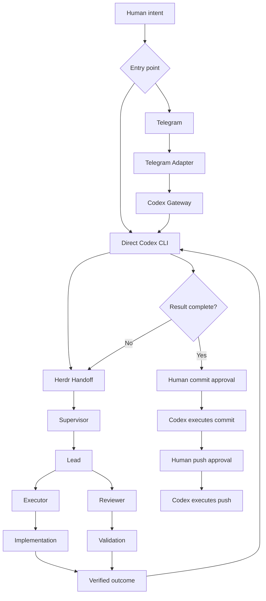

<p align="center">
  
</p>

# Dodging Infinity v0.7.0

[](https://github.com/TheMickeyDodger/dodging-infinity/actions/workflows/ci.yml)
[](LICENSE)
[](https://github.com/TheMickeyDodger/dodging-infinity/releases/latest)

> **Bounding the infinite to the finite.**

## What this is

Dodging Infinity is a governed mission fabric for giving AI real work
without giving AI uncontrolled authority.

**[IMPLEMENTED / PROVEN]** A person states an objective. In v0.7.0 the
system turns it into one bounded remote mission: an exact target and
baseline, explicit rules, a one-shot human approval bound to the exact
rendered mission text before anything consequential runs, evidence-gated
verification before the work can be called finished, and separate local
human gates for commit, push, and release tag. The person can start the
mission from a phone, ask what is happening without interrupting the
work, and receive a verified result, returned exactly once.

**[PLANNED / TARGET]** The target adds a durable `M-####` mission record
with budgets and checkpoints under the Mission Harness, and a human
approval at every consequential boundary, including PR, merge, release,
and deploy gates with exact one-shot remote delivery approvals. It adds a
standing Observation Service that answers what is happening without
touching the work. Nothing in the tree implements the mission record, the
remote delivery approvals, or the Observation Service.

The labels are defined under [How to read this](#how-to-read-this); the
full split is in [Current vs End State](docs/wiki/Current-vs-End-State.md).

The design keeps five things apart and never lets one stand in for another:

- **Intent.** What the human asked for. Intent is not permission.
- **Reasoning.** The Operator role, which reads evidence and chooses bounded
  work for one mission. It is a role, not a model brand.
- **Execution.** The engineering organization that does the work inside an
  engineering mission. It never governs the mission.
- **Proof.** Declared before execution and produced by tests, independent
  review, and verification gates. A result is verified because a gate
  passed, not because a model said so.
- **Authority.** Held by humans, at every consequential boundary, separately.
  Approval for one step never carries to the next.

The end-state operating model, in one line:

> **Grok Bot converses. Operator operates. Herdr engineers. Dodging Infinity governs. Humans authorize. The Reconciler keeps truth current. The Ops Steward learns. The world observes.**

Most agent systems ask a model to do more. Dodging Infinity makes the
problem smaller. A large objective becomes bounded units with explicit
scope, rules, ownership, and validation, so the system scales outward
without silently expanding the authority of any single agent.

The intelligence is replaceable.

**The orchestration contract is not.**

## What it is not

Dodging Infinity is not a wrapper around a chat app, a model provider, or a
coding agent. It is not a persona collection, a multi-agent chat demo, a
task board, a generic workflow engine, or an autonomous Git bot. It is not
merely the engineering organization that runs inside its missions, and it
is not a UI for that organization. It is not a visual simulation that
controls agents.

Each of those can be an interface, an implementation, a dependency, a
candidate, or a reference. The product is the governed mission fabric that
joins them. [Current vs End State](docs/wiki/Current-vs-End-State.md) names
every third party in the design and states what it is not.

## How to read this

Every major claim in this document and in the wiki carries one of six
labels. A section's first paragraph or its status table carries the label
for that section.

| Label | Meaning |
|---|---|
| IMPLEMENTED / PROVEN | Exists in this repository and is pinned by a named test, a CHANGELOG entry, a CI run, or a release evidence identifier. |
| IN PROGRESS | Phase 1 work that exists in this checkout and does not yet implement its target design. |
| PLANNED / TARGET | Design intent. Nothing in the tree implements it. |
| CANDIDATE | A third party under evaluation for a target role. Not selected and not depended on. |
| REFERENCE / FALLBACK | The current implementation of a role that the target design makes replaceable. Telegram as transport and Codex as Operator carry this label. Neither is permanent architecture. |
| DESIGN REFERENCE | A project whose ideas are borrowed. It is not a backend and it carries no authority. |

## Where to go next

| If you want | Read |
|---|---|
| The whole picture and a map of every page | [Wiki home](docs/wiki/Home.md) |
| What exists, what is in progress, and what is target, one table per subsystem | [Current vs End State](docs/wiki/Current-vs-End-State.md) |
| The target stack and where this checkout sits inside it | [Architecture](docs/wiki/Architecture.md) |
| Who may do what, and why the gates are separate | [Authority and Safety](docs/wiki/Authority-and-Safety.md) |
| Phase 0 to Phase 11 | [Roadmap](docs/wiki/Roadmap.md) |
| Five end-state scenarios, each labelled as target | [Examples](docs/wiki/Examples.md) |
| Every operating command and setting that ships today | [Operational reference](docs/reference/README.md) |

## What works today (v0.7.0)

**[IMPLEMENTED / PROVEN]** Everything in this section is pinned by
`tests/test_release_narrative.py`, the v0.7.0 entry in
[CHANGELOG.md](CHANGELOG.md), and GitHub CI run `33330263889`.

**v0.7.0 adds DI-REMOTE-2 Remote Target Repository Routing.** A natural-language
Telegram request can produce a separately planned, one-shot Mission
Authorization that the independent Runtime advances through an isolated managed
target workspace into a real Herdr. No manual clone, target registration,
terminal bootstrap, or manual Herdr setup is required.

The release proves these behaviors:

- Remote mission authorization. A natural-language request produces a
  closed-schema Mission Authorization. Approval is one-shot and bound to the
  exact rendered mission text. Typed chat text carries no authority.
- Remote target routing, route (b). The legacy Operator turn's marker is a
  routing signal only. A separate fresh planning turn produces the
  authorization.
- Telegram as the reference transport. Allowlisted numeric user ids, private
  chats only, and authentication before any content is parsed.
- Isolated managed target materialization, verified for containment,
  canonical remote identity, and the approved baseline.
- Unattended target Herdr bootstrap: Supervisor, Lead, Executor, and Reviewer.
- Independent Reviewer decisions, canonical and persisted.
- Evidence-gated verification. A verified result is gated, not declared.
- Exactly-once final Telegram result: never twice and never silently dropped.
- Ambiguity that fails closed rather than replaying an external effect.
- Separate human Git gates. Commit, push, and release tag are three different
  one-shot approvals.
- Codex as the current reference Operator behind a Gateway with no path to
  the engineering layer.
- Deterministic Runtime and Broker boundaries, with protected workflow
  authority state.

One historical external-target mountain (workflow
`wf-2c901885473fc4781bf82296`, target Herdr task `20260830-094026-9fef2d`)
exercised the real cross-repository path from the exact phone request
through target Herdr execution to a target task COMPLETE and a canonical
target Reviewer APPROVE. It then exposed genuine post-dispatch policy drift
and correctly terminated BLOCKED at `broker_verification_policy_drift`:
`verified_result` and `result_delivery` stayed null, and no target Git
delivery occurred. Those downstream stages did not run in that historical
execution. The corrected verification and exactly-once final-result path
was subsequently certified hermetically and adversarially for v0.7.0. A
fresh post-fix live mountain is not used as release evidence. Separate
artifact delivery and Telegram-native delivery authorization remain outside
that certification.

Remote mission execution authority exists today. Remote delivery authority
does not. Current Telegram missions carry `delivery_authority = none`, and
commit and push remain separate local require-human gates. The chain is
deliberately broken at every link: mission authorization does not authorize
a commit; a commit does not authorize a push; a push does not authorize a
merge; a merge does not authorize a release; a release does not authorize
deployment. Exact, one-shot Telegram-native commit, push, and PR
authorization is planned Phase-I work, not implemented behavior. See the
[Remote Mission Fabric roadmap](docs/remote-mission-fabric-roadmap.md).

The operating model is deliberate. In v0.7.0 the principal operating model is Remote Target Repository Routing (DI-REMOTE-2):

**Phone → Telegram → Mission Authorization → approval → Runtime → Broker → isolated managed target → target Herdr → evidence verification → Telegram result → human-gated delivery**

The released v0.6.3 operating model remains the local-mission path (a mission against this repository):

**Phone → Telegram → Telegram Adapter → Codex Gateway → Codex Operator → Herdr → verified result → human-gated delivery**

The goal is not merely multi-agent coding.

Dodging Infinity creates a reliable boundary between:

- human intent
- operator reasoning
- autonomous engineering
- adversarial review
- deterministic evidence
- human-controlled delivery

## What this system does not tell you

Read this before the architecture, not after it. These are limits of the
EVIDENCE, not gaps in the implementation, and each is pinned by a named test —
see "Claim-to-pin map" below for which one.

- **The model a RUNNING agent uses is not observable through the agent
  interface (F1).** `herdctl observe` reports `configured_model` — the model a
  role's CONFIGURATION asks for — and states that limit in its own diagnostics.
  The projection carries no `running_model` field, no `model_observable` flag
  and no verdict about a running model, because such a field would imply a
  distinction the evidence cannot support.
- **A verdict cannot distinguish a model substitution from a restart (F2).**
  Where a substitution preserves the agent's session, the two situations are
  not representably different in what this system can see, and the surface says
  so rather than guessing.
- **Observation is a reporting surface, not a gate.** It does not mutate,
  repair, prompt agents, change workflow or control execution.
- **A turn record written by a different build of the observer is a claim made
  by different logic.** Skew is reported, naming both the build that wrote the
  record and the build on disk, rather than reconciled silently.
- **DI-REMOTE-2 has both hermetic proof and bounded live proof.** Automated
  coverage proves the fail-closed lifecycle. Production exercised real
  Telegram v2 traffic, GitHub target materialization, fresh Codex role turns,
  unattended target bootstrap, and Supervisor-led Herdr execution on ONE
  historical external-target mountain through target Herdr COMPLETE with a
  canonical target Reviewer APPROVE. That historical execution then exposed
  genuine post-dispatch policy drift and correctly terminated BLOCKED at
  `broker_verification_policy_drift`; `verified_result` and `result_delivery`
  remained null in that historical run. The corrected independent
  verification, `VERIFIED`/`COMPLETED`, and exactly-once final-result path is
  certified hermetically and adversarially for v0.7.0. A fresh post-fix live
  mountain is not used as release evidence. Separate artifact delivery and
  Telegram-native delivery authorization remain outside that certification.

---

# Architecture

## Current architecture on `main`: remote target routing (DI-REMOTE-2, v0.7.0)

**[IMPLEMENTED / PROVEN]** DI-REMOTE-2 is the v0.7.0 remote-target architecture. It runs one exact
bounded mission against a remote GitHub target repository while this
repository remains the permanent control and policy repository. The v0.6.3
local-mission path remains preserved compatibility behavior underneath it.
The complete principal flow:

```text
control repository (this repo: pinned control + policy, never the work target)
    |
    v
fresh Codex turns (read-only sandbox, no resume/fork; the Mission
Authorization comes only from a separate fresh planning turn, route (b))
    |
    v
Runtime (`dirun`, a separate deterministic process)
    |
    v
Broker (privileged, fixed lifecycle actions only)
    |
    v
managed target workspace (isolated, materialized only after approval)
    |
    v
target Herdr (Supervisor -> Lead -> Executor / Reviewer)
    |
    v
evidence verification (a verified result is gated, not declared)
    |
    v
Telegram result (the verified result, exactly once; see caveat below)
    |
    v
human delivery gate (commit/push/PR/tag/release/merge stay local human actions)
```

Each component, precisely:

- **Control repository**: this repository is the permanently pinned
  control and policy repository, never the work target; target
  engineering can never modify it through this path.
- **Telegram transport boundary**: Telegram and the adapter are
  transport only; there is no direct path from them to Herdr or
  `herdctl` (the same boundary as the released local flow below).
- **Fresh restricted Codex turns**: every DI-REMOTE-2 role turn is a
  distinct fresh process with a read-only sandbox and no resume or
  fork; the Mission Authorization is produced only by a separate fresh
  planning turn (route (b); the legacy turn's marker is a routing
  signal with no authority).
- **Deterministic Runtime (`dirun`)**: a separate process, coupled to
  the control chain only through the durable workflow authority store;
  Telegram, the Gateway, and Codex never invoke it in-process.
- **Target Broker**: privileged and fixed-action: nine fixed
  lifecycle actions; `perform` takes exactly
  `(workflow_id, action, revision, capability)`, where the capability
  is the Runtime-minted one-shot token bound to exactly that
  `(workflow_id, action, revision)` tuple; sensitive values (paths,
  URLs, baselines, handoff bytes) are resolved from the protected
  workflow record, never supplied by the caller; capabilities are
  minted by the Runtime, never by Codex.
- **Managed isolated targets**: managed workspaces under the
  protected per-user root, materialized only after one-shot approval
  consumption, with containment, canonical-remote, and baseline
  verification.
- **Target Herdr, Supervisor-first**: the Broker's first dispatch is
  the byte-exact stored handoff (a corrective follow-up is a bounded
  corrective brief, never a technical solution); the target Herdr
  Supervisor is the first strategy-bearing component (the Mission
  Authorization binds
  destination and boundaries, never implementation strategy), and the
  existing Herdr organization (Supervisor -> Lead -> Executor /
  Reviewer) runs unchanged inside the target.
- **Evidence verification**: a verified result is gated, not
  declared: the fresh verification turn's `verified_result` is
  necessary, never sufficient, and the full gate (eight conjuncts, ten
  independent problem codes) is described in "Remote Target Repository
  Routing" below.
- **Telegram result** — before dispatch, the adapter creates and durably
  binds one bot-owned result placeholder. After independent verification, the
  final result edits that same known Telegram object. Ambiguous placeholder
  creation fails closed before dispatch, crash-after-edit recovery reconciles
  against that same object, and a placeholder-bound workflow can never fall
  back to a second result `sendMessage`.
- **Human delivery gate**: no delivery authority exists anywhere in
  the machine path; commit, push, PR, tag, release, and merge remain
  local, human-authorized actions. Telegram-native exact delivery approvals are
  planned in the roadmap, not available today.

---

## Released architecture (v0.6.3): local missions

**[IMPLEMENTED / PROVEN]** This is what the released v0.6.3 tag does, and it remains the
local-mission path on `main` (a mission against this repository).
It is preserved compatibility behavior, not the principal `main`
architecture above.



The architecture deliberately separates responsibilities:

- **Human** defines intent and retains delivery authority.
- **Telegram Adapter** authenticates allowlisted users and transports intent, plans, status, and results.
- **Codex Gateway** accepts and normalizes human intent but has no direct Herdr authority.
- **Codex** is the persistent outer operator.
- **Herdr** owns bounded engineering execution.
- **Supervisor** decomposes and coordinates engineering work.
- **Lead** owns acceptance and completion.
- **Executor** implements.
- **Reviewer** challenges the result independently.
- **Git gates** enforce human authorization at delivery boundaries.

The gateway must never become an alternate execution path around Codex.
The trust boundaries of this path (phone, MacBook, Gateway, Operator,
Herdr, human) are in [docs/wiki/Authority-and-Safety.md](docs/wiki/Authority-and-Safety.md),
and the target stack that grows around it is in
[docs/wiki/Architecture.md](docs/wiki/Architecture.md).

## Where this is going

**[IN PROGRESS]** Phase 1 is host survival and provider-neutral seams, with
v0.7.0 behavior preserved underneath. Two initial seams are now on `main`.
`OperatorSession` provides the provider-neutral `prepare()` / `execute()`
boundary around the current Codex path. `HumanInteractionAdapter` provides
the provider-neutral human interaction boundary, with
`TelegramHumanInteractionAdapter` as the current reference implementation.
The production Telegram controller routes transport operations through that
seam while durable cursor state, queueing, approval validation, Mission
Authorization, result-delivery state, `OperatorSession`, Runtime, Herdr, and
Git authority remain outside it. Both seams stay IN PROGRESS because they are
initial abstractions, not the complete target lifecycles. They are pinned by
`tests/test_operator_session.py` and `tests/test_human_interaction.py`. See
[OperatorSession](docs/wiki/OperatorSession.md) and
[Architecture](docs/wiki/Architecture.md).

**[PLANNED / TARGET]** The target is a mission fabric in which canonical
state, not a conversation or a model process, is the durable truth. That
means a Mission Harness that owns identity, lifecycle, authority, evidence,
blockers, artifacts, budgets, checkpoints, and delivery receipts; a
deterministic Reconciler that compares expected state with reality; a
pull-based Observation Service and a push-based Attention Router; a full
`OperatorSession` lifecycle behind which Pi is the candidate runtime and
Codex is the reference; capability-aware Workers, of which the trusted Mac
is Worker 1; a BrowserCapability that splits reads from writes; true
multi-mission execution; an Ops Steward that learns across missions and
cannot expand its own authority; and, last, a Visual Mission OS that
projects canonical state and is never the backend. None of that is in the
tree. [Current vs End State](docs/wiki/Current-vs-End-State.md) has the
per-subsystem table and [Roadmap](docs/wiki/Roadmap.md) has the phases.

---

## Quick start

**[IMPLEMENTED / PROVEN]** Every command below was checked against
`herdctl.py --help` and the subcommand help in this checkout.

Install the command wrappers once (`herdctl`, `codexgw`, `tgop`, `dirun`
into `~/.local/bin`):

```bash
bash scripts/install.sh
```

Initialize a repository. `ALIAS` is the name you will use to address it,
`CMD` is its verification command:

```bash
herdctl init --alias ALIAS --preset max-quality --test-command 'CMD'
```

If the verification command is not known yet:

```bash
herdctl init --alias ALIAS --preset max-quality
herdctl set-test 'CMD' --repo ALIAS
```

Install the runtime command guard once per Mac, then check the repository:

```bash
herdctl safety-install
herdctl doctor --repo ALIAS
herdctl health --repo ALIAS
```

Dispatch a bounded task and watch it:

```bash
herdctl task 'OBJECTIVE. Do not commit.' --repo ALIAS
herdctl status --repo ALIAS
herdctl observe --repo ALIAS --json
```

Upgrade an initialized repository after pulling a new version:

```bash
herdctl upgrade --repo ALIAS
herdctl doctor --repo ALIAS
```

Commit, push, and release-tag stay behind the human gates described below.
The full command surface, presets, rules, the mission contract, and the
task lifecycle are in
[docs/reference/herdr-operations.md](docs/reference/herdr-operations.md).

---

# Telegram Remote Operator

**[REFERENCE / FALLBACK]** Telegram is the current reference transport,
shipped as an MVP adapter (`telegram_operator/` package, `tgop` entry
script). It is an adapter, not an execution system. Current `main` routes
its transport operations through the initial provider-neutral
`HumanInteractionAdapter` seam via `TelegramHumanInteractionAdapter`.
Telegram remains the reference and fallback transport while Grok and the
broader interaction plane remain planned. The adapter has no direct path to
Herdr or `herdctl`; it authenticates allowlisted users and carries intent,
plans, status, and results between the phone and the Gateway.

```text
Telegram
    |
    v
Telegram Adapter (tgop)
    |
    v
Codex Gateway
    |
    v
Codex Operator
```

## Setup

Configuration lives OUTSIDE any repository, in
`~/Library/Application Support/DodgingInfinity/telegram/config.json`
(directory mode `700`, file mode `600`; the adapter refuses to load a
group/other-readable config because it holds the bot token):

```json
{
  "bot_token": "<token from @BotFather>",
  "allowed_user_ids": [123456789],
  "repository": "/path/to/one/repository"
}
```

- `allowed_user_ids` is an exact NUMERIC Telegram user-id allowlist.
- One repository per adapter instance.
- Durable adapter state (`state.json`) sits next to the config, also
  outside the repository, written atomically.

Run in the foreground with `tgop run`, or install the optional per-user
LaunchAgent with `tgop install-agent` and remove it with
`tgop uninstall-agent`. A single-instance lock refuses a second concurrent
adapter.

## Interaction

- Send natural-language intent (or `/mission <intent>`). The adapter
  authenticates the sender BEFORE parsing any content, then routes the
  intent through the Codex Gateway into a new or resumed Codex
  Operator session.
- A `plan` reply is displayed first, with no controls; its one-shot
  **Approve / Reject** inline buttons are attached only after complete
  delivery is proven and the exact message binding has been durably
  persisted.
- `/status` reports durable adapter lifecycle state, then fetches
  engineering status through a separately constrained READ-ONLY Operator
  turn. It is answered behind any active Gateway work, never streamed.
- `/help` (or `/start`) describes the commands.

Transport, approval binding, crash recovery, the adapter's delivery
authority today, and the security requirements the static and behavioral
suites enforce are in
[docs/reference/telegram-remote-operator.md](docs/reference/telegram-remote-operator.md).

---

# Remote Target Repository Routing (DI-REMOTE-2, v0.7.0)

**[IMPLEMENTED / PROVEN]** DI-REMOTE-2 is the v0.7.0 remote-target capability. It extends the Telegram
remote experience from a local configured repository to one exact bounded
mission against a remote GitHub target while Dodging Infinity remains the
permanent control and policy repository. The historical external-target mountain
remains bounded live evidence; the corrected final-result contract is
certified by the later hermetic and adversarial release evidence.

The flow:

```text
Phone intent
    |
    v
Legacy Codex turn  -> DI-REMOTE-2 marker = ROUTING SIGNAL ONLY
    |                  (no authority; body discarded)
    |               -> or a DI-REMOTE-1 plan envelope -> v1 local path
    v
Separate FRESH restrictive planning turn  (route (b))
    |   produces the DI-REMOTE-2 Mission Authorization
    v
Exact rendered mission on the phone -> one-shot Approve Mission
    |
    v
Durable workflow authority store (workflows.json, schema-2)
    |
    v
Runtime (dirun) claims it and advances the FULL lifecycle:
  materialize isolated workspace -> verify identity + baseline
  -> discover bounded target instructions
  -> fresh read-only handoff-validation turn (SHOWN the real rules)
  -> dispatch the BYTE-EXACT stored handoff to the target Herdr
  -> observe the target (read-only Herdr observability)
  -> fresh verification turn -> VERIFIED -> COMPLETED
  -> verified result returned to Telegram exactly once (human-gated)
    |
    v
Target Herdr Supervisor makes the FIRST engineering plan
```

Deliberate properties:

- Routing is **route (b)**: the legacy Codex turn's DI-REMOTE-2 marker
  is a routing signal that carries no authority; a *separate* fresh
  restrictive planning turn produces the Mission Authorization.
- The Mission Authorization binds the **destination and its
  boundaries only** (objective, constraints, rules, desired outcome,
  acceptance, unresolved questions, execution scope, control identity +
  policy digest, canonical target, issue/PR, approved baseline, bounded
  handoff, revision, `delivery_authority: none`, plus the exact human
  request). Implementation-strategy fields are refused by name; the
  target Herdr Supervisor owns the engineering route. Validation is
  structural; see SECURITY.md for the stated limit and the structural
  protections around it.
- **The user's exact typed message is stored**, not just the Operator's
  paraphrase: it is recorded verbatim in the workflow record
  (`human_intent`, adapter-stamped; an Operator that supplies it is
  refused), rendered quoted into the approved mission text, bound by its
  own sha256, and therefore shown to every role turn via the rendered
  text. This is what makes "the Operator can never change what the human
  said" true.
- Approval is **one-shot** and bound to the exact rendered mission
  text; a v2 approval dispatches no Codex turn — the Runtime, a
  separate process, claims the durably consumed authorization on its
  own. After Approve Mission there is **no manual Mac, clone,
  registration, Herdr-setup, configuration-switching, or terminal
  step**, and the lifecycle runs all the way to a **verified result
  returned to Telegram exactly once** (verified end to end by the
  hermetic release-narrative test). "Exactly once" means never twice and
  never silently dropped — NOT that it always eventually arrives: a
  placeholder-bound workflow can never fall back to a second result
  `sendMessage`, so the result is **not re-sent automatically** in any
  state. An ambiguous edit outcome (durable state `edit_indefinite`) is
  retried only as an idempotent edit of the same bound message; a result
  that does not fit one Telegram message (`degraded_unrenderable`), a
  bound placeholder that is gone or no longer matches (`degraded_unbindable`),
  and an ambiguous placeholder creation before dispatch (placeholder state
  `indefinite`) are terminal; `/status` says so, and recovering a terminal
  outcome is a human step. Records from the pre-DI-REMOTE-3 legacy lane
  (`reserved` / `partial`) are AT-MOST-ONCE and are never re-sent either.
- The initial dispatch is the **byte-exact stored handoff**; corrective
  follow-ups are a separate path bounded (2) as an **authorization-scope
  bound, not a review-round limit**; exceeding it transitions durably
  to NEEDS_REAUTHORIZATION.
- The durable workflow store is **schema-2**; a schema-1 record is
  retired (never upgraded) by `tgop migrate-workflows`, which preserves
  a byte-exact backup.
- A stopped or uninstalled Runtime is an **actionable `/status`
  error** naming the exact remedy commands, never a silent stall; an
  indefinitely unobservable target renders distinctly ("target task
  NOT OBSERVABLE since …"), never like a healthy running one.
- **No delivery authority anywhere**: commit, push, PR, tag, release,
  deploy, and merge remain local, human-authorized actions; the
  Runtime is structurally incapable of them.
- DI-REMOTE-1 approvals can never authorize v2 targets, and v1 local
  behavior is unchanged.
- **A verified result is gated, not declared.** The fresh
  verification turn's `verified_result` is NECESSARY, NEVER
  SUFFICIENT: eight conjuncts (ten independent problem codes) are
  applied against a fresh disk read, the canonical target Reviewer
  APPROVE among them as TARGET-PRODUCED evidence that the target's
  own review process ran and concluded (never independent
  verification), and Herdr lifecycle COMPLETE alone can never
  verify. Observation completeness is SOURCE-SCOPED (ruling R-6):
  the raw global completeness is rendered unaltered, and an
  agents-unprobed global PARTIAL is EXPECTED in production.
- **Dispatch identity recovery is evidence-only (ruling R-3).** An
  identity-unresolved dispatched workflow runs one fresh
  `status_recovery` turn and reconciles by binding EXACTLY ONE
  provable existing child (exact leased-workspace realpath plus the
  lease's own observed task id) or stopping durably BLOCKED; it
  reads NOTHING outside this repository, never spawns, and the
  derived alias is never binding evidence. More BLOCKED outcomes
  are the accepted cost.
- **A full record never kills the Runtime.** A workflow record at a
  hard bound stops that ONE workflow durably with a truthful
  capacity code (record-growth containment); the Runtime process
  and every other workflow keep running.
- **Inherited-defect attribution:** the permanent-PARTIAL stall and
  the never-executable production role-turn wrapper corrected by
  this work were BOTH inherited from accepted task 20260826-022933.
- **What the historical mountain proved:** workflow
  `wf-2c901885473fc4781bf82296` began from a natural-language Telegram request
  targeting an external repository issue, used a
  separate fresh restrictive planning process, preserved the exact human
  request, bound the target baseline
  `3e1833d930723ef4f7220698c98155a925591d4d`, and required a one-shot Telegram
  button approval with `delivery_authority = none`. Runtime, not the Gateway,
  then materialized and trusted the isolated workspace, prepared and validated
  the handoff, recorded durable target identity, and bootstrapped all four
  Herdr roles. Supervisor owned strategy; Lead, Executor, and Reviewer ran
  normally; target Herdr task `20260830-094026-9fef2d` reached COMPLETE; a
  canonical target Reviewer APPROVE was recorded; and target observation
  refreshed from a stale `ACTIVE` reading to `COMPLETE`.
- **How the historical mountain ended:** it exposed genuine post-dispatch
  policy drift and correctly terminated BLOCKED at
  `broker_verification_policy_drift`. `verified_result` and `result_delivery`
  remained null. No target Git delivery occurred: the target stayed at
  baseline `3e1833d930723ef4f7220698c98155a925591d4d` carrying an
  implementation diff only.
- **Final-result release certification:** the corrected independent
  verification, `VERIFIED`/`COMPLETED`, and exactly-once final Telegram result
  path is certified hermetically and adversarially for v0.7.0. A fresh
  post-fix live mountain is not used as release evidence. Separate artifact
  delivery and Telegram-native commit/push/PR/tag/release/deploy/merge
  authorization remain outside this certification.
- **Historical Runtime stabilization, integrated:** stabilization commit
  `d8ec2af409e4086f985be03371a872a84a3767ec` on branch
  `fix/runtime-terminal-reconciliation` (Herdr task `20260830-185309-4c3db7`,
  COMPLETE, final canonical Reviewer round 6 APPROVE) was reviewed and pushed
  before being integrated into `main` for v0.7.0. Its historical validation
  remains part of the evidence record: focused regression 159/159;
  `tests/test_target_runtime.py` 250/250; static checks PASS; Python 3.9.6
  compile PASS; `git diff --check` PASS. The historical repository-wide LIVE
  working-tree loop stood at 35/37 solely because pre-existing live `.herd`
  specimen assertions in `tests/test_hermetic_git.py` and
  `tests/test_reconcile_audit.py` predate that task.

## Runtime service (`dirun`)

`scripts/install.sh` installs the `dirun` wrapper. Run one claim pass
with `dirun once`, the foreground loop with `dirun run`, or install
the optional per-user LaunchAgent:

```bash
scripts/dirun-agent.sh install            # default protected config
scripts/dirun-agent.sh install --config PATH
scripts/dirun-agent.sh uninstall
```

The agent mirrors the tgop LaunchAgent semantics: absolute paths,
RunAtLoad, KeepAlive with a restart throttle, logs beside the
protected state, the validated `codex` directory first on the job
PATH, fail-closed install when `codex` is not resolvable, and a
single-instance lock (the same lock `/status` probes).

## Upgrading: explicit state migration (breaking)

The adapter state schema moved from version 1 to 2. An existing v1
`state.json` fails closed until the human runs `tgop migrate-state`:
the adapter refuses to start against the old schema rather than
migrating silently, because the migration marks every pre-existing
approval superseded FOR V2 PURPOSES ONLY (an old approval must never
authorize a v2 target). The command keeps a byte-exact v1 backup, and
v1 local semantics are unchanged after migration. This break has
existed since the v2 state schema landed; it is documented here as
user-visible breakage.

## What is and is not proven

The complete DI-REMOTE-2 lifecycle is certified hermetically and adversarially
on the stable release tree.

Production separately exercised one historical external-repository mission
through real target Herdr COMPLETE and canonical target Reviewer APPROVE. That
historical execution then exposed genuine post-dispatch policy drift and
correctly terminated BLOCKED; `verified_result` and `result_delivery` remained
null in that run and no target Git delivery occurred.

For v0.7.0, the corrected independent verification,
`VERIFIED`/`COMPLETED`, and exactly-once final-result path is certified by the
later release evidence. A fresh post-fix live mountain is not used as release
evidence. Separate artifact delivery and Telegram-native delivery authority
remain outside this certification.

Historical clean-clone evidence remains GitHub run `33330263889` at
`4eea64f2a915e988dbfd73ad51dd9f6546bc6a8f`; the branch also passed at
`52a97b71a3b5c9f20ff33d4feb1332284cd825b7`, with all four macOS/Ubuntu x
Python 3.9/3.13 jobs green.

The recorded codex-cli 0.149.0 telemetry limitation (A0) remains stated
verbatim in SECURITY.md.

---

# Strict Reviewer protocol

**[IMPLEMENTED / PROVEN]** The Reviewer contract requires exactly one
canonical terminal decision, `HERD_DECISION: APPROVE` or
`HERD_DECISION: REJECT`. Synonyms are not accepted. After a Reviewer turn
the Lead validates and persists the decision:

```bash
herdctl review-decision \
  --repo example-repo \
  --reviewer reviewer1
```

Example:

```json
{
  "valid": true,
  "decision": "APPROVE",
  "raw_token": "APPROVE",
  "round": 2,
  "review_file": "/.../.herd/state/reviews/<task>-round-02.md"
}
```

Malformed output returns `"valid": false`, and the Lead re-prompts the same
Reviewer session rather than interpreting malformed output itself. The
Reviewer is read-only; the deterministic harness persists review evidence.
Reviewer independence and what an APPROVE does and does not mean are in
[docs/wiki/Herdr.md](docs/wiki/Herdr.md); the full protocol is in
[docs/reference/herdr-operations.md](docs/reference/herdr-operations.md).

---

# Human delivery gates

**[IMPLEMENTED / PROVEN]** Three gates, three separate one-shot human
authorizations. Commit approval does not imply push approval, and push
approval does not imply tag approval. Each is bound to exact state and a
short TTL, and any change to that state invalidates it.

```bash
herdctl approve-commit --repo example-repo     # bound to worktree, branch, HEAD, staged diff hash
herdctl approve-push --repo example-repo       # then: git push
herdctl approve-push --tag vX.Y.Z              # then: herdctl push-tag vX.Y.Z
```

`git push --dry-run` does not consume a push approval. Git itself permits
bypass forms such as `git push --no-verify`; runtime-level command
protections and role contracts complement the deterministic Git guards, and
no machine path in this repository holds delivery authority. Commands,
bindings, and what each gate does not authorize are in
[docs/reference/human-git-gates.md](docs/reference/human-git-gates.md).

---

# `herdctl observe`

**[IMPLEMENTED / PROVEN]** Pinned by `tests/test_docs_i8.py` against the
production projection. `doctor`, `status`, and `health` are in
[docs/reference/observability.md](docs/reference/observability.md).

```text
herdctl observe [--repo NAME] [--json]
```

`observe` builds a strictly read-only point-in-time projection of a repository's Herdr.

Human mode prints a concise summary.

JSON mode returns the schema-versioned canonical projection.

Observation is a reporting surface, not a gate.

It does not:

- mutate
- repair
- prompt agents
- change workflow
- control execution

## Observation schema v3

The projection is schema version 3. Top-level keys, in the order the projection
emits them:

```text
schema_version
generated_at
completeness
repository
config
vintage
checkpoint
roles
turns
mission
task
runtime
agents
children
reviews
artifacts
recent_tasks
legacy
diagnostics
```

`vintage`, `checkpoint`, `roles` and `turns` arrived after schema v1: they carry
the task a state file belongs to, the artifacts that disagree about it, the
role-to-agent bindings, and the turn records for this task.

Every source section uses a closed source-state vocabulary:

```text
available
missing
malformed
unreadable
unavailable
empty
```

`completeness` describes visibility only.

It does not affect execution.

## What observation says about models

A role's model appears in the projection under the key `configured_model`, and
in the human render as `model-CONFIGURED=`. Both name the CONFIGURATION, and
the unqualified `model` key that preceded them is gone rather than merely
renamed alongside.

The projection also carries the limit itself as a diagnostic, so a consumer
that reads only the JSON meets it without reading this document:

```text
NO running-model value exists in this document and there is no unqualified
`model` key: the model a RUNNING agent uses is not observable through the
agent interface. `configured_model` states intent.
```

A role whose configuration names no model renders `(unset)` — stated as unset
rather than guessed, and not reported as unknown.

## Hard observation bounds

Observation limits are constants rather than repository-controlled values.

Current bounds include:

- 1 MiB state-file limit
- 64 live agent probes
- 32 listed agents
- 10 recent tasks
- 40 review files
- 32 listed children
- 16 artifacts
- 200-character projected strings
- 2000-entry directory scan budget
- 2000-line dirty-file count cap

Bounds are disclosed rather than silently presenting partial information as complete.

## Observation non-goals

`observe` is not:

- a stream
- a daemon
- a control surface
- a repair command
- a TUI
- a replacement Mission Control

It is an instrument panel.


---

# Documentation map

The wiki is the canonical reviewed source for architecture and direction.
The reference set preserves the complete v0.7.0 operating surface.

| Wiki page | What it answers |
|---|---|
| [Home](docs/wiki/Home.md) | The entry point, the truth-label legend, and the map of every page. |
| [Architecture](docs/wiki/Architecture.md) | The full target stack and where this checkout sits inside it. |
| [Current vs End State](docs/wiki/Current-vs-End-State.md) | One table per subsystem: proven, in progress, or target. |
| [Authority and Safety](docs/wiki/Authority-and-Safety.md) | Intent versus authority, the separate chain, trust boundaries, ambiguous effects. |
| [Missions and Lifecycle](docs/wiki/Missions-and-Lifecycle.md) | The durable mission record, mainline and side states, what ends a mission. |
| [OperatorSession](docs/wiki/OperatorSession.md) | The provider-neutral reasoning seam: built and designed. |
| [Herdr](docs/wiki/Herdr.md) | The engineering organization inside an engineering mission. |
| [Evidence and Verification](docs/wiki/Evidence-and-Verification.md) | Proof contracts and why a verified result is gated. |
| [Observation and Recovery](docs/wiki/Observation-and-Recovery.md) | Reading state without steering it, and surviving failure. |
| [Capabilities and Workers](docs/wiki/Capabilities-and-Workers.md) | Bounded execution hosts and brokered capabilities. |
| [Roadmap](docs/wiki/Roadmap.md) | Phase 0 to Phase 11 and the detailed near-term plan. |
| [Examples](docs/wiki/Examples.md) | Five end-state scenarios, each labelled as target. |
| [Glossary](docs/wiki/Glossary.md) | One definition per term, each labelled. |

| Reference page | Contents |
|---|---|
| [Reference index](docs/reference/README.md) | What the reference set covers and what it does not. |
| [Herdr operations](docs/reference/herdr-operations.md) | Setup, presets, rules, mission contract, task lifecycle, Reviewer protocol, heartbeat, multi-repo, the full command surface. |
| [Human Git gates](docs/reference/human-git-gates.md) | Commit, push, and release-tag gates and their bindings. |
| [Telegram Remote Operator](docs/reference/telegram-remote-operator.md) | Setup detail, transport, interaction, approval binding, recovery, security. |
| [Codex Gateway](docs/reference/codex-gateway.md) | The Gateway boundary, isolation, non-goals, live compatibility validation. |
| [Runtime and host](docs/reference/runtime-and-host.md) | The `dirun` service and the always-on Mac host. |
| [Observability](docs/reference/observability.md) | `doctor`, `status`, `health`, and how they relate to `observe`. |
| [Release evidence v0.7.0](docs/reference/release-evidence-v0.7.0.md) | The release lineage and evidence trail from v0.6.1 to v0.7.0. |

Other documents: the detailed
[Remote Mission Fabric roadmap](docs/remote-mission-fabric-roadmap.md),
[CHANGELOG.md](CHANGELOG.md), [SECURITY.md](SECURITY.md),
[OPERATOR_PROTOCOL.md](OPERATOR_PROTOCOL.md), and
[CONTRIBUTING.md](CONTRIBUTING.md).

---

# Design constraint

Everything in the roadmap is subordinate to one architectural rule:

> **Codex operates. Herdr engineers. Humans authorize delivery.**

Remote interfaces must not bypass the Operator. Gateway code must not
become Herdr. Observability must not become control. Distribution must not
weaken the safety boundaries. The interface gets simpler. The system
underneath stays rigorous.

---

# License

Dodging Infinity is licensed under the [Apache License 2.0](LICENSE).
