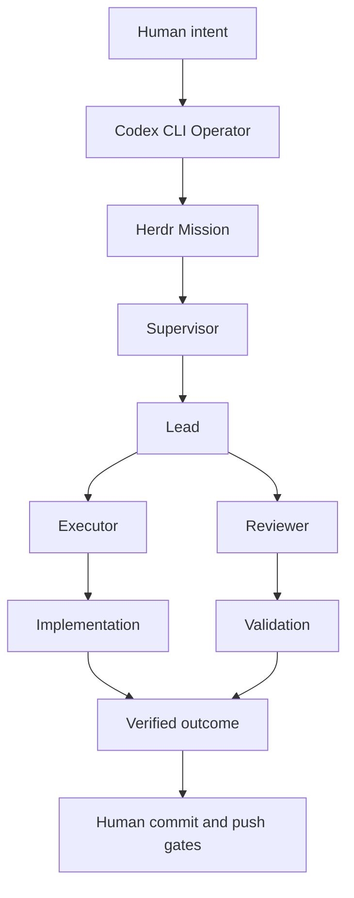

<p align="center">
  
</p>

# Dodging Infinity v0.6.0

[](https://github.com/TheMickeyDodger/dodging-infinity/actions/workflows/ci.yml)
[](LICENSE)
[](https://github.com/TheMickeyDodger/dodging-infinity/releases/latest)

> **Bounding the infinite to the finite.**

**Any problem. Any repo. Any issue.**

Dodging Infinity is a Codex-powered engineering operator built around Herdr for turning human intent into bounded, isolated, and verifiable engineering work.

Codex investigates the problem, gathers context, asks clarifying questions, and creates a precise Herdr mission. Herdr then decomposes, executes, reviews, and validates the work through specialized roles with explicit scope, rules, and completion criteria.

The goal is not merely multi-agent coding. Dodging Infinity creates a reliable boundary between human intent, model reasoning, autonomous execution, adversarial review, and verified outcomes.

## Why Dodging Infinity?

Most agent systems ask a model to do more.

Dodging Infinity does something different: it makes the problem smaller.

Instead of giving one model an expanding context and hoping it can reason across everything, Dodging Infinity recursively turns a large objective into bounded units with explicit scope, rules, ownership, dependencies, and validation.

That means the system can scale outward without silently expanding the authority of any individual agent.

The intelligence is replaceable. The orchestration contract is not.



## What v0.6.0 adds

- **Codex CLI operator workflow** — Codex becomes the human-facing reasoning layer for understanding objectives, gathering context, asking clarifying questions, and preparing precise Herdr missions.
- **Herdr execution boundary** — Herdr owns bounded engineering execution through Supervisor, Lead, Executor, and Reviewer roles with explicit scope and validation.
- **Simplified orchestration model** — Removed the experimental Mission Control layer and returned orchestration ownership to Herdr.
- **Structured mission handoff** — Engineering intent is converted into a durable objective, rules, constraints, and verification expectations before autonomous execution begins.
- **Deterministic review protocol** — Reviewer decisions remain canonical, persisted, and validated through Herdr's existing review gates.
- **Human-controlled delivery** — Commit and push operations remain protected behind deterministic human authorization gates.
- **Repository isolation** — Agents remain bounded to their assigned repository and task scope.
- **Model/runtime flexibility** — Codex, Herdr roles, and supported runtimes remain replaceable components behind stable orchestration contracts.

## How Dodging Infinity works

Dodging Infinity starts with an unbounded human objective and turns it into a bounded engineering mission.

Codex acts as the operator layer. It investigates the repository, understands the problem, gathers relevant context, asks questions when requirements are unclear, and creates a precise Herdr mission containing objectives, constraints, rules, and verification expectations.

Herdr then executes that mission through bounded roles. The Supervisor coordinates, the Lead owns acceptance, Executors implement changes, and Reviewers challenge the result before completion.

Each Herdr owns a finite scope: one repository, one task, one rule set, one runtime state, and explicit completion criteria.

The core loop is:

**understand -> define -> decompose -> solve -> challenge -> validate -> deliver**

The same bounded-work model can apply beyond conventional software engineering wherever complex objectives can be decomposed into isolated units with observable evidence and explicit validation.

## Model and runtime agnosticity

Dodging Infinity separates **responsibilities from models**.

Codex serves as the operator layer for human intent discovery and mission preparation. Herdr roles such as Supervisor, Lead, Executor, and Reviewer remain logical engineering responsibilities rather than fixed model assignments.

Any model/runtime supported by Herdr can be assigned to any execution layer:

```text
Supervisor  -> Model A
Lead        -> Model B
Executor    -> Model C
Reviewer    -> Model D
```

or:

```text
Supervisor  -> Model X
Lead        -> Model X
Executor    -> Model X
Reviewer    -> Model X
```

Different providers, reasoning profiles, permission modes, context sizes, and tool capabilities can therefore be composed within the same Dodging Infinity system.

The orchestration contract belongs to the **role**. The model is a replaceable execution engine for that role.

Presets such as `max-quality`, `all-claude`, and `conservative` are tested convenience configurations, not architectural requirements. A new model or runtime can participate at any layer once it can be launched and controlled through Herdr.

This allows Dodging Infinity to select different forms of intelligence for different bounded problems while preserving the same decomposition, isolation, review, dependency, and validation machinery.

## Example max-quality topology

```text
You
 |
Codex CLI Operator
 |
Herdr Mission
 |
Claude Fable 5 — Supervisor
 |
Claude Opus 5 — Lead
 |
 +---------------------------------+
 | Adversarial Executor Pod        |
 |                                 |
 | Claude Fable 5 — Executor       |
 |              ↕                  |
 | GPT-5.6 Sol High — Reviewer     |
 | Read-only validation role       |
 +---------------------------------+
 |
Lead verification
 |
Human commit gate
 |
Local Git history
 |
Human push gate
 |
Remote
```

The Reviewer remains read-only. The deterministic harness/Lead persists its review transcript; GPT does not need write access to `.herd/state/`.

## Upgrade an existing Herdr repo to v0.6.0

After updating Dodging Infinity and reinstalling the `herdctl` wrapper:

```bash
cd ~/code/internal

herdctl upgrade --repo example-repo
herdctl doctor --repo example-repo
```

v0.6.0 changes the operating model:

1. Start with a human objective in Codex CLI.
2. Codex investigates the repository and gathers the required context.
3. Codex creates a structured Herdr mission containing the objective, constraints, repository rules, acceptance criteria, and verification expectations.
4. Herdr executes the mission through its Supervisor, Lead, Executor, and Reviewer workflow.
5. Human commit and push gates remain required for delivery.

Existing Herdr safety boundaries, repository isolation, review validation, and Git authorization controls remain intact.

## New repo in essentially one command

For a new repository, the recommended workflow is:

1. Open the repository in Codex CLI.
2. Describe the objective in natural language.
3. Codex investigates the codebase and gathers the required context.
4. Codex creates the Herdr mission.
5. Herdr executes the bounded engineering workflow.

Example human objective:

```text
I want to fix the authentication bug in this repository.
Investigate the cause, implement the correct fix, add verification,
and prepare the change for review.
```

Codex converts that intent into a structured Herdr mission containing:

- objective
- constraints
- repository rules
- acceptance criteria
- verification requirements

Herdr then manages execution through:

```text
Supervisor
    |
Lead
    |
+-----------+
| Executor  |
| Reviewer  |
+-----------+
```

The underlying repository setup remains:

```bash
herdctl init \
  --alias my-repo \
  --preset max-quality \
  --test-command 'npm test && npm run build'
```

That creates the isolated Herdr workspace, repository state, runtime configuration, and Git authorization boundaries required for execution.

If you do not yet know the verification command:

```bash
herdctl init --alias my-repo --preset max-quality
herdctl set-test 'npm test && npm run build' --repo my-repo
```

## Presets

Presets configure the runtime assignments, models, and permissions used by Herdr roles. They do not change the orchestration model.

List available presets:

```bash
herdctl presets
```

Current built-ins:

```text
max-quality   Multi-model configuration optimized for adversarial execution and review
all-claude    Claude-based runtime configuration
conservative  Explicit approval-focused configuration
```

Apply a preset to an existing repository:

```bash
herdctl preset max-quality --repo example-repo
```

The orchestration hierarchy remains independent from the preset. Presets only determine which runtimes, models, and permission profiles are assigned to each role.

## Strict Reviewer protocol

The Reviewer contract requires exactly one terminal line:

```text
HERD_DECISION: APPROVE
```

or:

```text
HERD_DECISION: REJECT
```

No synonym is accepted. `ACCEPT`, `LGTM`, `PASS`, etc. are malformed.

After every Reviewer turn, the Lead is instructed to run:

```bash
herdctl review-decision --repo example-repo --reviewer reviewer1
```

Example deterministic output:

```json
{
  "valid": true,
  "decision": "APPROVE",
  "raw_token": "APPROVE",
  "round": 2,
  "review_file": "/.../.herd/state/reviews/<task>-round-02.md"
}
```

A malformed result produces `"valid": false`; the Lead must re-prompt the **same Reviewer session** for a canonical token rather than interpreting the synonym itself.

This also solves read-only Reviewer persistence: Herd writes the captured transcript under `.herd/state/reviews/` while the Reviewer remains sandboxed read-only.

## Human commit gate

Stage exactly what you want to commit, inspect it, then:

```bash
herdctl approve-commit --repo example-repo
```

The one-shot approval is bound to:

- repo/worktree
- branch
- HEAD
- exact staged diff hash
- short TTL

A changed staged diff, branch or HEAD invalidates the token. The deeper Git reference-transaction guard also blocks ordinary attempts to bypass pre-commit with `git commit --no-verify`.

## Human push gate

After a local commit, inspect:

```bash
git status -sb
git log --oneline origin/main..HEAD
```

Then authorize exactly one push:

```bash
herdctl approve-push --repo example-repo
```

The approval screen shows:

- exact repo/path
- current branch and HEAD
- remote name and URL
- target ref
- upstream
- best-effort list of commits ahead

You type the repo alias to authorize exactly one push for a short TTL.

Then:

```bash
git push
```

The Git pre-push guard validates the exact branch/HEAD/remote/target and consumes the token at the push boundary.

### Push guard note

Git itself allows a human/non-hook-aware runtime to bypass `pre-push` with `git push --no-verify`. For the current proven workforce, Claude's global PreToolUse guard independently blocks `--no-verify` and force-push forms before Bash executes, while the Codex Reviewer is read-only. The role contracts also forbid bypassing the gate. If you later put a different write-capable runtime in an Executor seat, give it an equivalent runtime-level command guard if you require the same hard guarantee.

## Claude Auto Mode setup

Run once per Mac after installing/upgrading Herd:

```bash
herdctl safety-install
```

It installs/maintains the Claude PreToolUse commit/push guard and ensures the user-level `autoMode.environment` contains:

```json
["$defaults"]
```

This preserves Claude's built-in conservative trust boundary (working repo + configured remotes) instead of broadening trust to unrelated repos. Existing user Auto Mode entries are preserved.

## Rules and task-local constraints

Dodging Infinity supports constraints at two scopes.

Repository rules are durable and apply to future tasks in that repository:

```bash
herdctl rules --repo example-repo
herdctl rules add "Never modify migrations" --repo example-repo
herdctl rules remove "Never modify migrations" --repo example-repo
```

Task-local rules apply only to one dispatched task:

```bash
herdctl task "Implement X" \
  --repo example-repo \
  --rule "Only modify README.md" \
  --rule "Do not commit"
```

Task-local rules are layered into that task's effective policy and do not persist into the repository's durable rule set.


## Task lifecycle

```text
IDLE -> ACTIVE -> COMPLETE
               -> ABORTED
               -> ERROR
```

Start:

```bash
herdctl task 'Implement X. Do not commit.' --repo example-repo
```

Inspect:

```bash
herdctl task-status --repo example-repo
herdctl status --repo example-repo
```

The Supervisor finishes with:

```bash
herdctl task-complete \
  --repo example-repo \
  --checkpoint-file .herd/state/task-checkpoint.md
```

Completed-task context is checkpointed to bounded `.herd/memory/task-history.md`. The next top-level task can start with fresh runtime context while rejection rounds inside the same task remain long-running.

## Idle-aware heartbeat

```text
15-minute tick
 |
 +-- no ACTIVE task ------------------> skip
 |
 +-- Supervisor working/blocked ------> skip
 |
 +-- ACTIVE + Supervisor idle/done ---> health-check
```

## Multi-repo usage

```bash
herdctl task 'Fix auth' --repo example-repo
herdctl task 'Improve onboarding' --repo zenmo
herdctl status --repo another-repo
```

Every repo has its own Herdr workspace, task state, context, memory and Git approval tokens.

## Main commands

```text
herdctl init [--alias NAME] [--preset PRESET] [--test-command COMMAND]
herdctl presets
herdctl preset PRESET --repo NAME
herdctl set-test COMMAND --repo NAME
herdctl upgrade --repo NAME [--preset PRESET]
herdctl repos [--prune]
herdctl safety-install
herdctl doctor --repo NAME
herdctl integrations --repo NAME
herdctl bootstrap --repo NAME [--force]
herdctl task "..." --repo NAME [--rule RULE ...] [--rejection-drill]
herdctl task-status --repo NAME
herdctl task-complete --repo NAME --checkpoint-file FILE
herdctl rules --repo NAME
herdctl rules add RULE --repo NAME
herdctl rules remove RULE --repo NAME
herdctl review-decision --repo NAME --reviewer reviewer1
herdctl clear-contexts --repo NAME
herdctl approve-commit --repo NAME
herdctl approve-push --repo NAME [--remote origin] [--target-branch BRANCH]
herdctl status --repo NAME
herdctl read ROLE --repo NAME
herdctl prompt ROLE "..." --repo NAME
herdctl heartbeat --once --repo NAME
herdctl restart-heartbeat --repo NAME
```
## License

Dodging Infinity is licensed under the [Apache License 2.0](LICENSE).
