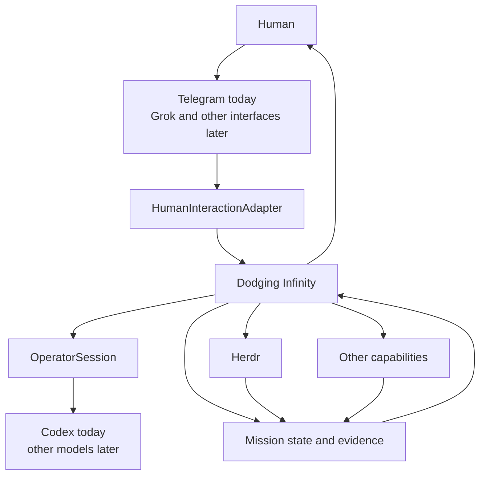

<p align="center">
  
</p>

# Dodging Infinity

[](https://github.com/TheMickeyDodger/dodging-infinity/actions/workflows/ci.yml)
[](LICENSE)
[](https://github.com/TheMickeyDodger/dodging-infinity/releases/latest)

> **Bounding the infinite to the finite.**

Dodging Infinity lets AI work on real problems while keeping important decisions in your hands.

The idea is simple.

You should be able to say:

> **Figure out why this is broken, fix it, prove the fix, and get it ready to ship. Do not ship anything without me.**

Dodging Infinity takes that big request and turns it into a mission with clear rules.

It keeps track of:

- what you asked for
- where the work is allowed to happen
- what the AI is allowed to do
- what counts as finished
- what proof is required
- what still needs your approval

The goal is not to build one giant AI agent.

The goal is to let AI do a lot of useful work without giving it permission to do whatever it wants.

---

## What using it should feel like

Imagine you are away from your computer.

You send this from your phone:

> The export path is timing out. Figure out why, fix it if we safely can, prove the fix, and get it ready for review. Do not ship anything.

Dodging Infinity turns that request into a mission.

You see the rules before the work starts.

You approve them.

Then the system gets to work.

If the problem needs engineering, Herdr can run a small engineering team:

```text
Supervisor
    ↓
   Lead
    ↓
 Executor
    ↕
 Reviewer
```

The Executor writes the change.

The Reviewer can reject it.

Tests and other proof are collected.

You can check what is happening without stopping the work.

When the mission is finished, the result comes back to you.

But the AI still cannot just ship it.

A commit is one decision.

A push is another.

A merge is another.

A release is another.

A deploy is another.

You stay in control of those steps.

Some of this experience works today.

Some of it is where the project is going.

The rest of this README makes that split clear.

---

## How the pieces fit

The project follows this idea:

> **Grok Bot converses. Operator operates. Herdr engineers. Dodging Infinity governs. Humans authorize. The Reconciler keeps truth current. The Ops Steward learns. The world observes.**

Here is what that means in normal English.

**Grok Bot converses.**

Grok is where I want the main chat experience to go. Telegram does that job today.

**Operator operates.**

The Operator figures out what work needs to happen. Codex does that job today.

**Herdr engineers.**

When code needs to change, Herdr handles the engineering. A Supervisor plans the work, a Lead coordinates it, an Executor builds it, and a Reviewer checks it.

**Dodging Infinity governs.**

Dodging Infinity keeps track of the mission, the rules, the work, the proof, and the approvals.

**Humans authorize.**

Important actions wait for you.

**The Reconciler keeps truth current.**

This is future work. It will check whether what Dodging Infinity thinks is happening matches what is actually happening.

**The Ops Steward learns.**

This is also future work. It will look for problems that keep happening and suggest permanent fixes.

**The world observes.**

The long-term plan includes a visual mission world on the desktop. It will show what the system is doing. It will not run the system itself.

---

## What works today

The current release is **v0.7.0**.

Dodging Infinity can already take a real request from a phone and run a controlled engineering mission against another GitHub repository.

The current remote flow looks like this:

```text
Phone
  ↓
Telegram
  ↓
Mission approval
  ↓
Dodging Infinity Runtime
  ↓
Isolated target workspace
  ↓
Herdr
  ↓
Review and verification
  ↓
Verified result
  ↓
You
```

Today, Dodging Infinity can:

- accept a natural-language request from Telegram
- ask for approval before the remote mission starts
- bind that approval to the exact mission you saw
- create an isolated workspace for the target repository
- verify that it is working from the approved starting point
- start Herdr inside that target
- run Supervisor, Lead, Executor, and Reviewer roles
- let the Reviewer reject work and require another round
- require proof before calling the result verified
- return the final result through Telegram
- avoid sending the same final result twice
- stop instead of guessing when an outside action may have already happened
- keep commit, push, and release-tag actions behind separate human approvals on the Mac

Telegram is the main remote interface today.

Codex is the current Operator.

Herdr is the engineering team.

The repo also has the first versions of two larger interfaces:

- `OperatorSession`
- `HumanInteractionAdapter`

These are early pieces of the future architecture.

They are not finished versions of everything described in the roadmap.

---

## Herdr

Herdr is the engineering team inside an engineering mission.

It is not Dodging Infinity itself.

```text
Supervisor
    ↓
   Lead
    ↓
 Executor
    ↕
 Reviewer
```

The jobs are different on purpose.

The **Supervisor** decides the engineering direction.

The **Lead** coordinates the work.

The **Executor** builds and tests the change.

The **Reviewer** checks the work independently and can reject it.

A Reviewer approval is useful proof.

It does not automatically mean the whole mission is finished.

Dodging Infinity still checks whether the mission has everything it needs.

---

## The Operator

The Operator is the part that figures out what work should happen next.

Today, Codex fills that job.

The long-term goal is to make that part replaceable.

Dodging Infinity should be able to use different models without changing the rules around the mission.

That is what `OperatorSession` is starting to make possible.

The model should be a choice.

It should not be the whole system.

---

## Important actions still need you

A request to solve a problem is not permission to ship code.

Those are different things.

Today, Dodging Infinity already keeps commit, push, and release-tag actions behind separate human approvals.

The long-term flow extends the same idea:

```text
approve the mission
        ↓
approve the commit
        ↓
approve the push or PR
        ↓
approve the merge
        ↓
approve the release
        ↓
approve the deploy
```

Approving one step does not approve the next one.

That is intentional.

---

## What happens when Dodging Infinity is not sure

Dodging Infinity should stop instead of guessing.

If work says it is finished but the required review is missing, it is not finished.

If an outside action may have already happened, Dodging Infinity should check before trying it again.

If the mission changes enough that the old approval no longer matches the work, the system should ask again.

This matters more than making the AI look smart.

A real external mission has already shown why.

The mission reached Herdr completion and received Reviewer approval.

Then Dodging Infinity noticed that the verification rules no longer matched what it expected.

It stopped.

No verified result was claimed.

Nothing was delivered to the target repository.

That is a good failure.

Stop clearly.

Keep the evidence.

Do not guess.

---

## Why build this?

Starting AI agents is getting easy.

The hard part is everything around them.

How do you make AI work:

- survive crashes
- stay inside the right repository
- keep different jobs separate
- show what is happening
- recover when something dies
- prove that the work is actually correct
- avoid repeating an action that may have already happened
- switch models without rebuilding everything
- keep important actions under human control

That is what Dodging Infinity is trying to solve.

---

## Where this is going

The end goal is much bigger than coding.

Dodging Infinity is being built toward a general system for work like:

- software engineering
- research
- browser QA
- operations analysis
- reports
- monitoring
- planning
- automation work
- release preparation
- maintenance

A mission should be able to run for hours or days without depending on one chat window or one model process staying alive.

You should be able to leave your computer alone, check in from your phone, and still know what is happening.

### Phase 1

Finish the basic building blocks.

That includes:

- better recovery when the Mac restarts
- `DurableExecution`
- `Capability`
- `Worker`
- testing DBOS as a possible durability layer
- testing Pi as a possible Operator runtime
- testing Grok as a future chat interface

Telegram and Codex stay in place while those ideas are tested.

### Phase 2

Build the Mission Harness.

Each mission gets its own long-lived record.

That record will keep things like:

- what the mission is
- what rules it has
- what proof it needs
- what is blocked
- what files it produced
- what state it is in
- what the human approved

This is also where the Reconciler and better read-only mission status come in.

### Phase 3

Make conversation work across many missions.

That means:

- route a message to the right mission
- tell the human when something needs attention
- answer status questions without interrupting the work
- add Grok as the preferred chat interface

### Later

Later phases add:

- more than one mission running at the same time
- browser work
- more file and report types
- more worker machines
- stronger crash and outage testing
- the Ops Steward
- easier installation
- more kinds of non-engineering work
- the visual mission world

The deeper roadmap is here:

[docs/wiki/Roadmap.md](docs/wiki/Roadmap.md)

---

## Long-term architecture

This is the direction of travel, not a picture of what is all finished today.



The important part is not the boxes.

The important part is who does what.

The chat interface is how you talk to the system.

The Operator figures out the work.

Herdr handles engineering.

Dodging Infinity keeps the mission and its rules.

You approve the important actions.

---

## Set it up on your machine

Dodging Infinity runs locally.

For the full remote workflow today, the main machine is a Mac that you trust and control.

That Mac does the actual work.

Your phone is just the remote control.

### What you need

Before installing Dodging Infinity, make sure you have:

- **macOS** for the full always-on remote setup
- **Python 3**
- **Git**
- **Herdr**
- **Codex CLI**, installed and signed in
- access to the Git repositories you want Dodging Infinity to work with

The test suite is checked on macOS and Ubuntu with Python 3.9 and Python 3.13.

The full Telegram and background-service setup is Mac-first today because it uses macOS LaunchAgents.

If you only want to work on or test the codebase, the project is also tested on Ubuntu.

### Check the basics

You should be able to run:

```bash
python3 --version
git --version
codex --version
herdr agent list
```

If one of those commands is missing, install or configure that system before continuing.

### Clone Dodging Infinity

```bash
git clone https://github.com/TheMickeyDodger/dodging-infinity.git
cd dodging-infinity
```

### Install the local commands

Run:

```bash
bash scripts/install.sh
```

This installs command wrappers into:

```text
~/.local/bin
```

You get:

```text
herdctl
codexgw
tgop
dirun
```

If `~/.local/bin` is not already on your `PATH`, add this to your shell profile:

```bash
export PATH="$HOME/.local/bin:$PATH"
```

Then reload your shell or open a new terminal.

Check that the commands are available:

```bash
herdctl --help
codexgw --help
tgop --help
dirun --help
```

### Install the command guard

Dodging Infinity keeps commit and push actions behind explicit human approval.

Install the local guard once:

```bash
herdctl safety-install
```

### Add a repository

Move into a repository you want Dodging Infinity to work with:

```bash
cd /path/to/your/repository
```

Initialize it:

```bash
herdctl init \
  --alias my-repo \
  --preset max-quality \
  --test-command 'YOUR_TEST_COMMAND'
```

For example:

```bash
herdctl init \
  --alias my-app \
  --preset max-quality \
  --test-command 'python3 -m pytest'
```

If you do not know the test command yet:

```bash
herdctl init --alias my-repo --preset max-quality
herdctl set-test 'YOUR_TEST_COMMAND' --repo my-repo
```

### Make sure everything is ready

Run:

```bash
herdctl doctor --repo my-repo
herdctl health --repo my-repo
```

`doctor` checks the local tools and configuration.

`health` checks whether the repository's Herdr setup is ready to work.

Fix anything they report before starting a real mission.

### Try a local task

Start small:

```bash
herdctl task \
  'Find the failing test, explain the cause, and fix it. Do not commit.' \
  --repo my-repo
```

Watch it:

```bash
herdctl status --repo my-repo
```

Or get the structured view:

```bash
herdctl observe --repo my-repo --json
```

At this point, the local Herdr workflow is ready.

### Optional: control it from Telegram

You only need this if you want to start and watch missions from your phone.

Create a Telegram bot with BotFather and get its bot token.

You also need your numeric Telegram user ID.

Create:

```text
~/Library/Application Support/DodgingInfinity/telegram/config.json
```

Example:

```json
{
  "bot_token": "<token from @BotFather>",
  "allowed_user_ids": [123456789],
  "repository": "/path/to/your/repository"
}
```

Only the user IDs in `allowed_user_ids` can use that adapter.

Start it in the foreground:

```bash
tgop run
```

Or install it as a background service on your Mac:

```bash
tgop install-agent
```

Remove it later with:

```bash
tgop uninstall-agent
```

From Telegram:

```text
/status
```

shows what Dodging Infinity is doing.

```text
/help
```

shows the available commands.

### Optional: run the remote mission Runtime in the background

The remote target workflow also uses `dirun`.

Run it in the foreground with:

```bash
dirun run
```

Or install the macOS background service:

```bash
scripts/dirun-agent.sh install
```

Remove it later with:

```bash
scripts/dirun-agent.sh uninstall
```

### What needs to stay available

For the current remote setup to work while you are away, the Mac needs to:

- stay powered on
- stay connected to the internet
- have access to the repositories you use
- stay signed in to Codex
- stay authenticated to Git and GitHub
- have Herdr available
- keep the Telegram adapter running
- keep the Dodging Infinity Runtime running

There is no cloud service hiding behind this today.

Your Mac is the worker.

Your phone is how you talk to it.

### If setup fails

Start with:

```bash
herdctl doctor --repo my-repo
herdctl health --repo my-repo
```

Then see:

- [Herdr operations](docs/reference/herdr-operations.md)
- [Telegram remote operator](docs/reference/telegram-remote-operator.md)
- [Runtime and host](docs/reference/runtime-and-host.md)
- [Human Git gates](docs/reference/human-git-gates.md)

---

## Quick start

If everything is already installed, the short version is:

```bash
git clone https://github.com/TheMickeyDodger/dodging-infinity.git
cd dodging-infinity
bash scripts/install.sh
herdctl safety-install
```

Then move into the repository you want to work on:

```bash
cd /path/to/your/repository
```

Initialize it:

```bash
herdctl init \
  --alias my-repo \
  --preset max-quality \
  --test-command 'YOUR_TEST_COMMAND'
```

Check it:

```bash
herdctl doctor --repo my-repo
herdctl health --repo my-repo
```

Start a task:

```bash
herdctl task 'Fix the failing test. Do not commit.' --repo my-repo
```

Check what is happening:

```bash
herdctl status --repo my-repo
```

The full command reference is here:

[docs/reference/herdr-operations.md](docs/reference/herdr-operations.md)

---

## Human Git gates

Commit, push, and release tag are separate approvals today.

Approve one commit:

```bash
herdctl approve-commit --repo my-repo
```

Approve one push:

```bash
herdctl approve-push --repo my-repo
```

Approve one release tag:

```bash
herdctl approve-push --tag vX.Y.Z
herdctl push-tag vX.Y.Z
```

More detail:

[docs/reference/human-git-gates.md](docs/reference/human-git-gates.md)

---

## More documentation

For the deeper technical details:

- [Architecture](docs/wiki/Architecture.md)
- [Current vs End State](docs/wiki/Current-vs-End-State.md)
- [Authority and Safety](docs/wiki/Authority-and-Safety.md)
- [Missions and Lifecycle](docs/wiki/Missions-and-Lifecycle.md)
- [OperatorSession](docs/wiki/OperatorSession.md)
- [Herdr](docs/wiki/Herdr.md)
- [Evidence and Verification](docs/wiki/Evidence-and-Verification.md)
- [Observation and Recovery](docs/wiki/Observation-and-Recovery.md)
- [Capabilities and Workers](docs/wiki/Capabilities-and-Workers.md)
- [Roadmap](docs/wiki/Roadmap.md)
- [Examples](docs/wiki/Examples.md)
- [Glossary](docs/wiki/Glossary.md)
- [Operational reference](docs/reference/README.md)
- [v0.7.0 release evidence](docs/reference/release-evidence-v0.7.0.md)
- [CHANGELOG](CHANGELOG.md)
- [Security](SECURITY.md)

---

## What this project is not

Dodging Infinity is not:

- a Telegram bot
- a Codex wrapper
- a Grok wrapper
- one giant prompt
- a collection of AI characters
- an autonomous Git bot
- a task board
- a system where the model decides what it is allowed to do

Those tools can be part of Dodging Infinity.

They are not Dodging Infinity.

---

## Contributing

Contributions are welcome.

Start with:

[CONTRIBUTING.md](CONTRIBUTING.md)

For security issues, see:

[SECURITY.md](SECURITY.md)

---

## License

Dodging Infinity is licensed under Apache 2.0.

See [LICENSE](LICENSE).
