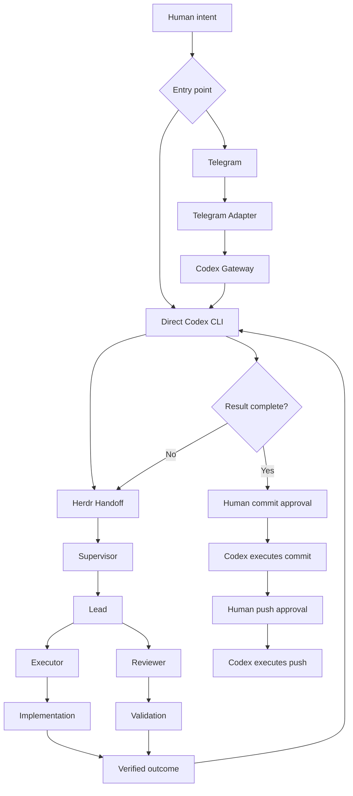

<p align="center">
  
</p>

# Dodging Infinity v0.7.0

[](https://github.com/TheMickeyDodger/dodging-infinity/actions/workflows/ci.yml)
[](LICENSE)
[](https://github.com/TheMickeyDodger/dodging-infinity/releases/latest)

> **Bounding the infinite to the finite.**

**Any problem. Any repo. Any issue.**

Dodging Infinity is a remote engineering orchestration system that turns human
intent into bounded, isolated, and verifiable work on a trusted Mac. Codex
operates the mission lifecycle; the target Herdr Supervisor owns engineering
strategy and delegates through Lead, Executor, and Reviewer.

[v0.6.1](https://github.com/TheMickeyDodger/dodging-infinity/releases/tag/v0.6.1) established the repository-level Codex Operator contract, explicit operating protocol, and strictly read-only health and observability surfaces.

[v0.6.2](https://github.com/TheMickeyDodger/dodging-infinity/releases/tag/v0.6.2) added **Codex Gateway v0.1**.

[v0.6.3](https://github.com/TheMickeyDodger/dodging-infinity/releases/tag/v0.6.3) adds the implemented **Telegram Remote Operator MVP**. A trusted, allowlisted Telegram user can submit intent from a phone, receive and approve or reject a Codex plan, resume the same Codex session, query status, and receive the verified result. The adapter has no direct path to Herdr or `herdctl`.

**v0.7.0 adds DI-REMOTE-2 Remote Target Repository Routing.** A natural-language
Telegram request can produce a separately planned, one-shot Mission
Authorization that the independent Runtime advances through an isolated managed
target workspace into a real Herdr. No manual clone, target registration,
terminal bootstrap, or manual Herdr setup is required.

One historical live Mitiq #2802 mountain exercised the real cross-repository
path through target Herdr COMPLETE and then exposed genuine post-dispatch
policy drift and correctly terminated BLOCKED. The corrected final-result path
was subsequently certified hermetically and adversarially for v0.7.0. A fresh
post-fix live mountain is not used as release evidence, and separate artifact
delivery is not claimed by that certification.

The operating model is deliberate. In v0.7.0 the principal operating model is Remote Target Repository Routing (DI-REMOTE-2):

**Phone → Telegram → Mission Authorization → approval → Runtime → Broker → isolated managed target → target Herdr → evidence verification → Telegram result → human-gated delivery**

One historical live Mitiq #2802 mountain (workflow
`wf-2c901885473fc4781bf82296`, target Herdr task `20260830-094026-9fef2d`)
exercised this path from the exact phone request through target Herdr
execution to a target task COMPLETE and a canonical target Reviewer APPROVE.
It then exposed genuine post-dispatch policy drift and correctly terminated
BLOCKED at `broker_verification_policy_drift`: `verified_result` and
`result_delivery` stayed null, and no target Git delivery occurred. Those
downstream stages did not run in that historical execution. The corrected
verification and exactly-once final-result path is now certified hermetically
and adversarially for v0.7.0; a fresh post-fix live mountain is not used as
release evidence. Separate artifact delivery and Telegram-native delivery
authorization remain outside that certification.

Remote mission execution authority exists today; remote delivery authority does
not. Current Telegram missions carry `delivery_authority = none`, and commit and
push remain separate local require-human gates. Exact, one-shot Telegram-native
commit, push, and PR authorization is planned Phase-I work, not implemented
behavior. See the [Remote Mission Fabric roadmap](docs/remote-mission-fabric-roadmap.md).

The released v0.6.3 operating model remains the local-mission path (a mission against this repository):

**Phone → Telegram → Telegram Adapter → Codex Gateway → Codex Operator → Herdr → verified result → human-gated delivery**

The goal is not merely multi-agent coding.

Dodging Infinity creates a reliable boundary between:

- human intent
- operator reasoning
- autonomous engineering
- adversarial review
- deterministic evidence
- human-controlled delivery

## What this system does not tell you

Read this before the architecture, not after it. These are limits of the
EVIDENCE, not gaps in the implementation, and each is pinned by a named test —
see "Claim-to-pin map" below for which one.

- **The model a RUNNING agent uses is not observable through the agent
  interface (F1).** `herdctl observe` reports `configured_model` — the model a
  role's CONFIGURATION asks for — and states that limit in its own diagnostics.
  The projection carries no `running_model` field, no `model_observable` flag
  and no verdict about a running model, because such a field would imply a
  distinction the evidence cannot support.
- **A verdict cannot distinguish a model substitution from a restart (F2).**
  Where a substitution preserves the agent's session, the two situations are
  not representably different in what this system can see, and the surface says
  so rather than guessing.
- **Observation is a reporting surface, not a gate.** It does not mutate,
  repair, prompt agents, change workflow or control execution.
- **A turn record written by a different build of the observer is a claim made
  by different logic.** Skew is reported, naming both the build that wrote the
  record and the build on disk, rather than reconciled silently.
- **DI-REMOTE-2 has both hermetic proof and bounded live proof.** Automated
  coverage proves the fail-closed lifecycle. Production exercised real
  Telegram v2 traffic, GitHub target materialization, fresh Codex role turns,
  unattended target bootstrap, and Supervisor-led Herdr execution on ONE
  historical Mitiq #2802 mountain through target Herdr COMPLETE with a
  canonical target Reviewer APPROVE. That historical execution then exposed
  genuine post-dispatch policy drift and correctly terminated BLOCKED at
  `broker_verification_policy_drift`; `verified_result` and `result_delivery`
  remained null in that historical run. The corrected independent
  verification, `VERIFIED`/`COMPLETED`, and exactly-once final-result path is
  certified hermetically and adversarially for v0.7.0. A fresh post-fix live
  mountain is not used as release evidence. Separate artifact delivery and
  Telegram-native delivery authorization remain outside that certification.


## Why Dodging Infinity?

Most agent systems ask a model to do more.

Dodging Infinity does something different:

**it makes the problem smaller.**

Instead of giving one model an expanding context and hoping it can reason across everything, Dodging Infinity recursively turns a large objective into bounded units with explicit scope, rules, ownership, dependencies, and validation.

That means the system can scale outward without silently expanding the authority of any individual agent.

The intelligence is replaceable.

**The orchestration contract is not.**

---

# Architecture

## Current architecture on `main`: remote target routing (DI-REMOTE-2, v0.7.0)

DI-REMOTE-2 is the v0.7.0 remote-target architecture. It runs one exact
bounded mission against a remote GitHub target repository while this
repository remains the permanent control and policy repository. The v0.6.3
local-mission path remains preserved compatibility behavior underneath it.
The complete principal flow:

```text
control repository (this repo: pinned control + policy, never the work target)
    |
    v
fresh Codex turns (read-only sandbox, no resume/fork; the Mission
Authorization comes only from a separate fresh planning turn — route (b))
    |
    v
Runtime (`dirun`, a separate deterministic process)
    |
    v
Broker (privileged, fixed lifecycle actions only)
    |
    v
managed target workspace (isolated, materialized only after approval)
    |
    v
target Herdr (Supervisor -> Lead -> Executor / Reviewer)
    |
    v
evidence verification (a verified result is gated, not declared)
    |
    v
Telegram result (the verified result, exactly once — see caveat below)
    |
    v
human delivery gate (commit/push/PR/tag/release/merge stay local human actions)
```

Each component, precisely:

- **Control repository** — this repository is the permanently pinned
  control and policy repository, never the work target; target
  engineering can never modify it through this path.
- **Telegram transport boundary** — Telegram and the adapter are
  transport only; there is no direct path from them to Herdr or
  `herdctl` (the same boundary as the released local flow below).
- **Fresh restricted Codex turns** — every DI-REMOTE-2 role turn is a
  distinct fresh process with a read-only sandbox and no resume or
  fork; the Mission Authorization is produced only by a separate fresh
  planning turn (route (b) — the legacy turn's marker is a routing
  signal with no authority).
- **Deterministic Runtime (`dirun`)** — a separate process, coupled to
  the control chain only through the durable workflow authority store;
  Telegram, the Gateway, and Codex never invoke it in-process.
- **Target Broker** — privileged and fixed-action: nine fixed
  lifecycle actions; `perform` takes exactly
  `(workflow_id, action, revision, capability)`, where the capability
  is the Runtime-minted one-shot token bound to exactly that
  `(workflow_id, action, revision)` tuple; sensitive values (paths,
  URLs, baselines, handoff bytes) are resolved from the protected
  workflow record, never supplied by the caller; capabilities are
  minted by the Runtime, never by Codex.
- **Managed isolated targets** — managed workspaces under the
  protected per-user root, materialized only after one-shot approval
  consumption, with containment, canonical-remote, and baseline
  verification.
- **Target Herdr, Supervisor-first** — the Broker's first dispatch is
  the byte-exact stored handoff (a corrective follow-up is a bounded
  corrective brief, never a technical solution); the target Herdr
  Supervisor is the first strategy-bearing component (the Mission
  Authorization binds
  destination and boundaries, never implementation strategy), and the
  existing Herdr organization — Supervisor -> Lead -> Executor /
  Reviewer — runs unchanged inside the target.
- **Evidence verification** — a verified result is gated, not
  declared: the fresh verification turn's `verified_result` is
  necessary, never sufficient, and the full gate (eight conjuncts, ten
  independent problem codes) is described in "Remote Target Repository
  Routing" below.
- **Telegram result** — before dispatch, the adapter creates and durably
  binds one bot-owned result placeholder. After independent verification, the
  final result edits that same known Telegram object. Ambiguous placeholder
  creation fails closed before dispatch, crash-after-edit recovery reconciles
  against that same object, and a placeholder-bound workflow can never fall
  back to a second result `sendMessage`.
- **Human delivery gate** — no delivery authority exists anywhere in
  the machine path; commit, push, PR, tag, release, and merge remain
  local, human-authorized actions. Telegram-native exact delivery approvals are
  planned in the roadmap, not available today.

---

## Released architecture (v0.6.3): local missions

This is what the released v0.6.3 tag does, and it remains the
local-mission path on `main` (a mission against this repository).
It is preserved compatibility behavior, not the principal `main`
architecture above.



The architecture deliberately separates responsibilities:

- **Human** defines intent and retains delivery authority.
- **Telegram Adapter** authenticates allowlisted users and transports intent, plans, status, and results.
- **Codex Gateway** accepts and normalizes human intent but has no direct Herdr authority.
- **Codex** is the persistent outer operator.
- **Herdr** owns bounded engineering execution.
- **Supervisor** decomposes and coordinates engineering work.
- **Lead** owns acceptance and completion.
- **Executor** implements.
- **Reviewer** challenges the result independently.
- **Git gates** enforce human authorization at delivery boundaries.

The gateway boundary is intentionally strict:

```text
Phone / human interface
        |
        v
     Telegram
        |
        v
Telegram Adapter
        |
        v
 Codex Gateway
        |
        v
 Codex Operator
        |
        v
 Herdr Handoff
        |
        v
      Herdr
```

The gateway must never become an alternate execution path around Codex.

# End-state architecture

The destination for Dodging Infinity is a remotely accessible autonomous engineering system in which the **MacBook remains the trusted execution node**.

DI-REMOTE-2 on `main` implements the remote-target portion of this destination; the chain below is the local-mission spine that remains underneath it.

The phone does not run Herdr.

Telegram and the Telegram Adapter never invoke Herdr or `herdctl` directly.

The gateway does not run Herdr.

They deliver human intent to Codex.

Codex remains the operator.

Herdr remains the engineering organization underneath it.

```text
Phone
  -> Telegram
  -> Telegram Adapter
  -> Codex Gateway
  -> Codex Operator
  -> Herdr
       Supervisor -> Lead -> Executor / Reviewer
  -> verified result
  -> Codex Operator
  -> human-gated delivery
```

Every component from the adapter onward runs on the trusted MacBook. Telegram is a remote control surface, not an execution node. In v0.1, the remote surface stops at plan decisions, status, and verified-result delivery; commit, push, PR, tag, release, deployment, and merge authority remain outside the Telegram protocol.

## Trust boundaries

### Phone / Telegram

The phone is a remote human interface.

It may:

- submit human intent
- receive Codex plans
- approve bounded execution plans
- reject bounded execution plans
- query mission status with `/status` (each answer is explicitly
  requested and queued behind active Gateway work — never streamed)
- receive restart and recovery notices about work it sent that was
  interrupted
- receive verification results

It must not:

- receive arbitrary shell access
- invoke Herdr directly
- construct Herdr missions itself
- bypass Codex reasoning
- silently broaden permissions
- expose Mac credentials or repository secrets
- authorize commits, pushes, PRs, tags, releases, deployments, or merges in v0.1

### MacBook

The MacBook is the trusted execution node.

It owns:

- repositories
- Git credentials
- Codex credentials/session state
- Codex Gateway
- Herdr runtime
- Herdr agents
- local test environments
- repository-scoped `.herd` state
- commit/push authorization gates

All engineering execution remains local to this trusted node unless a future architecture explicitly changes that boundary.

### Codex Gateway

The gateway is a transport-neutral front door.

It:

- accepts human intent
- validates the target repository
- starts or resumes Codex Operator sessions
- returns structured Codex results
- preserves source/request identity
- fails closed on malformed Codex output

It does **not**:

- import Herdr
- call `HerdrControlPlane`
- invoke `herdctl`
- prompt Herdr agents
- create Herdr missions
- dispatch engineering work
- grant approvals
- commit
- push
- merge
- release

### Codex Operator

Codex owns the human-to-engineering boundary.

Codex:

1. understands human intent
2. inspects the target repository
3. gathers context
4. resolves genuine ambiguity
5. proposes a bounded execution plan
6. receives human approval
7. creates the Herdr handoff
8. dispatches Herdr
9. manages routine execution and recovery inside the approved scope
10. monitors Herdr
11. independently inspects the result
12. creates bounded follow-up Herdr work when necessary
13. prepares verified work for delivery
14. requests protected human authorization

Codex does not become the Executor.

### Herdr

Herdr owns engineering.

The Supervisor determines the engineering route.

```text
Herdr Handoff
      |
      v
Supervisor
      |
      v
Lead
   /      \
  v        v
Executor  Reviewer
   \        /
    \      /
      v
Verified Result
```

The Supervisor owns:

- decomposition
- role assignment
- execution planning
- sequencing
- engineering strategy
- validation workflow

The Lead owns acceptance.

The Executor implements.

The Reviewer adversarially validates.

Rejection can cause additional engineering iterations until the work genuinely satisfies the mission.

### Human

The human remains the ultimate delivery authority.

Normal engineering execution should require one bounded-plan approval.

Delivery remains separately protected.

The human explicitly authorizes:

- commit
- push
- pull-request publication where required
- tag
- release
- destructive or materially expanded authority

The intended operating principle is:

> **The human approves the plan. Codex operates. Herdr engineers. The human authorizes delivery.**

---

# Foundation available by v0.6.1

- **Operational readiness** — `herdctl health [--repo NAME]` checks configuration, server reachability, runtime state, expected live agents, and task-state readability without repairing or mutating the repository.
- **Read-only observability** — `herdctl observe [--repo NAME] [--json]` projects repository identity, workforce configuration, mission and task state, runtime topology, child dependencies, reviews, artifacts, and recent task summaries through a schema-versioned snapshot.
- **Bounded diagnostics** — Health and observation probes cap reads, scans, and live-agent queries; missing or malformed inputs become actionable diagnostics instead of unbounded work or tracebacks.
- **Codex Operator contract** — Repository-level `AGENTS.md` defines Codex as the persistent human-facing operator and Herdr as the engineering execution layer.
- **Operator protocol** — `OPERATOR_PROTOCOL.md` defines bounded handoffs, plan-scoped autonomy, completion review, recovery, and separate human delivery authorization.
- **Operator-to-Herdr mission boundary** — A durable mission contract carries objective, constraints, rules, acceptance criteria, and verification requirements into Herdr.
- **Mission CLI** — `herdctl mission create`, `herdctl mission show`, and `herdctl task --mission`.
- **Herdr execution ownership** — Herdr remains the canonical engineering engine through Supervisor, Lead, Executor, and Reviewer roles.
- **Simplified orchestration model** — The abandoned Mission Control layer was removed rather than creating a second engineering orchestration system beside Herdr.
- **Full mission envelope delivery** — The complete structured mission is delivered to the Supervisor while mission rules remain enforceable through task policy.
- **Stronger bootstrap boundaries** — Agents are explicitly prevented from inferring engineering work from repository state, verification commands, or shared memory before receiving an explicit task or delegation.
- **Deterministic review protocol** — Reviewer decisions remain canonical, persisted, and validated through Herdr's review gates.
- **Human-controlled delivery** — Commit, branch push, and release-tag push operations remain protected behind deterministic one-shot human authorization gates.
- **Improved push approval lifecycle** — `git push --dry-run` no longer consumes a one-shot approval.
- **Release-tag authorization** — Annotated tag pushes can be bound to the exact tag ref and tag-object SHA through `herdctl approve-push --tag` and `herdctl push-tag`.
- **Repository isolation** — Agents remain bounded to their assigned repository and task scope.
- **Model/runtime flexibility** — Operator and Herdr runtimes remain replaceable components behind stable orchestration contracts.

---

# Codex Gateway v0.1 (released in v0.6.2)

Codex Gateway v0.1 adds a local, transport-neutral interface boundary in front of the existing Codex Operator workflow.

Its job is intentionally narrow:

```text
Human intent
    |
    v
codexgw
    |
    v
Codex Gateway
    |
    v
Local Codex CLI
    |
    v
AGENTS.md + OPERATOR_PROTOCOL.md
    |
    v
Existing Codex Operator workflow
    |
    v
Herdr only when Codex decides to dispatch engineering work
```

Gateway v0.1 provides:

- **Versioned request/response contracts**
- **Local terminal entry point**
- **New Codex Operator sessions**
- **Resumed Codex Operator sessions**
- **Repository/operator-contract validation**
- **Subprocess argument isolation**
- **Fail-closed structured output**
- **Strict UTF-8 boundaries**
- **Bounded errors**
- **Hermetic regression coverage**
- **Static enforcement of the gateway/Herdr architectural boundary**

The gateway invokes the installed Codex CLI.

It never becomes an engineering runtime.

## Gateway isolation

Gateway source must not:

- import `herdr`
- call `HerdrControlPlane`
- invoke `herdctl`
- manipulate `.herd`
- construct mission envelopes
- prompt Supervisor, Lead, Executor, or Reviewer
- grant execution approval
- perform Git delivery

Engineering remains downstream of Codex.

## Gateway v0.1 non-goals

Gateway v0.1 intentionally does not provide:

- remote networking
- Telegram
- authentication
- a daemon
- HTTP
- sockets
- queues
- mission construction
- Herdr dispatch
- Herdr lifecycle management
- commit/push/tag/release authority

Those responsibilities remain outside the Gateway itself. The Telegram adapter supplies Telegram transport, allowlist authentication, and the optional long-running LaunchAgent process as a client of the Gateway; it does not add those capabilities to the Gateway. Mission construction, Herdr dispatch and lifecycle management, and delivery authority remain downstream or separately deferred.

## Live compatibility validation

Gateway tests remain hermetic and mock Codex rather than consuming a real Codex engineering turn.

Before the Telegram adapter was enabled, the installed Codex CLI was separately checked against the declared compatibility boundary. That validation covered:

- new Codex sessions work
- resumed Codex sessions work
- `AGENTS.md` is loaded from the target repository
- `OPERATOR_PROTOCOL.md` remains authoritative
- clarification responses round-trip correctly
- approval requests round-trip correctly
- real Codex structured events match the gateway parser
- malformed/unexpected events fail closed
- no direct Herdr path exists through the gateway

---

# Direct Herdr mission workflow

A mission can still be explicitly created through the deterministic Herdr primitives:

```bash
herdctl mission create \
  "Fix the authentication bug" \
  --constraint "Do not change the database schema" \
  --rule "Preserve backward compatibility" \
  --acceptance "Authentication tests pass" \
  --verification "python3 -m unittest discover -s tests"
```

Inspect it:

```bash
herdctl mission show
```

Dispatch it:

```bash
herdctl task --mission
```

Herdr receives:

```text
OBJECTIVE
Fix the authentication bug

CONSTRAINTS
- Do not change the database schema

RULES
- Preserve backward compatibility

ACCEPTANCE CRITERIA
- Authentication tests pass

VERIFICATION
- python3 -m unittest discover -s tests
```

The Supervisor then owns engineering execution.

In normal operator use, however, humans should not need to manually construct this envelope.

Codex handles the translation from human intent into the Herdr handoff.

---

# How Dodging Infinity works

This section describes the local-mission path — the released flow that
remains on `main` for missions against this repository. A remote target
mission follows the DI-REMOTE-2 chain in "Current architecture on
`main`" instead.

Dodging Infinity starts with an unbounded human objective and turns it into bounded, independently reviewed engineering work.

The human can enter through any of these paths:

```text
Direct Codex CLI

Local codexgw -> Codex Gateway

Phone -> Telegram -> Telegram Adapter -> Codex Gateway
```

All three paths terminate at the same authority boundary:

**Codex Operator.**

The gateway does not construct or dispatch Herdr work.

It delivers human intent to Codex.

Codex is responsible for:

1. understanding the objective
2. investigating the repository
3. gathering context
4. resolving genuine ambiguity with the human
5. constructing a bounded Herdr handoff
6. presenting an execution plan
7. receiving human plan approval
8. dispatching Herdr
9. monitoring Herdr without becoming the Executor
10. handling routine recovery inside approved scope
11. inspecting Herdr's result
12. independently validating evidence
13. issuing bounded follow-up Herdr work when necessary
14. preparing verified work for delivery

Herdr remains responsible for engineering execution.

The Supervisor coordinates.

The Lead owns acceptance.

Executors implement.

Reviewers challenge the result.

Each Herdr owns a finite scope:

- one repository
- one top-level task
- one effective rule set
- one runtime state
- explicit acceptance criteria
- observable verification evidence

The core loop is:

**understand -> define -> decompose -> solve -> challenge -> validate -> deliver**

---

# Telegram remote operator experience

This is the released v0.6.3 (v0.1 adapter) experience for a mission
against the configured local repository; a remote target mission adds
the one-shot Approve Mission flow described in "Remote Target
Repository Routing" below.

The implemented v0.1 interaction is deliberately simpler than the machinery underneath it.

You are away from the Mac.

You open Telegram on your phone.

You send:

```text
Fix issue #702 in Mitiq.

Investigate the actual cause, preserve the repository contribution rules,
add the necessary verification, and prepare the result for delivery.
```

Telegram forwards the intent to the trusted Mac.

Codex investigates.

Your phone receives:

```text
PLAN READY

Repository:
mitiq

Objective:
Resolve issue #702

Constraints:
- preserve compatibility
- follow contribution rules
- add regression coverage
- no delivery without separate approval

Proceed?

[Approve]
[Reject]
```

You approve once. That one-shot decision authorizes only the exact plan presented for that Telegram user, private chat, repository, Gateway request, Codex session, Telegram message, and plan digest. Ordinary Telegram text grants no authority.

Then you can put the phone away.

Codex:

- starts/restores required local execution components
- creates the Herdr handoff
- dispatches Herdr
- monitors progress
- handles routine recovery
- creates bounded follow-up missions when necessary
- independently verifies the final result

Herdr:

- decomposes
- implements
- tests
- reviews
- rejects when necessary
- corrects
- re-reviews
- produces evidence

While the mission runs, your phone receives no unsolicited progress
delivery: v0.1 has no proactive progress streaming. (The one
unsolicited message class is a restart/recovery notice about work you
sent that was interrupted, if the adapter restarts mid-mission.) If
you want to know how things are going, you send:

```text
/status
```

The adapter acknowledges immediately, and the answer — durable
lifecycle state plus a read-only Operator status snapshot — arrives
when it reaches the front of the queue behind the active engineering
work.

When the engineering turn you approved completes, its reply is the
verified result:

```text
MISSION COMPLETE

Reviewer:
APPROVE

Tests:
Passed

Changed files:
4

Delivery:
Awaiting a separate human-controlled local Git authorization
```

Telegram v0.1 does not authorize or perform a commit, push, PR, tag, release, deployment, or merge. Those actions remain behind the existing explicit human gates outside the Telegram adapter.

Your Mac did the engineering.

Your phone was the intent, plan, status, and result control surface.

---

# Telegram Remote Operator

Telegram is the first remote client, shipped as an MVP adapter
(`telegram_operator/` package, `tgop` entry script).

It is an adapter, not an execution system.

```text
Telegram
    |
    v
Telegram Adapter (tgop)
    |
    v
Codex Gateway
    |
    v
Codex Operator
```

## Setup

Configuration lives OUTSIDE any repository, in
`~/Library/Application Support/DodgingInfinity/telegram/config.json`
(directory mode `700`, file mode `600` — the adapter refuses to load a
group/other-readable config because it holds the bot token):

```json
{
  "bot_token": "<token from @BotFather>",
  "allowed_user_ids": [123456789],
  "repository": "/path/to/one/repository"
}
```

- `allowed_user_ids` is an exact NUMERIC Telegram user-id allowlist.
- One repository per adapter instance.
- Durable adapter state (`state.json`) sits next to the config, also
  outside the repository, written atomically.

Run in the foreground with `tgop run`, or install the optional
per-user LaunchAgent with `tgop install-agent` (absolute paths,
RunAtLoad, KeepAlive with a restart throttle; logs in the protected
state directory, which the installer creates at mode `700`). An
explicit `--config PATH` given to `install-agent` is propagated into
the installed job as an absolute path, so the agent runs exactly the
named configuration, and the job's logs, state, and lock all live in
that config's directory (the default protected state directory
otherwise) — never split across two locations. Because launchd does
not inherit your shell PATH, the installer resolves the `codex`
binary at INSTALL time and bakes its directory into the job's PATH
FIRST, ahead of a fixed constant list — never your ambient PATH — so
the exact validated binary always wins; installation refuses
with an actionable message when `codex` cannot be resolved, and the
agent must be reinstalled if the `codex` binary later moves. Disable
with `tgop uninstall-agent` — it unloads and removes exactly the
per-user plist the installer created. A single-instance lock refuses
a second concurrent adapter.

## Transport

The adapter uses genuine outbound Telegram Bot API long polling:
`getUpdates` with a positive server-side long-poll duration, and a
client socket deadline that is strictly LONGER than the long poll by a
hard constant margin (so the server always answers an idle poll before
the client gives up; a deadline firing on an idle poll is treated as a
normal empty poll, never an error and never a reason to disturb the
update offset). Failed polls recover with capped exponential backoff.
There is no webhook, no public listener, and no inbound port. These
deadlines exist ONLY in the Telegram transport; the Codex Gateway's
subprocess keeps its no-deadline behavior unchanged.

## Interaction

- Send natural-language intent (or `/mission <intent>`). The adapter
  authenticates the sender BEFORE parsing any content, then routes the
  intent through the Codex Gateway into a new or resumed Codex
  Operator session.
- The Operator answers through a versioned remote protocol envelope
  (plan / status / result / error). A free-form model message is never
  reinterpreted as an approved plan or a verified result.
- A `plan` reply is displayed first, with no controls; its one-shot
  **Approve / Reject** inline buttons are attached to the plan message
  only after complete delivery is proven and the exact message binding
  has been durably persisted.
- `/status` reports durable adapter lifecycle state first — the last
  gateway turn, queued items besides the status request itself,
  in-flight dispatch, approvable plans awaiting decision (counted
  across all chats; expired, consumed, and superseded approvals are
  excluded), and session-map evictions since first run, each an exact
  labelled count — then fetches engineering status through a
  separately constrained READ-ONLY Operator turn.
- `/status` is acknowledged immediately ("Gathering status…") but is
  ANSWERED through the same single worker that serializes every
  Gateway turn: a status request queues behind any active or
  already-queued Gateway work and is answered only when it reaches
  the front. Visibility is polled and lifecycle-based — there is no
  proactive progress streaming; send `/status` again for a fresh
  snapshot.
- `/help` (or `/start`) describes the commands.

## Approval binding

Plan approval is ONE-SHOT and bound to ALL of: the exact Telegram user
id, the private chat, the configured repository realpath, the Gateway
request, the Codex session, the Telegram plan message, the sha256
digest of the exact plan text, a random adapter-held nonce, and an
`expires_at` validity bound. No approval CONTROL exists before proof:
the plan text is sent with no keyboard, and the Approve / Reject
buttons are offered — on exactly the bound plan message — only after
the send outcome proves the complete plan text was displayed and the
message binding has been durably persisted. A plan too long to display
within the Telegram chunk cap is refused with no approval armed; a
truncated, partial, failed, or unverifiable plan delivery voids the
approval with an explanation and offers no buttons; and a failed or
unverifiable button offer voids the approval too — an actionable
approval binds exactly what was displayed, never undisplayed text. A
revised plan invalidates every prior
approval in the thread, and any intervening engineering turn in the
chat invalidates a still-pending approval at dispatch time (checking
/status does not). Replays, mismatches, expiry, and duplicates
all fail closed. The nonce never leaves the Mac: inline buttons carry
only an opaque approval id, and typed chat text can never forge the
adapter's decision envelope (marker-bearing user lines are visibly
quoted before forwarding).

## Recovery

Authority-bearing state is persisted before any external action, and
the Telegram offset advances only after accepted state is durably
stored. After a crash or restart the adapter reports
queued-but-undispatched work as dropped (re-send it) and
dispatched-but-unconfirmed work as AMBIGUOUS — it is never replayed
automatically.

## Delivery authority — local today, Telegram-native planned

Remote delivery authority is not implemented today. No Telegram
message — plain text or approval callback — can commit, push, open a
PR, tag, release, or deploy. The adapter's decision envelope states
explicitly that it grants no delivery authority. Commit, push, PR,
tag, and release remain separate, human-authorized, local actions.

Telegram-native delivery authorization is now a Phase-I product requirement.
It will require exact mission/result/diff/ref binding, expiring one-shot human
approval, durable receipts, replay protection, and separate authorization at
each commit, push, PR, tag, release, deploy, or merge boundary. The design is
tracked in the [Remote Mission Fabric roadmap](docs/remote-mission-fabric-roadmap.md).

## Telegram security requirements

The adapter enforces, with static and behavioral regression tests:

- allowlist trusted NUMERIC Telegram user IDs, private chats only
- authenticate every update BEFORE parsing or persisting content
- reject unknown senders with no reply; nothing they send is parsed
  or persisted — no content, intent, approval, work, or session
  state. The only durable effect of a denied update is the transport
  update-offset advance (intended poll-loop bookkeeping, so a denied
  update is not re-fetched and cannot wedge the poller)
- never expose arbitrary shell execution
- never forward raw shell commands directly
- never invoke Herdr, never read orchestration state — not even a
  path string (isolation is enforced by the static suite)
- never bypass Codex
- never silently interpret chat text as Git authorization
- bind approval actions to a known Codex request/session and the
  exact bounded plan
- redact the bot token from every error and diagnostic surface

---

# Remote Target Repository Routing (DI-REMOTE-2, v0.7.0)

DI-REMOTE-2 is the v0.7.0 remote-target capability. It extends the Telegram
remote experience from a local configured repository to one exact bounded
mission against a remote GitHub target while Dodging Infinity remains the
permanent control and policy repository. The historical Mitiq #2802 mountain
remains bounded live evidence; the corrected final-result contract is
certified by the later hermetic and adversarial release evidence.

The flow:

```text
Phone intent
    |
    v
Legacy Codex turn  -> DI-REMOTE-2 marker = ROUTING SIGNAL ONLY
    |                  (no authority; body discarded)
    |               -> or a DI-REMOTE-1 plan envelope -> v1 local path
    v
Separate FRESH restrictive planning turn  (route (b))
    |   produces the DI-REMOTE-2 Mission Authorization
    v
Exact rendered mission on the phone -> one-shot Approve Mission
    |
    v
Durable workflow authority store (workflows.json, schema-2)
    |
    v
Runtime (dirun) claims it and advances the FULL lifecycle:
  materialize isolated workspace -> verify identity + baseline
  -> discover bounded target instructions
  -> fresh read-only handoff-validation turn (SHOWN the real rules)
  -> dispatch the BYTE-EXACT stored handoff to the target Herdr
  -> observe the target (read-only Herdr observability)
  -> fresh verification turn -> VERIFIED -> COMPLETED
  -> verified result returned to Telegram exactly once (human-gated)
    |
    v
Target Herdr Supervisor makes the FIRST engineering plan
```

Deliberate properties:

- Routing is **route (b)**: the legacy Codex turn's DI-REMOTE-2 marker
  is a routing signal that carries no authority; a *separate* fresh
  restrictive planning turn produces the Mission Authorization.
- The Mission Authorization binds the **destination and its
  boundaries only** (objective, constraints, rules, desired outcome,
  acceptance, unresolved questions, execution scope, control identity +
  policy digest, canonical target, issue/PR, approved baseline, bounded
  handoff, revision, `delivery_authority: none`, plus the exact human
  request). Implementation-strategy fields are refused by name; the
  target Herdr Supervisor owns the engineering route. Validation is
  structural — see SECURITY.md for the stated limit and the structural
  protections around it.
- **The user's exact typed message is stored**, not just the Operator's
  paraphrase: it is recorded verbatim in the workflow record
  (`human_intent`, adapter-stamped — an Operator that supplies it is
  refused), rendered quoted into the approved mission text, bound by its
  own sha256, and therefore shown to every role turn via the rendered
  text. This is what makes "the Operator can never change what the human
  said" true.
- Approval is **one-shot** and bound to the exact rendered mission
  text; a v2 approval dispatches no Codex turn — the Runtime, a
  separate process, claims the durably consumed authorization on its
  own. After Approve Mission there is **no manual Mac, clone,
  registration, Herdr-setup, configuration-switching, or terminal
  step**, and the lifecycle runs all the way to a **verified result
  returned to Telegram exactly once** (verified end to end by the
  hermetic Mitiq-narrative test). "Exactly once" means never twice and
  never silently dropped — NOT that it always eventually arrives: a
  placeholder-bound workflow can never fall back to a second result
  `sendMessage`, so the result is **not re-sent automatically** in any
  state. An ambiguous edit outcome (durable state `edit_indefinite`) is
  retried only as an idempotent edit of the same bound message; a result
  that does not fit one Telegram message (`degraded_unrenderable`), a
  bound placeholder that is gone or no longer matches (`degraded_unbindable`),
  and an ambiguous placeholder creation before dispatch (placeholder state
  `indefinite`) are terminal; `/status` says so, and recovering a terminal
  outcome is a human step. Records from the pre-DI-REMOTE-3 legacy lane
  (`reserved` / `partial`) are AT-MOST-ONCE and are never re-sent either.
- The initial dispatch is the **byte-exact stored handoff**; corrective
  follow-ups are a separate path bounded (2) as an **authorization-scope
  bound, not a review-round limit** — exceeding it transitions durably
  to NEEDS_REAUTHORIZATION.
- The durable workflow store is **schema-2**; a schema-1 record is
  retired (never upgraded) by `tgop migrate-workflows`, which preserves
  a byte-exact backup.
- A stopped or uninstalled Runtime is an **actionable `/status`
  error** naming the exact remedy commands, never a silent stall; an
  indefinitely unobservable target renders distinctly ("target task
  NOT OBSERVABLE since …"), never like a healthy running one.
- **No delivery authority anywhere**: commit, push, PR, tag, release,
  deploy, and merge remain local, human-authorized actions; the
  Runtime is structurally incapable of them.
- DI-REMOTE-1 approvals can never authorize v2 targets, and v1 local
  behavior is unchanged.
- **A verified result is gated, not declared.** The fresh
  verification turn's `verified_result` is NECESSARY, NEVER
  SUFFICIENT: eight conjuncts (ten independent problem codes) are
  applied against a fresh disk read, the canonical target Reviewer
  APPROVE among them as TARGET-PRODUCED evidence that the target's
  own review process ran and concluded — never independent
  verification — and Herdr lifecycle COMPLETE alone can never
  verify. Observation completeness is SOURCE-SCOPED (ruling R-6):
  the raw global completeness is rendered unaltered, and an
  agents-unprobed global PARTIAL is EXPECTED in production.
- **Dispatch identity recovery is evidence-only (ruling R-3).** An
  identity-unresolved dispatched workflow runs one fresh
  `status_recovery` turn and reconciles by binding EXACTLY ONE
  provable existing child (exact leased-workspace realpath plus the
  lease's own observed task id) or stopping durably BLOCKED; it
  reads NOTHING outside this repository, never spawns, and the
  derived alias is never binding evidence. More BLOCKED outcomes
  are the accepted cost.
- **A full record never kills the Runtime.** A workflow record at a
  hard bound stops that ONE workflow durably with a truthful
  capacity code (record-growth containment); the Runtime process
  and every other workflow keep running.
- **Inherited-defect attribution:** the permanent-PARTIAL stall and
  the never-executable production role-turn wrapper corrected by
  this work were BOTH inherited from accepted task 20260826-022933.
- **What the historical mountain proved:** workflow
  `wf-2c901885473fc4781bf82296` began from the exact natural-language Telegram
  request `I want to solve
  https://github.com/unitaryfoundation/mitiq/issues/2802. Go do it.`, used a
  separate fresh restrictive planning process, preserved the exact human
  request, bound the target baseline
  `3e1833d930723ef4f7220698c98155a925591d4d`, and required a one-shot Telegram
  button approval with `delivery_authority = none`. Runtime, not the Gateway,
  then materialized and trusted the isolated workspace, prepared and validated
  the handoff, recorded durable target identity, and bootstrapped all four
  Herdr roles. Supervisor owned strategy; Lead, Executor, and Reviewer ran
  normally; target Herdr task `20260830-094026-9fef2d` reached COMPLETE; a
  canonical target Reviewer APPROVE was recorded; and target observation
  refreshed from a stale `ACTIVE` reading to `COMPLETE`.
- **How the historical mountain ended:** it exposed genuine post-dispatch
  policy drift and correctly terminated BLOCKED at
  `broker_verification_policy_drift`. `verified_result` and `result_delivery`
  remained null. No target Git delivery occurred — the target stayed at
  baseline `3e1833d930723ef4f7220698c98155a925591d4d` carrying an
  implementation diff only.
- **Final-result release certification:** the corrected independent
  verification, `VERIFIED`/`COMPLETED`, and exactly-once final Telegram result
  path is certified hermetically and adversarially for v0.7.0. A fresh
  post-fix live mountain is not used as release evidence. Separate artifact
  delivery and Telegram-native commit/push/PR/tag/release/deploy/merge
  authorization remain outside this certification.
- **Historical Runtime stabilization — integrated:** stabilization commit
  `d8ec2af409e4086f985be03371a872a84a3767ec` on branch
  `fix/runtime-terminal-reconciliation` (Herdr task `20260830-185309-4c3db7`,
  COMPLETE, final canonical Reviewer round 6 APPROVE) was reviewed and pushed
  before being integrated into `main` for v0.7.0. Its historical validation
  remains part of the evidence record: focused regression 159/159;
  `tests/test_target_runtime.py` 250/250; static checks PASS; Python 3.9.6
  compile PASS; `git diff --check` PASS. The historical repository-wide LIVE
  working-tree loop stood at 35/37 solely because pre-existing live `.herd`
  specimen assertions in `tests/test_hermetic_git.py` and
  `tests/test_reconcile_audit.py` predate that task.

## Runtime service (`dirun`)

`scripts/install.sh` installs the `dirun` wrapper. Run one claim pass
with `dirun once`, the foreground loop with `dirun run`, or install
the optional per-user LaunchAgent:

```bash
scripts/dirun-agent.sh install            # default protected config
scripts/dirun-agent.sh install --config PATH
scripts/dirun-agent.sh uninstall
```

The agent mirrors the tgop LaunchAgent semantics: absolute paths,
RunAtLoad, KeepAlive with a restart throttle, logs beside the
protected state, the validated `codex` directory first on the job
PATH, fail-closed install when `codex` is not resolvable, and a
single-instance lock (the same lock `/status` probes).

## Upgrading: explicit state migration (breaking)

The adapter state schema moved from version 1 to 2. An existing v1
`state.json` fails closed until the human runs `tgop migrate-state` —
the adapter refuses to start against the old schema rather than
migrating silently, because the migration marks every pre-existing
approval superseded FOR V2 PURPOSES ONLY (an old approval must never
authorize a v2 target). The command keeps a byte-exact v1 backup, and
v1 local semantics are unchanged after migration. This break has
existed since the v2 state schema landed; it is documented here as
user-visible breakage.

## What is and is not proven

The complete DI-REMOTE-2 lifecycle is certified hermetically and adversarially
on the stable release tree.

Production separately exercised one historical Telegram-to-Mitiq mountain
through real target Herdr COMPLETE and canonical target Reviewer APPROVE. That
historical execution then exposed genuine post-dispatch policy drift and
correctly terminated BLOCKED; `verified_result` and `result_delivery` remained
null in that run and no target Git delivery occurred.

For v0.7.0, the corrected independent verification,
`VERIFIED`/`COMPLETED`, and exactly-once final-result path is certified by the
later release evidence. A fresh post-fix live mountain is not used as release
evidence. Separate artifact delivery and Telegram-native delivery authority
remain outside this certification.

Historical clean-clone evidence remains GitHub run `33330263889` at
`4eea64f2a915e988dbfd73ad51dd9f6546bc6a8f`; the branch also passed at
`52a97b71a3b5c9f20ff33d4feb1332284cd825b7`, with all four macOS/Ubuntu x
Python 3.9/3.13 jobs green.

The recorded codex-cli 0.149.0 telemetry limitation (A0) remains stated
verbatim in SECURITY.md.

---

# Always-on Mac host

Remote operation requires the trusted Mac to remain available.

The MVP includes an optional per-user macOS LaunchAgent installed by `tgop install-agent`. It runs the outbound long-polling adapter at login, uses `RunAtLoad` and `KeepAlive` with restart throttling, stores logs and durable state in the protected configuration directory, embeds the validated Codex executable path, and refuses concurrent adapter instances. `tgop uninstall-agent` unloads and removes that exact job.

This is the current always-on process model, not a cloud service: Telegram sends updates to the Bot API, and the adapter on the MacBook polls outbound for them. There is no webhook, public listener, or inbound port. The MacBook remains the trusted execution node and must be awake, online, authenticated, and able to access the configured repository.

The remaining always-on work is operational reliability validation and productization while preserving existing execution semantics.

The Mac should:

- remain powered on
- remain connected to the internet
- retain local repository access
- retain Codex authentication
- retain Git authentication
- retain Herdr runtime access
- start the remote adapter automatically at user login
- expose health/status locally
- recover the adapter process if it exits

This does not require moving Herdr into the cloud.

The Mac remains the engineering node.

---

# Model and runtime agnosticity

Dodging Infinity separates **responsibilities from models**.

The outer operator and Herdr roles are logical responsibilities rather than permanent model assignments.

Any model/runtime supported by Herdr can be assigned to an execution layer:

```text
Supervisor  -> Model A
Lead        -> Model B
Executor    -> Model C
Reviewer    -> Model D
```

or:

```text
Supervisor  -> Model X
Lead        -> Model X
Executor    -> Model X
Reviewer    -> Model X
```

The orchestration contract belongs to the role.

The model is a replaceable execution engine.

Presets such as:

```text
max-quality
all-claude
conservative
```

are convenience configurations rather than architectural requirements.

---

# Target max-quality topology

```text
Human
 |
Phone / Terminal
 |
Codex Gateway or direct Codex CLI
 |
Codex Operator
 |
Herdr Handoff
 |
Claude Fable 5 — Supervisor
 |
Claude Opus 5 — Lead
 |
 +---------------------------------+
 | Adversarial Executor Pod        |
 |                                 |
 | Claude Fable 5 — Executor       |
 |              ↕                  |
 | GPT-5.6 Sol High — Reviewer     |
 | Read-only validation role       |
 +---------------------------------+
 |
Lead verification
 |
Codex independent inspection
 |
Human commit gate
 |
Codex commit
 |
Human push / PR gate
 |
Codex delivery
 |
GitHub
```

The Reviewer remains read-only.

The deterministic harness/Lead persists review evidence; the Reviewer does not need write access to `.herd/state/`.

---

# Repository setup

Initialize a repository:

```bash
herdctl init \
  --alias my-repo \
  --preset max-quality \
  --test-command 'npm test && npm run build'
```

If the verification command is not known yet:

```bash
herdctl init --alias my-repo --preset max-quality
herdctl set-test 'npm test && npm run build' --repo my-repo
```

The repository receives isolated Herdr runtime configuration and Git authorization boundaries.

---

# Upgrade an existing repository

```bash
cd ~/code/internal

herdctl upgrade --repo example-repo
herdctl doctor --repo example-repo
```

Existing Herdr safety boundaries, repository isolation, review validation, and Git authorization controls remain intact.

---

# Presets

List presets:

```bash
herdctl presets
```

Current built-ins:

```text
max-quality   Multi-model configuration optimized for adversarial execution and review
all-claude    Claude-based runtime configuration
conservative  Explicit approval-focused configuration
```

Apply one:

```bash
herdctl preset max-quality --repo example-repo
```

Presets assign runtimes/models/permissions.

They do not alter the orchestration hierarchy.

---

# Strict Reviewer protocol

The Reviewer contract requires exactly one canonical terminal decision:

```text
HERD_DECISION: APPROVE
```

or:

```text
HERD_DECISION: REJECT
```

Synonyms are not accepted.

After a Reviewer turn:

```bash
herdctl review-decision \
  --repo example-repo \
  --reviewer reviewer1
```

Example:

```json
{
  "valid": true,
  "decision": "APPROVE",
  "raw_token": "APPROVE",
  "round": 2,
  "review_file": "/.../.herd/state/reviews/<task>-round-02.md"
}
```

Malformed output produces:

```json
{
  "valid": false
}
```

The Lead re-prompts the same Reviewer session rather than interpreting malformed output itself.

---

# Mission contract

Mission state is persisted under:

```text
.herd/state/mission.json
```

Conceptually:

```json
{
  "version": 1,
  "objective": "Fix authentication bug",
  "constraints": [
    "Do not change database schema"
  ],
  "rules": [
    "Preserve backward compatibility"
  ],
  "acceptance_criteria": [
    "Authentication tests pass"
  ],
  "verification": [
    "python3 -m unittest discover -s tests"
  ]
}
```

Create:

```bash
herdctl mission create \
  "Fix authentication bug" \
  --constraint "Do not change database schema" \
  --rule "Preserve backward compatibility" \
  --acceptance "Authentication tests pass" \
  --verification "python3 -m unittest discover -s tests"
```

Inspect:

```bash
herdctl mission show
```

Dispatch:

```bash
herdctl task --mission
```

---

# Human commit gate

Stage the exact desired result.

Then:

```bash
herdctl approve-commit --repo example-repo
```

Authorization is bound to:

- repository/worktree
- branch
- HEAD
- exact staged diff hash
- short TTL

A changed staged diff, branch, or HEAD invalidates the approval.

For Codex Operator flows after explicit human confirmation:

```bash
herdctl approve-commit --yes
```

Codex may then execute the exact commit.

---

# Human push gate

Inspect:

```bash
git status -sb
git log --oneline origin/main..HEAD
```

Authorize:

```bash
herdctl approve-push --repo example-repo
```

Then:

```bash
git push
```

A dry run does not consume approval:

```bash
git push --dry-run
```

Push remains independently authorized from commit.

---

# Human release-tag gate

Create an annotated tag:

```bash
git tag -a vX.Y.Z -m "Dodging Infinity vX.Y.Z"
```

Authorize exactly that tag:

```bash
herdctl approve-push --tag vX.Y.Z
```

Push:

```bash
herdctl push-tag vX.Y.Z
```

Authorization binds to the exact tag ref and object.

---

# Runtime command safety

Git itself permits bypass forms such as:

```bash
git push --no-verify
```

Runtime-level command protections and role contracts complement the deterministic Git guards.

The Codex Gateway preserves the operator boundary.

It does not become a replacement delivery authority.

---

# Claude Auto Mode setup

Run once per Mac after installing/upgrading Herdr:

```bash
herdctl safety-install
```

This maintains the Claude runtime command guard while preserving existing user Auto Mode configuration.

---

# Rules and constraints

Repository rules persist:

```bash
herdctl rules --repo example-repo

herdctl rules add \
  "Never modify migrations" \
  --repo example-repo

herdctl rules remove \
  "Never modify migrations" \
  --repo example-repo
```

Task-local rules:

```bash
herdctl task "Implement X" \
  --repo example-repo \
  --rule "Only modify README.md" \
  --rule "Do not commit"
```

Mission rules remain scoped to the dispatched mission.

---

# Task lifecycle

```text
IDLE -> ACTIVE -> COMPLETE
               -> ABORTED
               -> ERROR
```

Start:

```bash
herdctl task \
  'Implement X. Do not commit.' \
  --repo example-repo
```

Or:

```bash
herdctl task --mission --repo example-repo
```

Inspect:

```bash
herdctl task-status --repo example-repo
herdctl status --repo example-repo
```

Complete:

```bash
herdctl task-complete \
  --repo example-repo \
  --checkpoint-file .herd/state/task-checkpoint.md
```

Completed context is checkpointed to:

```text
.herd/memory/task-history.md
```

Long-running rejection/correction loops are intentional when they continue producing useful engineering evidence.

---

# Idle-aware heartbeat

```text
15-minute tick
 |
 +-- no ACTIVE task ------------------> skip
 |
 +-- Supervisor working/blocked ------> skip
 |
 +-- ACTIVE + Supervisor idle/done ---> health-check
```

The heartbeat observes active work without inventing work when no task exists.

---

# Multi-repo usage

```bash
herdctl task 'Fix auth' --repo example-repo
herdctl task 'Improve onboarding' --repo another-repo
herdctl status --repo third-repo
```

Every repository receives isolated:

- Herdr workspace
- task state
- mission state
- context
- memory
- runtime configuration
- Git approval tokens

The Telegram Remote Operator preserves this same isolation: one configured repository per adapter instance, with session and approval state bound to that repository's resolved path.

---

# Main Herdr commands

```text
herdctl init [--alias NAME] [--preset PRESET] [--test-command COMMAND]

herdctl presets
herdctl preset PRESET --repo NAME
herdctl set-test COMMAND --repo NAME

herdctl upgrade --repo NAME [--preset PRESET]
herdctl repos [--prune]

herdctl safety-install
herdctl doctor --repo NAME
herdctl health --repo NAME
herdctl integrations --repo NAME

herdctl bootstrap --repo NAME [--force]

herdctl mission create "OBJECTIVE" \
  [--repo NAME] \
  [--constraint CONSTRAINT ...] \
  [--rule RULE ...] \
  [--acceptance CRITERION ...] \
  [--verification COMMAND ...]

herdctl mission show [--repo NAME]

herdctl task "..." \
  --repo NAME \
  [--rule RULE ...] \
  [--rejection-drill]

herdctl task --mission \
  --repo NAME \
  [--rule RULE ...] \
  [--rejection-drill]

herdctl task-status --repo NAME
herdctl task-complete --repo NAME --checkpoint-file FILE
herdctl task-abort --repo NAME [--reason REASON]

herdctl rules --repo NAME
herdctl rules add RULE --repo NAME
herdctl rules remove RULE --repo NAME

herdctl review-decision --repo NAME --reviewer reviewer1

herdctl clear-contexts --repo NAME

herdctl approve-commit --repo NAME
herdctl approve-commit --repo NAME --yes

herdctl approve-push \
  --repo NAME \
  [--remote origin] \
  [--target-branch BRANCH]

herdctl approve-push \
  --repo NAME \
  [--remote origin] \
  --tag TAG

herdctl push-tag TAG --repo NAME

herdctl status --repo NAME
herdctl observe --repo NAME [--json]
herdctl read ROLE --repo NAME
herdctl prompt ROLE "..." --repo NAME

herdctl heartbeat --once --repo NAME
herdctl restart-heartbeat --repo NAME
```

---

# Codex Gateway

The Codex Gateway is a separate outer interface.

Installed CLI:

```text
codexgw
```

Inspect installed options:

```bash
codexgw --help
```

The gateway intentionally remains separate from `herdctl`.

That separation is architectural, not cosmetic.

---

# Inspecting a herd

Four commands answer four different questions:

- `doctor` — are the environment, binaries, runtime kinds, and Git guards installed?
- `status` — what is the Herdr currently doing?
- `health` — is this repository's Herdr operational and usable right now?
- `observe` — what does all bounded persisted and live-queryable state say right now?

---

# `herdctl health`

```text
herdctl health [--repo NAME]
```

`health` is strictly read-only.

It checks:

- Herdr configuration
- server reachability
- runtime state
- expected/live agents
- task-state readability

Valid workflow states such as:

```text
idle
working
done
blocked
```

are informational rather than infrastructure failures.

Missing, unreachable, malformed, or unknown required infrastructure fails with actionable diagnostics and a nonzero exit.

Healthy state returns:

```text
Health: READY
```

with exit `0`.

Agent probing remains bounded.

---

# `herdctl observe`

```text
herdctl observe [--repo NAME] [--json]
```

`observe` builds a strictly read-only point-in-time projection of a repository's Herdr.

Human mode prints a concise summary.

JSON mode returns the schema-versioned canonical projection.

Observation is a reporting surface, not a gate.

It does not:

- mutate
- repair
- prompt agents
- change workflow
- control execution

## Observation schema v3

The projection is schema version 3. Top-level keys, in the order the projection
emits them:

```text
schema_version
generated_at
completeness
repository
config
vintage
checkpoint
roles
turns
mission
task
runtime
agents
children
reviews
artifacts
recent_tasks
legacy
diagnostics
```

`vintage`, `checkpoint`, `roles` and `turns` arrived after schema v1: they carry
the task a state file belongs to, the artifacts that disagree about it, the
role-to-agent bindings, and the turn records for this task.

Every source section uses a closed source-state vocabulary:

```text
available
missing
malformed
unreadable
unavailable
empty
```

`completeness` describes visibility only.

It does not affect execution.

## What observation says about models

A role's model appears in the projection under the key `configured_model`, and
in the human render as `model-CONFIGURED=`. Both name the CONFIGURATION, and
the unqualified `model` key that preceded them is gone rather than merely
renamed alongside.

The projection also carries the limit itself as a diagnostic, so a consumer
that reads only the JSON meets it without reading this document:

```text
NO running-model value exists in this document and there is no unqualified
`model` key: the model a RUNNING agent uses is not observable through the
agent interface. `configured_model` states intent.
```

A role whose configuration names no model renders `(unset)` — stated as unset
rather than guessed, and not reported as unknown.

## Hard observation bounds

Observation limits are constants rather than repository-controlled values.

Current bounds include:

- 1 MiB state-file limit
- 64 live agent probes
- 32 listed agents
- 10 recent tasks
- 40 review files
- 32 listed children
- 16 artifacts
- 200-character projected strings
- 2000-entry directory scan budget
- 2000-line dirty-file count cap

Bounds are disclosed rather than silently presenting partial information as complete.

## Observation non-goals

`observe` is not:

- a stream
- a daemon
- a control surface
- a repair command
- a TUI
- a replacement Mission Control

It is an instrument panel.

---

# Distribution end state

Once the architecture has been externally validated, the final productization stage is to turn Dodging Infinity into a plug-and-play installable system.

The intended experience:

```text
Install Dodging Infinity
        |
        v
Installer verifies host
        |
        +--> Herdr runtime
        +--> herdctl
        +--> Codex Gateway
        +--> Codex integration
        +--> operator contracts
        +--> safety guards
        +--> Telegram adapter
        +--> Mac background service
        |
        v
Ready
```

A new user should not need to manually assemble Python packages, shell wrappers, hooks, contracts, or background services.

The installer should:

- detect supported macOS/Linux environment
- install required runtime dependencies
- install/verify Codex CLI
- install/verify Herdr runtime
- install `herdctl`
- install `codexgw`
- install safety guards
- initialize user configuration
- provide Telegram setup when requested
- install/start the local background host
- run a deterministic health check
- confirm the system is ready

Repository onboarding should then be simple:

```bash
cd my-repository
herdctl init
```

and normal operation should become:

```text
Phone or terminal
      |
      v
Human intent
      |
      v
Codex
      |
      v
Herdr
      |
      v
Verified engineering result
```

---

# Roadmap

The detailed [Remote Mission Fabric roadmap](docs/remote-mission-fabric-roadmap.md)
preserves the historical BLOCKED mountain as diagnostic evidence, records the
v0.7.0 certification and release gate, and defines the Phase-I requirement for
exact Telegram-native delivery authorization.

## Completed foundations

- durable Herdr mission boundary
- Supervisor → Lead → Executor → Reviewer orchestration
- repository isolation
- deterministic review protocol
- human commit/push/tag gates
- Codex Operator contract
- plan-scoped operator protocol
- `herdctl health`
- `herdctl observe`
- schema-versioned observation model
- Codex Gateway v0.1 local intent boundary
- live Codex Gateway compatibility validation
- Telegram Remote Operator MVP
- trusted Telegram identity allowlist and private-chat enforcement
- one-shot, fully bound plan approval and rejection
- resumed Codex sessions, status, meaningful errors, and verified-result delivery
- optional per-user macOS LaunchAgent baseline
- DI-REMOTE-2 Remote Target Repository Routing (part of v0.7.0;
  hermetically verified and historically exercised through target Herdr
  COMPLETE before the live mountain exposed post-dispatch policy drift and
  terminated BLOCKED; the corrected final-result path is now certified
  hermetically and adversarially, while separate artifact delivery remains
  outside that certification)

Real Telegram setup and traffic validation shipped in v0.6.3. The
adapter was exercised from an allowlisted private Telegram user against
the trusted MacBook with:

- real outbound Bot API traffic
- new and resumed Codex sessions
- bounded Codex plan generation
- the live Approve / Reject callback path
- live `editMessageReplyMarkup` approval attachment after complete plan
  delivery and durable binding
- status and verified-result delivery
- the fail-closed Telegram → Codex Gateway → Codex Operator boundary,
  with no direct Telegram path to Herdr or `herdctl`

Remote commit, push, PR, tag, release, deployment, and merge authorization are
not implemented today. Exact Telegram-native delivery approvals are planned
Phase-I work in the Remote Mission Fabric roadmap.

## 1. Always-on Mac reliability

Exercise and harden the shipped LaunchAgent model while the trusted Mac is powered on.

Validate:

- login startup and restart-on-failure behavior
- sleep, wake, reboot, network loss, and recovery
- protected configuration, logs, lock, and durable state over long runtimes
- Telegram ↔ Codex session continuity and crash ambiguity reporting
- actionable local health and diagnostics

Do not move engineering execution out of the trusted Mac.

## 2. Broaden external-repository validation

Repeat the certified DI-REMOTE-2 workflow against unrelated repositories and
real issues, then exercise multi-mission and hostile recovery conditions.

A fresh post-fix Mitiq mountain may provide useful additional production
evidence, but it is not used as the v0.7.0 release prerequisite or release
proof. Remote delivery remains a separately authorized roadmap stage.

## 3. Distribution / productization

Package the entire system into an installable, dependency-aware distribution.

The end goal:

> Install once. Connect Telegram. Point Dodging Infinity at a repository. Start engineering.

## 4. Desktop app later

After the remote workflow and distribution model are proven, consider a desktop app for local setup, health, configuration, and status. It must remain a client of the same operator boundaries, not a replacement execution path around Codex or Herdr.

---

# Design constraint

Everything in the roadmap is subordinate to one architectural rule:

> **Codex operates. Herdr engineers. Humans authorize delivery.**

Remote interfaces must not bypass Codex.

Gateway code must not become Herdr.

Observability must not become control.

Distribution must not weaken the safety boundaries.

The interface gets simpler.

The system underneath stays rigorous.

---

# License

Dodging Infinity is licensed under the [Apache License 2.0](LICENSE).
