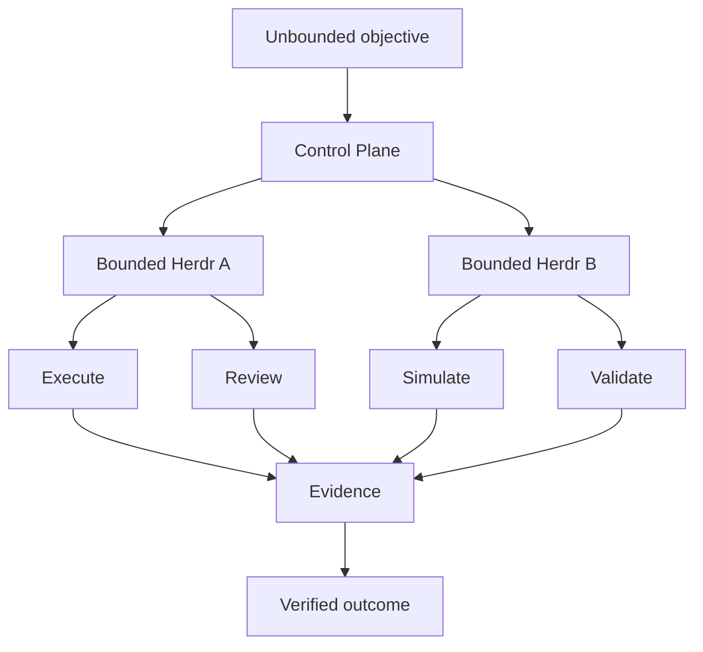

<p align="center">
  
</p>

# Dodging Infinity v0.4.0

[](https://github.com/TheMickeyDodger/dodging-infinity/actions/workflows/ci.yml)
[](LICENSE)
[](https://github.com/TheMickeyDodger/dodging-infinity/releases/latest)

> **Bounding the infinite to the finite.**

**Any problem. Any repo. Any issue.**

Dodging Infinity is a model/runtime-agnostic orchestration system built on Herdr for turning seemingly unbounded problems into bounded, isolated, solvable units of work.

It recursively decomposes objectives across specialized Herdrs, repositories, agents, simulations, and review loops; gives each unit a finite scope and explicit rules; then challenges, validates, and composes the results back into a verified outcome.

The goal is not merely multi-agent coding. Dodging Infinity is designed as a general orchestration layer for problems that require decomposition, implementation, simulation, adversarial review, and validation across technical domains.

## Why Dodging Infinity?

Most agent systems ask a model to do more.

Dodging Infinity does something different: it makes the problem smaller.

Instead of giving one model an expanding context and hoping it can reason across everything, Dodging Infinity recursively turns a large objective into bounded units with explicit scope, rules, ownership, dependencies, and validation.

That means the system can scale outward without silently expanding the authority of any individual agent.

The intelligence is replaceable. The orchestration contract is not.



## What v0.4.0 adds

- **Terminal Mission Control** — running `infinity` now opens a full-screen terminal control surface for observing and managing Herds without living inside individual `herdctl` commands.
- **Multi-Herd navigation** — Mission Control can display registered Herds side-by-side, switch the active view, and keep repository/runtime context visible from one place.
- **Live orchestration view** — the selected Herd shows its repository, runtime state, full active objective, configured role/model assignments, and current agent topology.
- **Activity journal** — Mission Control surfaces append-only control-plane events so runtime initialization, task dispatch, child-Herd activity, and lifecycle changes are visible in one place.
- **Non-destructive Close Herd** — a Herd can be removed from the active Mission Control fleet without deleting its repository, working tree, or preserved `.herd` state.
- **Mission Control snapshot API** — canonical repository, runtime, task, agent, child-Herd, and policy state is exposed through a JSON-serializable observation layer rather than duplicated inside the UI.
- **Browser mode remains available** — `infinity web` starts the HTTP Mission Control interface for users who prefer a browser view.
- **Dedicated Ghostty session foundation** — Mission Control now has a tested macOS session driver capable of creating, targeting, reconnecting to, and closing a specific Ghostty terminal by stable terminal UUID.
- **Deterministic handoff foundation** — the Ghostty session work proves a machine-readable completion marker can be emitted through a side channel without screen-scraping the terminal. This is groundwork for the next Mission Control operator layer; automated intake/review/execution is not yet part of v0.4.0.
- **`infinity` installer support** — `scripts/install.sh` now installs both the lower-level `herdctl` CLI and the human-facing `infinity` launcher.
- **Existing Herdr behavior remains canonical** — Supervisor planning, Lead delegation, Executor work, Reviewer loops, child Herdrs, task lifecycle, and human commit/push gates are unchanged. Mission Control observes and wraps Herdr rather than replacing its orchestration logic.

The recursive orchestration, child-Herdr dependency model, repository/task-scoped rules, deterministic Reviewer protocol, bounded context, human commit/push gates, and model/runtime-agnostic role system introduced in the v0.3 line remain the foundation underneath Mission Control.

## How Dodging Infinity works

Dodging Infinity treats an unbounded objective as a hierarchy of bounded problems.

Each Herdr owns a finite scope: one repository, one task, one rule set, one runtime state, and explicit completion criteria.

If an objective exceeds that boundary, the Supervisor does not silently expand its authority. It delegates the new bounded problem to another Herdr through the Control Plane. That child becomes a tracked dependency of the parent, and the parent cannot complete until required child work is resolved.

The core loop is:

**decompose -> isolate -> solve -> challenge -> validate -> compose**

The same orchestration model can apply beyond conventional software work wherever a problem can be decomposed into bounded units with observable evidence and explicit validation.

## Mission Control

`herdctl` remains the canonical lower-level CLI. `infinity` is the human-facing Mission Control entry point built around it.

After installing Dodging Infinity:

```bash
./scripts/install.sh
```

Launch Mission Control from any repository with:

```bash
infinity
```

Or explicitly choose a repository:

```bash
infinity --repo /path/to/repository
```

The terminal interface provides three live views:

```text
HERDS                  ACTIVE ORCHESTRATION              ACTIVITY
-----                  --------------------              --------
registered Herds       repository / runtime              control-plane events
current selection      active objective                  task dispatch
runtime state          role/model assignments            lifecycle changes
                       current agent topology             child-Herd activity
```

Keyboard controls:

```text
TAB       switch pane
↑ / ↓     select or scroll the focused pane
R         refresh
X         close the selected Herd
Q         quit Mission Control
```

Closing a Herd is intentionally non-destructive. It removes that active Herd from Mission Control without deleting the repository, working tree, commits, or preserved `.herd` state.

The browser interface remains available:

```bash
infinity web
```

and can be pointed at another repository with:

```bash
infinity web --repo /path/to/repository
```

### Mission Control and Herdr

Mission Control does not replace Herdr.

```text
Mission Control
      ↓
human-facing observation / lifecycle controls
      ↓
herdctl
      ↓
Herdr
      ↓
Supervisor → Lead → Executor → Reviewer
```

Herdr remains responsible for planning, delegation, execution, review, task lifecycle, child-Herd orchestration, and the protected Git gates.

The dedicated Ghostty session driver introduced in v0.4.0 provides the terminal foundation for the next Mission Control stages. It can create, target, reconnect to, and close an exact terminal session using a stable terminal identifier.

### v0.5.0 development: deterministic command handoff

The current v0.5.0 development branch adds the first execution layer on top of that Ghostty foundation.

Mission Control can now:

- actively prove a newly created Ghostty shell is ready before sending work;
- arm a deterministic one-shot zsh handoff hook before a command is entered;
- send the supplied command to Ghostty **verbatim**, without wrapping, rewriting, chaining, or silently modifying it;
- execute a supplied multi-command sequence serially, advancing only after the previous command returns successfully;
- emit per-command completion markers with exact exit codes;
- emit the canonical `HERDR_HANDOFF:<execution-id>:<exit-code>` marker when control returns to Mission Control;
- stop immediately on a failed command;
- time out and stop the sequence when an unexpected interactive prompt prevents shell handoff, rather than guessing an answer or continuing;
- prevent later commands in the sequence from running after a failure or timeout.

The handoff channel is machine-readable and does not depend on scraping terminal contents.

This execution engine has been validated against real Ghostty sessions for successful commands, ordered multi-command sequences, failures, and interactive-prompt timeouts.

Natural-language intake, operator-model review, the global approval queue, Git-gate translation, durable Mission Control audit state, and crash recovery remain later Mission Control phases and are **not yet implemented**.

## Model and runtime agnosticity

Dodging Infinity separates **roles from models**.

Supervisor, Lead, Executor, and Reviewer are logical responsibilities inside an orchestration graph. They are not tied to Claude, Codex, OpenAI, Anthropic, or any particular model family.

Any model/runtime supported by Herdr can be assigned to any layer:

```text
Supervisor  -> Model A
Lead        -> Model B
Executor    -> Model C
Reviewer    -> Model D
```

or:

```text
Supervisor  -> Model X
Lead        -> Model X
Executor    -> Model X
Reviewer    -> Model X
```

Different providers, reasoning profiles, permission modes, context sizes, and tool capabilities can therefore be composed within the same Dodging Infinity system.

The orchestration contract belongs to the **role**. The model is a replaceable execution engine for that role.

Presets such as `max-quality`, `all-claude`, and `conservative` are tested convenience configurations, not architectural requirements. A new model or runtime can participate at any layer once it can be launched and controlled through Herdr.

This allows Dodging Infinity to select different forms of intelligence for different bounded problems while preserving the same decomposition, isolation, review, dependency, and validation machinery.

## Example max-quality topology

```text
You
 |
Claude Fable 5 — Supervisor (auto)
 |
Claude Opus 5 — Lead (auto)
 |
 +---------------------------------+
 | Adversarial Executor Pod        |
 |                                 |
 | Claude Fable 5 — Executor       |
 |              ↕                  |
 | GPT-5.6 Sol High — Reviewer     |
 | Codex / read-only / never ask   |
 +---------------------------------+
 |
Lead verification
 |
Human commit gate
 |
Local Git history
 |
Human push gate
 |
Remote
```

The Reviewer remains read-only. The deterministic harness/Lead persists its review transcript; GPT does not need write access to `.herd/state/`.

## Upgrade an existing repo to v0.4.0

After updating Dodging Infinity, reinstall the command wrappers:

```bash
./scripts/install.sh

cd ~/code/internal

herdctl upgrade --repo example-repo --preset max-quality
herdctl safety-install
herdctl integrations --repo example-repo
herdctl doctor --repo example-repo
```

If a live herd is running, refresh all role contracts/runtimes with:

```bash
herdctl bootstrap --repo example-repo --force
```

If you only changed role contracts and the currently running runtimes already match the preset, you can instead clear completed-task contexts and re-seed:

```bash
herdctl clear-contexts --repo example-repo
```

Runtime-aware reset defaults:

```json
"reset_commands": {
  "claude": "/clear",
  "codex": "/new"
}
```

## New repo in essentially one command

Clone/go to the repo, then:

```bash
herdctl init \
  --alias my-repo \
  --preset max-quality \
  --test-command 'npm test && npm run build'
```

Then:

```bash
herdctl integrations --repo my-repo
herdctl doctor --repo my-repo
herdctl bootstrap --repo my-repo
```

That creates a separate Herdr workspace, task state, memory, role set, commit authorization and push authorization for that repo.

If you do not yet know the verification command:

```bash
herdctl init --alias my-repo --preset max-quality
herdctl set-test 'npm test && npm run build' --repo my-repo
```

## Presets

List them:

```bash
herdctl presets
```

Current built-ins:

```text
max-quality   Claude Fable supervisor/executor + Opus lead + GPT-5.6 Sol high reviewer
all-claude    Fable/Opus herd using Claude Auto Mode
conservative  Claude-only herd retaining explicit edit approvals
```

Apply to an existing initialized repo:

```bash
herdctl preset max-quality --repo example-repo
herdctl bootstrap --repo example-repo --force
```

The orchestration hierarchy is independent of the preset; presets only assign runtimes/models/permissions to seats.

## Strict Reviewer protocol

The Reviewer contract requires exactly one terminal line:

```text
HERD_DECISION: APPROVE
```

or:

```text
HERD_DECISION: REJECT
```

No synonym is accepted. `ACCEPT`, `LGTM`, `PASS`, etc. are malformed.

After every Reviewer turn, the Lead is instructed to run:

```bash
herdctl review-decision --repo example-repo --reviewer reviewer1
```

Example deterministic output:

```json
{
  "valid": true,
  "decision": "APPROVE",
  "raw_token": "APPROVE",
  "round": 2,
  "review_file": "/.../.herd/state/reviews/<task>-round-02.md"
}
```

A malformed result produces `"valid": false`; the Lead must re-prompt the **same Reviewer session** for a canonical token rather than interpreting the synonym itself.

This also solves read-only Reviewer persistence: Herd writes the captured transcript under `.herd/state/reviews/` while the Reviewer remains sandboxed read-only.

## Human commit gate

Stage exactly what you want to commit, inspect it, then:

```bash
herdctl approve-commit --repo example-repo
```

The one-shot approval is bound to:

- repo/worktree
- branch
- HEAD
- exact staged diff hash
- short TTL

A changed staged diff, branch or HEAD invalidates the token. The deeper Git reference-transaction guard also blocks ordinary attempts to bypass pre-commit with `git commit --no-verify`.

## Human push gate

After a local commit, inspect:

```bash
git status -sb
git log --oneline origin/main..HEAD
```

Then authorize exactly one push:

```bash
herdctl approve-push --repo example-repo
```

The approval screen shows:

- exact repo/path
- current branch and HEAD
- remote name and URL
- target ref
- upstream
- best-effort list of commits ahead

You type the repo alias to authorize exactly one push for a short TTL.

Then:

```bash
git push
```

The Git pre-push guard validates the exact branch/HEAD/remote/target and consumes the token at the push boundary.

### Push guard note

Git itself allows a human/non-hook-aware runtime to bypass `pre-push` with `git push --no-verify`. For the current proven workforce, Claude's global PreToolUse guard independently blocks `--no-verify` and force-push forms before Bash executes, while the Codex Reviewer is read-only. The role contracts also forbid bypassing the gate. If you later put a different write-capable runtime in an Executor seat, give it an equivalent runtime-level command guard if you require the same hard guarantee.

## Claude Auto Mode setup

Run once per Mac after installing/upgrading Herd:

```bash
herdctl safety-install
```

It installs/maintains the Claude PreToolUse commit/push guard and ensures the user-level `autoMode.environment` contains:

```json
["$defaults"]
```

This preserves Claude's built-in conservative trust boundary (working repo + configured remotes) instead of broadening trust to unrelated repos. Existing user Auto Mode entries are preserved.

## Rules and task-local constraints

Dodging Infinity supports constraints at two scopes.

Repository rules are durable and apply to future tasks in that repository:

```bash
herdctl rules --repo example-repo
herdctl rules add "Never modify migrations" --repo example-repo
herdctl rules remove "Never modify migrations" --repo example-repo
```

Task-local rules apply only to one dispatched task:

```bash
herdctl task "Implement X" \
  --repo example-repo \
  --rule "Only modify README.md" \
  --rule "Do not commit"
```

Task-local rules are layered into that task's effective policy and do not persist into the repository's durable rule set.


## Task lifecycle

```text
IDLE -> ACTIVE -> COMPLETE
               -> ABORTED
               -> ERROR
```

Start:

```bash
herdctl task 'Implement X. Do not commit.' --repo example-repo
```

Inspect:

```bash
herdctl task-status --repo example-repo
herdctl status --repo example-repo
```

The Supervisor finishes with:

```bash
herdctl task-complete \
  --repo example-repo \
  --checkpoint-file .herd/state/task-checkpoint.md
```

Completed-task context is checkpointed to bounded `.herd/memory/task-history.md`. The next top-level task can start with fresh runtime context while rejection rounds inside the same task remain long-running.

## Idle-aware heartbeat

```text
15-minute tick
 |
 +-- no ACTIVE task ------------------> skip
 |
 +-- Supervisor working/blocked ------> skip
 |
 +-- ACTIVE + Supervisor idle/done ---> health-check
```

## Multi-repo usage

```bash
herdctl task 'Fix auth' --repo example-repo
herdctl task 'Improve onboarding' --repo zenmo
herdctl status --repo another-repo
```

Every repo has its own Herdr workspace, task state, context, memory and Git approval tokens.

## Main commands

```text
infinity [mission-control] [--repo PATH]
infinity web [--repo PATH] [--port PORT] [--no-open]

herdctl init [--alias NAME] [--preset PRESET] [--test-command COMMAND]
herdctl presets
herdctl preset PRESET --repo NAME
herdctl set-test COMMAND --repo NAME
herdctl upgrade --repo NAME [--preset PRESET]
herdctl repos [--prune]
herdctl safety-install
herdctl doctor --repo NAME
herdctl integrations --repo NAME
herdctl bootstrap --repo NAME [--force]
herdctl task "..." --repo NAME [--rule RULE ...] [--rejection-drill]
herdctl task-status --repo NAME
herdctl task-complete --repo NAME --checkpoint-file FILE
herdctl rules --repo NAME
herdctl rules add RULE --repo NAME
herdctl rules remove RULE --repo NAME
herdctl review-decision --repo NAME --reviewer reviewer1
herdctl clear-contexts --repo NAME
herdctl approve-commit --repo NAME
herdctl approve-push --repo NAME [--remote origin] [--target-branch BRANCH]
herdctl status --repo NAME
herdctl read ROLE --repo NAME
herdctl prompt ROLE "..." --repo NAME
herdctl heartbeat --once --repo NAME
herdctl restart-heartbeat --repo NAME
```

## License

Dodging Infinity is licensed under the [Apache License 2.0](LICENSE).
