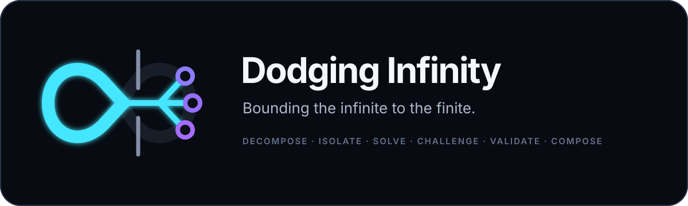

<p align="center">
  
</p>

# Dodging Infinity

**AI orchestration and mission control for agents.**

Dodging Infinity is built for work that is too large, too long-running, or too important to live inside one chat session.

```text
o──o──o
      \
       o──[ DI ]──o
```

---

# 1. What is Dodging Infinity?

Dodging Infinity is an orchestration layer for AI agents doing real work.

The unit of work is a **Mission**.

A Mission keeps the objective, scope, authorization, state, evidence, artifacts, and delivery decisions together while different models, agents, tools, and machines do their part.

That starts to matter once the job gets bigger than:

```text
"Write this function."
```

A real job might need research first. It might need engineering after that. It might involve a browser, a PDF, a screenshot, a simulator, several models, a second machine, a restart, a human approval, and finally a pull request.

Dodging Infinity keeps that work together instead of treating each chat or agent session as a separate universe.

The basic rule is:

> **Bots converse and collaborate. Dodging Infinity governs. Capabilities do bounded work. Workers execute. Humans authorize.**

The Mission stays the same even when the tools underneath it change.

```text
      01001        10110
          \        /
           \      /
            [ DI ]
           /      \
          /        \
      10110        01001
```

---

# 2. How does it work?

At a high level:

```text
                                  HUMAN
                                    │
                    text / voice / image / file
                    requests / approvals / status
                                    │
                                    ▼
              ┌──────────────────────────────────────┐
              │             INTERACTION              │
              │                                      │
              │   Dots (mobile interface)            │
              │   Telegram                           │
              │   CLI                                │
              │   Specialist bots                    │
              └──────────────────┬───────────────────┘
                                 │
                                 ▼
      ┌─────────────────────────────────────────────────────────┐
      │                   DODGING INFINITY                      │
      │                                                         │
      │   Missions                Authorization                  │
      │   Routing                 Evidence                       │
      │   State                   Artifacts                      │
      │   Observation             Verification                   │
      │   Reconciliation          Delivery gates                 │
      └───────────────────────────┬─────────────────────────────┘
                                  │
                                  ▼
              ┌──────────────────────────────────────┐
              │       OPERATOR + MODEL ROUTING       │
              │                                      │
              │   Pi                                 │
              │   Codex                              │
              │   GPT / Claude / Grok / Muse         │
              │   Local / future models              │
              └──────────────────┬───────────────────┘
                                 │
                                 ▼
      ┌─────────────────────────────────────────────────────────┐
      │                  BOUNDED CAPABILITIES                   │
      │                                                         │
      │   Engineering ───────────────────────► Herdr            │
      │   Research                                              │
      │   Browser                                               │
      │   Document / Ops                                        │
      │   Media / Multimodal                                    │
      │   Publishing / Messaging                                │
      └───────────────────────────┬─────────────────────────────┘
                                  │
                                  ▼
              ┌──────────────────────────────────────┐
              │               WORKERS                │
              │                                      │
              │   Trusted Mac                        │
              │   GPU / simulator host               │
              │   Browser / SaaS worker              │
              │   Other hosts                        │
              └──────────────────┬───────────────────┘
                                 │
                                 ▼
                  GitHub / Web / SaaS / APIs
                   Simulators / GPUs / Devices
```

Dodging Infinity sits in the middle because that is where the Mission lives.

The interface can change. The model can change. The work can move between capabilities or machines. None of that should require starting the Mission over from scratch.

## Interaction

The interaction layer is how you talk to the system.

That can be as simple as sending a request from your phone:

```text
You:
"The export path is timing out.
Figure out why, fix it, and prove the fix.
Do not commit anything."
```

Telegram can carry that request into Dodging Infinity today. Dots is the human-facing mobile interface: from the phone it can create or continue a local Codex task, and Codex is the Outer Operator. The larger interaction layer adds a coordinator that can sit across many Missions and work with specialist bots. The earlier Grok Bot interaction surface is retired; Grok as a model is a separate thing.

The conversation can get more interesting than one request at a time:

```text
You:
"Research Bot, did anything from the DBOS comparison
get handed to engineering?"

Research Bot:
"Yes. The durability findings are attached to Mission #202.
Engineering is using them in the worker design review."
```

Or:

```text
You:
"What needs me?"

Coordinator:
"Mission #144 is waiting on content approval.
Mission #145 needs credentials.
Engineering and research are still running."
```

The point is not to make the bots sound clever. The point is that they can all reference the same Missions, artifacts, evidence, and status instead of making up their own version of what is happening.

```text
       .----.           .----.
      | •  • |  ─────  | •  • |
      |  --  |   ref   |  --  |
       '----'           '----'
         BOT              BOT
```

### Dots: what is shown and what is not

DEMONSTRATED, user-observed and unedited:

1. Reach, read, and reply. A phone-initiated local Codex task read a repository file and returned its exact content plus session id `01a10275-e9b0-70fd-bc29-9724f5fd60e9`.
2. Same-task connected continuation and a durable status read. Continuing that task, it read `.herd/state/task.json` and returned task `20261003-115300-782f3a` / `ACTIVE`, with no edits: a status answer from a durable Dodging Infinity record, not chat history.

3. Live proposal and status exercise (2026-10-03, human-reported and corroborated from the durable stores): phone → Dots → the same local Codex task → `python3 direquest.py … propose` → durable `status` → phone, with matching request ref, Mission id, revision 1 and proposal digest; request OPEN, Mission AWAITING_DECISION and NOT_STARTED. Zero approval attempts, zero decisions, zero authorizations, no dispatch; the status approval block describes the fail-closed policy and does not show that `approve` was invoked.

That is connected same-task continuation, a small durable read, and proposal identity plus connected status only. It is not a new task, not a reconnect after an outage, not a large payload, and not authenticated intent. Full Task 8 remains active and unaccepted.

4. Live V6 exercise (2026-10-04), Operator-mediated, not Dots-autonomous. Dots (the same local Codex task) showed the exact Mission `mn-079a81327f76cda72d79eb241ada92d3` (revision 1, digest `7a83af04…`), and the human sent a separate `approved` reply. The Outer Operator ran the effectful DI commands; Dots' local command permission repeatedly refused DI propose and approve. DI recorded one dispatch receipt. Herdr child `20261004-172125-960973` completed in an isolated smoke clone (Lead verified, Reviewer round 2 APPROVE), and its only source change was the one-line marker `docs/task8-dots-smoke.md`. DI `verify` completed the Mission with `engineering_verified: true` (evidence `mv-5e4e0a62…`). The human reports Dots read the token-free durable files `dots-phone-status-v6.json`, `dots-phone-verified-result-v6.json` and `dots-phone-pr-result-v6.json` and returned them to the phone. Dots did not rerun verification or query GitHub or DI.
   - Delivery stayed separate. A standalone P1-A6 delivery, `prd-85cad864f6ae89b72c1c483d` (`mission: null`), approved by its own separate Operator-attested Dots reply, completed COMMIT, PUSH and PR_CREATE and opened PR #37, which is open and not merged. The Outer Operator independently checked GitHub and the delivery store; this repository's herd did not.
   - An earlier delivery, `prd-e87f7490…`, is REVOKED (GitHub GH007, private email) and created no remote branch or PR.
   - Because the delivery has no Mission parent, the Mission's DI status truthfully stays `delivered: false`.
   - Sources differ on the child: the parent's `.herd/state/children.json` still caches it as `ACTIVE`, while the copied verified result and checkpoint report it COMPLETE.

That live exercise is one Operator-mediated run. It is not Task 8 acceptance, which waits for the Outer Operator's own confirmation. Not demonstrated live: an unavailable machine or session, disconnection or restart around a decision or dispatch, and live pause or cancel of a running Herdr child; local deterministic tests are not substitutes.

NOT ESTABLISHED, so each is a blocked gate:

1. Authenticated exact approval binding. Nothing documented gives the local process an authenticated per-message principal or approval envelope. [SUPERSEDED in part by the user's Task 8 trust decision: a Mission approval over Dots is now the Outer Operator's ATTESTATION that the human replied exactly `approved` or `approve`, recorded as `operator_attested_relay` with proof `operator_attested_not_independently_verified`. It is not authenticated and not independently verified human provenance, and a mistaken or malicious same-user operator or local process could fabricate it. Independent authenticated human provenance is NOT ESTABLISHED, and it is DELIBERATELY DELEGATED to the Outer Operator, with that fabrication risk ACCEPTED by the user. It is NOT a Task 8 prerequisite and NOT an acceptance blocker, so this item is no longer a blocked gate.]
2. Outage and restart recovery of an in-flight approval.
3. Background notification and durable event delivery (the computer must be online with the app open).
4. Verified-result delivery fidelity (the verified result, not a paraphrase). [SUPERSEDED in part by the live V6 exercise: the human reports Dots returned the verified result read from the durable `dots-phone-verified-result-v6.json` file. That is one human-reported read, not a general guarantee.]
5. Full live Mission acceptance with real human participation, real live dispatch, and the phone-to-PR loop. Each still requires exact human authorization; none has been run. [SUPERSEDED: "none has been run" is history. Real human participation, one live dispatch and a separate phone-to-PR delivery were exercised once in the Operator-mediated V6 run above. Task 8 acceptance itself is still open.]

Offline is not revoked, and neither is a way to cancel: a running local Dots task may finish after admin access is disabled. Cancellation has to be a durable local Dodging Infinity record that the write and decision paths check and that fails closed.

What exists locally (Task 8, a LOCAL candidate under review; Task 8 is ACTIVE and UNACCEPTED): `direquest.py` (package `local_request/`), a neutral local request surface any local caller can invoke, including a local Codex task. It is not installed as a command; run it from the repository root as `python3 direquest.py --state-dir /absolute/protected/dir COMMAND`. [SUPERSEDED: the earlier description here, "always refuses approval" with nothing dispatched, described the candidate before the user's trust decision and before the run route; it is kept only as history.] Today:

- `propose`, `status`, `recover`, and `cancel` (the creator's one-time control capability withdraws its own pending revision-1 proposal: a durable marker, not a lifecycle state, that stops no running work).
- `approve` still always refuses. `present` then `attest-approval` relay the human's exact whole-string `approved` or `approve` reply as an operator-attested approval (not independently verified), bound exactly to the Mission, revision, proposal digest, scope, targets and a short expiry.
- The run route, for the request's own AUTHORIZED Mission, through the real Herdr spawn bridge (`target_runtime/mission_bridge.py`): `dispatch`, `observe`, `reconcile`, `prove` (one existing evidence or acceptance seam per step; nothing is auto-accepted), `verify`, `result`, `pause`, `resume` and `cancel-run`. `observe` → `prove` → `verify` is drivable in sequence; after a HOLD it is `reconcile` → `observe` (a second observe: reconciliation leaves the run AUTHORIZED, and verify before it is refused) → `prove` → `verify`, with nothing redispatched.
- VERIFIED is a conjunction Dodging Infinity decides, and it needs the whole approved proof contract. An unmet obligation is recorded as a durable, recoverable `verification_blocked_pending_proof` state with its blocker codes; the same run verifies once the obligation is met.
- `pause` halts Dodging Infinity's own progression only. External in-flight work is NOT suspended, and no supported suspend seam exists. `cancel-run` reports which of four achieved states occurred and reports HOLD whenever quiescence cannot be established.
- `status` answers from durable records alone, after a restart and with no chat context.
- Delivery stays separate: engineering approval confers no delivery, `delivery_authority` is structurally `none`, and status derives "delivered" only from an attested P1-A6 receipt. The P1-A6 delivery authorization has its own exact ceremony. Besides the unchanged local-terminal one, `python3 -m pr_delivery present-dots` / `attest-dots` take the human's simple Dots reply (no digest typed), relayed against the exact presented proposal and recorded as `dots_operator_attested` (operator-attested, not independently verified). [SUPERSEDED: "live phone-to-PR delivery remains unproven" is history; one standalone live delivery ran in V6, as item 4 above describes.]

[SUPERSEDED, history: "None of this has been run live: no live approval, dispatch, spawn or delivery has occurred." The Operator-mediated V6 exercise above used the operator-attested approval, `dispatch`, `verify` and `result` live, plus one standalone P1-A6 delivery. The recovery and pause or cancel cases listed above have not run live.] It is not a Dots adapter, and the surface itself is not evidence of Dots-autonomous behaviour. The exact final candidate identity and the canonical review rounds that cover it are recorded in the operator checkpoint, not here.

A structured plugin or MCP route is unproven, not impossible. The documented inline or file-declared MCP import is Desktop-only, so it is not the mobile Dots surface. Connecting one would need a registered app reference, a Secure MCP Tunnel, or public HTTPS; no usable DI connection has been established, and setup is not authorized in this task. OAuth or mTLS alone would still not prove exact human approval of a Mission revision. No existing Dodging Infinity structured connector may be assumed, and the user states there is likely none; a plugin-management catalog search cannot enumerate account-specific installed plugins, so no match is not absence.

Dodging Infinity alone owns Mission identity, authority, lifecycle, durable state, dispatch, evidence, reconciliation, and delivery gates. Herdr is the engineering execution system. Muse is not the Operator. The full position is in [Architecture](docs/architecture.md#3-interaction-dots-the-human-facing-mobile-interface).

## Operator and model routing

The Operator handles reasoning for a Mission step.

Dodging Infinity does not need every job to run through the same model. A research step may want one provider. A code change may want another. A small classification job may be cheaper somewhere else. A privacy-sensitive task may eventually stay local.

```text
                         Mission step
                              │
                              ▼
                       OperatorSession
                              │
                              ▼
                        Model routing
                              │
             ┌────────────────┼────────────────┐
             ▼                ▼                ▼
            Pi              Codex          Other adapter
             │                │                │
        GPT / Claude      GPT / Claude      local model
        Grok / Muse                         future model
```

Codex is the current reference Operator path in the repo.

`OperatorSession` is the seam that keeps the Mission logic separate from the provider doing the reasoning. Codex sits behind an adapter instead of being spread throughout the control plane.

Pi fits at the same boundary. The integration is designed around an adapter/RPC path so Pi can provide its model and tool runtime without becoming responsible for Mission identity, authority, evidence, or delivery.

That lets the model runtime change without changing the Mission format.

## Capabilities

Capabilities are the kinds of work Dodging Infinity can hand out.

Engineering is one capability. Research is another. Browser work, document work, media, publishing, and operations can follow the same pattern.

### Engineering through Herdr

Engineering routes through Herdr.

```text
                   Engineering Mission
                           │
                           ▼
                         Herdr
                           │
                           ▼
                      Supervisor
                           │
                           ▼
                         Lead
                           │
                           ▼
                       Executor
                           │
                    ┌──────┴──────┐
                    ▼             ▼
                  Tests        Reviewer
                    │             │
                    └──────┬──────┘
                           ▼
                        Evidence
                           │
                           ▼
                  Dodging Infinity
```

Herdr was adapted around a bounded engineering handoff.

The Supervisor receives the objective, repository context, constraints, rules, desired outcome, and unresolved questions. From there, Herdr owns the engineering route.

The roles are deliberately separate:

- **Supervisor** owns engineering direction and decomposition.
- **Lead** coordinates the work and decides when the engineering task is ready to close.
- **Executor** implements and tests.
- **Reviewer** checks the result independently and can reject it.

The Reviewer is read-only. It does not grade its own work because it did not write the work.

Each Herdr instance is scoped to a repository and top-level engineering task. The result comes back with review and verification evidence for Dodging Infinity to evaluate as part of the larger Mission.

### Example: engineering

```text
You:
"Fix Mitiq issue #2802.
Do not ship it."
          │
          ▼
Dodging Infinity creates the Mission
          │
          ├─ target repository
          ├─ objective
          ├─ constraints
          ├─ proof requirements
          └─ no delivery authority
          │
          ▼
You approve
          │
          ▼
Engineering Capability
          │
          ▼
Herdr
          │
Supervisor → Lead → Executor ↔ Reviewer
          │
          ▼
tests + evidence
          │
          ▼
Dodging Infinity verifies
          │
          ▼
result comes back to you
```

If the work is good, you decide what happens next.

Fixing the issue did not automatically authorize a commit, push, merge, release, or deployment.

### Example: research

```text
You:
"Compare DBOS, Temporal, and Postgres
for durable execution."
          │
          ▼
Research Mission
          │
      ┌───┴───┐
      ▼       ▼
  Research   Browser
      │       │
      └───┬───┘
          ▼
       Evidence
          │
          ▼
  Research artifact
          │
     ┌────┴──────────────┐
     ▼                   ▼
    You           Engineering Mission
```

A follow-up can be simple:

```text
"Ask Engineering Bot whether the DBOS research
changes how we should build the worker layer."
```

The research artifact can move directly into that Mission instead of being flattened into a pasted summary.

### Example: multimodal

```text
   screenshot
       +
 screen recording
       +
   voice note
       +
    log file
       │
       ▼
 Mission intake
       │
  ┌────┼──────────────┐
  ▼    ▼              ▼
file  transcription  visual analysis
  │    │              │
  └────┴──────┬───────┘
              ▼
         Mission context
              │
              ▼
      appropriate capability
```

If the problem is visual, show it. If the evidence is a PDF, image, recording, log, source archive, or CSV, attach it.

The original material stays with the Mission.

## Workers

Workers are the machines or environments that run capabilities.

A trusted Mac can handle the normal local workflow. A simulation Mission may need a GPU host. Browser-heavy work may run somewhere else.

```text
Mission:
"Run the quantum simulation."

Needs:
- repository access
- simulator
- GPU

Worker A              Worker B
Mac                   GPU host
repo = yes            repo = yes
GPU  = no             GPU  = yes
                      simulator = yes

                         │
                         ▼
                     Worker B
```

Worker selection answers where the work can run. The Mission already defines what the work is allowed to do.

## How the pieces fit

**Herdr** runs the engineering organization: Supervisor, Lead, Executor, Reviewer. Dodging Infinity gives it a bounded engineering handoff and consumes the evidence that comes back.

**Pi** fits behind the Operator boundary as a provider-neutral runtime. Dodging Infinity keeps the Mission model; Pi focuses on reasoning and tools.

**Codex** is the current reference Operator path and the Outer Operator. It sits behind the Codex Gateway and `OperatorSession` instead of owning orchestration directly.

**Claude** is used heavily inside the engineering stack and can also be used as a reasoning provider.

**Grok / Grok Bot** had two different jobs. Grok is a model option, and that is unchanged. Grok Bot was planned as the conversation layer across Missions and specialist bots; that interaction surface is retired.

**Dots** is the human-facing mobile interface. It reaches the machine as a local Codex task; Mission approval over it is Operator-attested (exercised live once in Task 8), and authenticated human provenance is not established (see [Dots: what is shown and what is not](#dots-what-is-shown-and-what-is-not)).

**Muse** is a possible model provider. Muse is not the Operator.

**Telegram** is the current phone interface for remote Mission requests, approval, status, and verified results, and the reference and fallback transport.

**GitHub** is a common source and delivery target for engineering Missions. Delivery actions stay behind separate human gates.

**DBOS, browsers, GPU hosts, SaaS APIs, and future workers** can be added underneath the same Mission and capability boundaries as the system expands.

```text
      o────o────o────o
           \        /
            o──────o
               │
            .------.
           |  •  •  |
           |   __   |
            '------'
```

---

# 3. System Requirements

Dodging Infinity runs locally. The full remote workflow is built around a machine that stays available while Missions are running.

## Computer requirements

| Component | Recommendation |
|---|---|
| **OS** | macOS for the full remote workflow; Linux is covered for development and CI |
| **CPU** | Apple Silicon or a modern multi-core system |
| **Memory** | 16 GB is a reasonable starting point |
| **Heavier use** | 24–32 GB gives multiple agent processes more room |
| **Storage** | SSD recommended; Missions may create isolated repository workspaces |
| **Network** | Stable internet access for GitHub and model providers |
| **Always-on use** | A dedicated Mac or Mac mini works well for unattended Missions |

These are practical recommendations, not hard hardware limits.

## Software requirements

| Software | What Dodging Infinity uses it for | Needed when |
|---|---|---|
| [Python 3.9+](https://www.python.org/downloads/) | Dodging Infinity runtime and CLI | Core |
| [Git](https://git-scm.com/downloads) | Repository state and delivery | Core |
| [Herdr](https://github.com/herdrdev/herdr) | Engineering capability | Engineering Missions |
| [Claude Code](https://docs.anthropic.com/en/docs/claude-code/overview) | Herdr roles and Claude-backed presets | Depends on preset |
| [Codex CLI](https://github.com/openai/codex) | Current reference Operator and Codex-backed roles | Current Operator / `max-quality` |
| [Pi](https://github.com/earendil-works/pi) | Provider-neutral Operator runtime path | Pi integration |
| Grok / xAI access | Grok model routing (the Grok Bot interaction layer is retired) | Grok model workflows |
| Telegram bot | Remote phone interface | Remote Mission control |
| Dots | Human-facing mobile interface reaching a local Codex task; nothing to install in this repository, and the computer must be online with the app open | Mobile access (Operator-attested Mission approval; authenticated provenance not established) |
| GitHub credentials | Repository access and delivery targets | GitHub Missions |
| Tailscale / SSH | Break-glass remote access to a trusted worker | Optional |

Dodging Infinity itself uses the Python standard library; there is no separate `pip install` step for the project.

## Install Dodging Infinity

```bash
git clone https://github.com/TheMickeyDodger/dodging-infinity.git
cd dodging-infinity
bash scripts/install.sh
```

The installer adds:

```text
herdctl
codexgw
tgop
dirun
```

to:

```text
~/.local/bin
```

If needed:

```bash
export PATH="$HOME/.local/bin:$PATH"
```

Install the local Git safety guard:

```bash
herdctl safety-install
```

## Set up a repository

```bash
cd /path/to/your/repository

herdctl init \
  --alias my-repo \
  --test-command 'python3 -m pytest'
```

Check the machine and repository:

```bash
herdctl doctor --repo my-repo
herdctl health --repo my-repo
```

Start Herdr:

```bash
herdctl bootstrap --repo my-repo
```

Start a Mission:

```bash
herdctl task \
  'Find the failing test, explain what is wrong, fix it, and verify the result. Do not commit.' \
  --repo my-repo
```

Watch it:

```bash
herdctl status --repo my-repo
```

or:

```bash
herdctl observe --repo my-repo --json
```

## Remote setup

Create:

```text
~/Library/Application Support/DodgingInfinity/telegram/config.json
```

```json
{
  "bot_token": "YOUR_BOT_TOKEN",
  "allowed_user_ids": [123456789],
  "repository": "/path/to/your/repository"
}
```

Run the Telegram adapter and Mission runtime:

```bash
tgop run
dirun run
```

Or install them as macOS background services:

```bash
tgop install-agent
scripts/dirun-agent.sh install
```

Then from Telegram:

```text
/mission <intent>
/status
/help
```

For the full operating surface, see [Operational Reference](docs/operations.md).

---

# 4. Closing note

I built Dodging Infinity because I wanted to hand AI a real problem, walk away, and come back to something I could inspect without treating a chat transcript as the source of truth.

A Mission might start from Telegram, move through an Operator, hand engineering to Herdr, use several models, survive a restart, pick up evidence from another Mission, run on a different worker, and eventually come back ready for a delivery decision.

It should still be the same Mission when it gets there.

That is what this project is trying to make normal.

```text
                  .        .        .
             .       0 1 0 1 0       .
          .      1 0         0 1       .
        .      0       .---.      0       .
       .      1       | • • |      1       .
      .      0        |  ^  |       0       .
       .      1        '---'       1       .
        .      0         |        0       .
          .      1 0     |    0 1       .
             .       0 1 | 1 0       .
                  .      |      .
                         |
                     .---+---.
                    /    |    \
                  01     |     10
                 /       |       \
               10        |        01
                         / \
                        /   \
                      01     10

                 o────o────o
                      \
                       o────o

                DODGING INFINITY
```

[Architecture](docs/architecture.md) · [Current vs End State](docs/architecture.md#16-current-implementation-notes) · [Roadmap](docs/roadmap.md) · [Security](SECURITY.md) · [Contributing](CONTRIBUTING.md)

## License

Apache 2.0. See [LICENSE](LICENSE).
